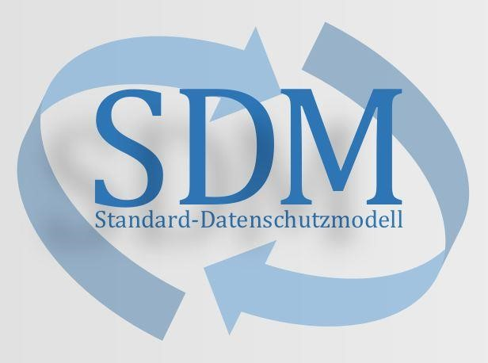

# Standard-Datenschutzmodell

> Eine Methode zur Datenschutzberatung und -prüfung auf der Basis einheitlicher Gewährleistungsziele

Version 3.0

## IMPRESSUM

### Eigentümer

Konferenz der unabhängigen Datenschutzaufsichtsbehörden des Bundes und der Länder

## Herausgeber

AK Technik der Konferenz der unabhängigen datenschutzaufsichtsbehörden des Bundes und der Länder

## Redaktion

UAG „Standard-Datenschutzmodell“ des AK Technik der Konferenz der unabhängigen Datenschutzaufsichtsbehörden des Bundes und der Länder

## Ansprechpartner

### Leiter der UAG „Standard-Datenschutzmodell“

Martin Rost

Unabhängiges Landeszentrum für Datenschutz Schleswig Holstein

Holstenstraße 98, 24103 Kiel

E-Mail: uld32@datenschutzzentrum.de

Tel: 0431 98813 91 

### Leiter des AK Technik

René Weichelt

Der Landesbeauftragte für Datenschutz und Informationsfreiheit Mecklenburg-Vorpommern

Schloss Schwerin, 19053 Schwerin

E-Mail: rene.weichelt@datenschutz-mv.de

Telefon: 0385 59494 41

## Datenlizenz

Dieses Dokument darf - ohne Rückfrage bei einer Aufsichtsbehörde - kommerziell und nicht kommerziell genutzt, insbesondere vervielfältigt, ausgedruckt, präsentiert, verändert, bearbeitet sowie an Dritte übermittelt oder auch mit eigenen Daten und Daten Anderer zusammengeführt und zu selbständigen neuen Datensätzen verbunden werden, wenn der folgende Quellenvermerk angebracht wird: „Konferenz der unabhängigen Datenschutzaufsichtsbehörden des Bundes und der Länder (Datenschutzkonferenz).“ Veränderungen, Bearbeitungen, neue Gestaltungen oder sonstige Abwandlungen der bereitgestellten Daten sind mit einem Veränderungshinweis im Quellenvermerk zu versehen. Datenlizenz Deutschland - Namensnennung - Version 2.0 (www.govdata.de/dl-de/by-2-0 ).

# Einleitung 

Die Europäische Datenschutz-Grundverordnung (2016/679/EU-DS-GVO) ist am 25. Mai 2016 in Kraft getreten und gilt nach einer zweijährigen Übergangsfrist unmittelbar seit dem 25. Mai 2018 in der gesamten Europäischen Union. Die DS-GVO enthält Vorschriften zum Schutz natürlicher Personen bei der Verarbeitung personenbezogener Daten. Sie schützt die Grundrechte und Grundfreiheiten natürlicher Personen und insbesondere deren Recht auf Schutz personenbezogener Daten. In den Artikeln 5, 12, 24, 25 und 32 DS-GVO finden sich grundlegende Anforderungen an die Verarbeitung personenbezogener Daten. Die DS-GVO fordert geeignete technische und organisatorische Maßnahmen, um die Risiken für die Rechte und Freiheiten natürlicher Personen angemessen zu mindern. Das betrifft sowohl Maßnahmen zur Gewährleistung der Rechte Betroffener (Kapitel III DS-GVO) als auch Maßnahmen zur Umsetzung der Datenschutzgrundsätze (Art. 25 Abs. 1 DS-GVO), darunter zur Datenminimierung (Art. 25 Abs. 2 DS-GVO) und zur Gewährleistung der Sicherheit der Verarbeitung (Art. 32 Abs. 1). Das Prinzip des Datenschutzes durch Technikgestaltung und durch datenschutzfreundliche Voreinstellungen (Art. 25 DS-GVO) fordert zu einer sehr frühzeitigen Befassung des Verantwortlichen mit datenschutzrechtlichen Vorgaben bereits bei der Planung von Verarbeitungen auf. Die DS-GVO verlangt ein Verfahren zur regelmäßigen Überprüfung, Bewertung und Evaluierung der Wirksamkeit der technischen und organisatorischen Maßnahmen (Art. 24 Abs. 1 Satz 2, Art. 32 Abs. 1 Satz 1 lit. d DS-GVO).

Schließlich sieht die DS-GVO ein Kohärenzverfahren vor, das die unabhängigen Aufsichtsbehörden in ein komplexes Konsultationsverfahren einbindet (Kapitel VII DS-GVO - Zusammenarbeit und Kohärenz). Insbesondere dieses Verfahren erfordert ein abgestimmtes, transparentes und nachvollziehbares System zur datenschutzrechtlichen Beurteilung der Verarbeitung personenbezogener Daten.

In Art. 5 DS-GVO werden wesentliche Grundsätze für die Verarbeitung personenbezogener Daten formuliert: Die Verarbeitung muss rechtmäßig, nach Treu und Glauben, nachvollziehbar, zweckgebunden, auf das notwendige Maß beschränkt, auf der Basis richtiger Daten, und die Integrität und Vertraulichkeit wahrend stattfinden. Zusätzlich dürfen personenbezogene Daten in der Regel nur so lange in einer Form gespeichert werden, die eine Identifizierung der betroffenen Personen erlaubt, wie dies erforderlich ist. Die Einhaltung der Grundsätze muss nachweisbar sein („Rechenschaftspflicht“).

Das Standard-Datenschutzmodell (SDM) bietet geeignete Mechanismen, um diese rechtlichen Anforderungen der DS-GVO in technische und organisatorische Maßnahmen zu überführen. Zu diesem Zweck erfasst das SDM zunächst die rechtlichen Anforderungen der DS-GVO und ordnet sie anschließend den Gewährleistungszielen Datenminimierung, Verfügbarkeit, Integrität, Vertraulichkeit, Transparenz, Nichtverkettung und Intervenierbarkeit zu. Das SDM überführt damit die rechtlichen Anforderungen der DS-GVO über die Gewährleistungsziele in von der Verordnung geforderten technischen und organisatorischen Maßnahmen, die im Referenzmaßnahmen-Katalog des SDM detailliert beschrieben werden. Es unterstützt somit die Transformation abstrakter rechtlicher Anforderungen in konkrete technische und organisatorische Maßnahmen.

Der zum SDM gehörende Referenzmaßnahmen-Katalog kann herangezogen werden, um bei jeder einzelnen Verarbeitung zu prüfen, ob das rechtlich geforderte „Soll“ von Maßnahmen mit dem vor Ort vorhandenen „Ist“ von Maßnahmen übereinstimmt. Das SDM und der Referenzmaßnahmen-Katalog bieten zudem eine Grundlage für die Planung und Durchführung der von der DS-GVO geförderten datenschutzspezifischen Zertifizierungen (Art. 42 DS-GVO) und der in bestimmten Fällen erforderlichen Datenschutz-Folgenabschätzung (Art. 35 DS-GVO).

Eine derartige Standardisierung unterstützt auch die in der Verordnung normierte Zusammenarbeit der Aufsichtsbehörden. Denn diese bedingt, dass auf nationaler Ebene die deutschen Datenschutzaufsichtsbehörden in zunehmendem Maße zusammenarbeiten und mit ihren Beratungs- und Prüfmethoden zu gleichen datenschutzrechtlichen Beurteilungen gelangen müssen. Das SDM wird mit dem Ziel erstellt, ein abgestimmtes, transparentes und nachvollziehbares System der datenschutzrechtlichen Beurteilung zu bieten.

Das SDM kann darüber hinaus auch dazu beitragen, die vom IT-Planungsrat verabschiedete Nationale E-Government-Strategie (NEGS) datenschutzkonform umzusetzen. Die NEGS fordert technische und organisatorische Maßnahmen zur Gewährleistung des Datenschutzes, die den Grundsatz der Datenminimierung wahren und die sich auf die Schutzziele Verfügbarkeit, Vertraulichkeit, Integrität, Transparenz, Nichtverkettung und Intervenierbarkeit beziehen sollen.

Das hier beschriebene Standard-Datenschutzmodell kann somit in Deutschland und auch im internationalen Kontext sowohl für die Datenschutzaufsicht als auch für die verantwortlichen Stellen im Bereich der privaten Wirtschaft und im Bereich der öffentlichen Verwaltung einen wesentlichen Beitrag leisten, um die DS-GVO effektiv und rechtskonform umzusetzen. Denn das SDM ermöglicht einen systematischen und nachvollziehbaren Vergleich zwischen Soll-Vorgaben, die sich aus Normen, Verträgen, Einwilligungserklärungen und Organisationsregeln ableiten, und dem Ist-Zustand, der sich durch die Umsetzung dieser Vorgaben sowohl auf organisatorischer als auch auf informationstechnischer Ebene bei der Verarbeitung personenbezogener Daten ergibt.

Mit dem SDM wird eine Methode bereitgestellt, mit der die Risiken der Rechte und Freiheiten natürlicher Personen, die mit der Verarbeitung personenbezogener Daten zwangsläufig einhergehen, mit Hilfe von geeigneten technischen und organisatorischen Maßnahmen beseitigt oder wenigstens auf ein tragbares Maß reduziert werden können. Für das Erstellen von Datenschutz- und Sicherheitskonzepten sind neben derartigen Methoden und Hilfsmitteln aber auch die langjährigen, individuellen Erfahrungen der handelnden Personen unerlässlich. Aus diesen Erfahrungen resultieren mitunter zwar dem SDM vergleichbare, im Detail aber abgewandelte Methoden zur Minimierung des Risikos. Diese Methoden können in speziellen Anwendungskontexten ihre Berechtigung haben.

# Teil A: Beschreibung des SDM 

## A1 Zweck des SDM 

Mit dem Standard-Datenschutzmodell (SDM) wird ein Werkzeug bereitgestellt, mit dem die Auswahl und die kontinuierliche Evaluation technischer und organisatorischer Maßnahmen unterstützt wird, die sicherstellen und den Nachweis dafür erbringen, dass die Verarbeitung personenbezogener Daten nach den Vorgaben der DS-GVO erfolgt. Diese Maßnahmen müssen angemessen und geeignet sein, die Risiken für die Rechte und Freiheiten der von der Verarbeitung betroffenen natürlichen Personen soweit einzudämmen, dass ein dem Risiko angemessenes Schutzniveau gewährleistet wird. Für jede Verarbeitung ist also zu prüfen, ob die personenbezogenen Daten durch eine angemessene Auswahl technischer und organisatorischer Maßnahmen so verarbeitet werden, dass die Rechte der Betroffenen gewahrt bleiben und die Sicherheit der Verarbeitung gewährleistet wird (Kapitel III der DS-GVO und die Bestimmungen zur Sicherheit der Verarbeitung gemäß Art. 24, 25 und 32 DS-GVO). Das SDM systematisiert diese Maßnahmen auf der Basis von Gewährleistungszielen und unterstützt somit die Auswahl geeigneter Maßnahmen. Das SDM dient ausschließlich einer datenschutzrechtlich konformen Gestaltung von Verarbeitungstätigkeiten und formuliert keine Anforderungen, die über das Datenschutzrecht hinausgehen.

Voraussetzung für die Rechtmäßigkeit der Verarbeitung personenbezogener Daten sind das Vorhandensein einer ausreichenden und tragfähigen Rechtsgrundlage (Zulässigkeit der Verarbeitung) und die Gewährleistung der Sicherheit der Datenverarbeitung. Es gelten die Verarbeitungsgrundsätze gemäß Art. 5 DS-GVO und die Bedingungen für die Rechtmäßigkeit der Verarbeitung gemäß Art. 6 DS-GVO. Die Prüfung des Vorliegens einer Rechtsgrundlage als Voraussetzung der Zulässigkeit der Verarbeitung muss vor der Anwendung des SDM erfolgen.

Anschließend ist kumulativ die zweite Voraussetzung der Rechtmäßigkeit der Verarbeitung zu überprüfen - die Frage, ob die Datenverarbeitung minimiert (Art. 25 Abs. 2 DS-GVO) und geeignete Maßnahmen zur Eindämmung des Risikos für die Rechte und Freiheiten der von Verarbeitung Betroffener umgesetzt wurden (Art. 25 Abs. 1 und 32 Abs. 1 DS-GVO). Diese Prüfung setzt als ersten Schritt voraus, dass dieses Risiko der Verarbeitung klar bestimmt wird. Denn die Auswahl geeigneter Maßnahmen ist abhängig von den Risiken.

Insofern ist das SDM Teil eines iterativen Prozesses bestehend aus der rechtlichen Beurteilung, der Gestaltung der Verarbeitungsvorgänge sowie der Auswahl und Umsetzung von begleitenden technischen und organisatorischen Maßnahmen. Das SDM bietet mit seinen Gewährleistungszielen eine Transformationshilfe zwischen Recht und Technik und unterstützt damit einen ständigen Dialog zwischen Beteiligten aus dem fachlichen, juristischen und technisch-organisatorischen Bereich. Dieser Prozess läuft während des gesamten Lebenszyklus einer Verarbeitung und kann somit die Forderung der DS-GVO nach regelmäßiger Bewertung und Evaluierung der technischen und organisatorischen Maßnahmen z. B. zur Gewährleistung der Sicherheit der Verarbeitung (Art. 32 Abs. 1 lit. d DS-GVO) unterstützen.

Der oben beschriebene iterative Prozess muss weit vor Beginn der Verarbeitung starten, zum Zeitpunkt der Festlegung der Mittel für die Verarbeitung (Art. 25 Abs. 1 DS-GVO). Bereits bei den ersten Planungen einer Verarbeitungstätigkeit mit personenbezogenen Daten müssen mögliche Risiken identifiziert und bewertet werden, um die Folgen der Verarbeitung beurteilen zu können.

Mit der Datenschutz-Folgenabschätzung (DSFA) verpflichtet die DS-GVO die Verantwortlichen in Art. 35, für besonders risikobehaftete Verarbeitungen die Notwendigkeit und Verhältnismäßigkeit der Verarbeitungsvorgänge einzuschätzen und eine sorgfältige Analyse, Bewertung und Planung der Behandlung der Risiken vorzunehmen (Art. 35 Abs. 7 DS-GVO). Das SDM bietet eine Systematik, um eine DSFA in strukturierter Form zu erarbeiten.

Das SDM richtet sich sowohl an die Aufsichtsbehörden als auch an die für die Verarbeitung personenbezogener Daten Verantwortlichen. Letztere können mit dem SDM die erforderlichen Funktionen und technischen und organisatorischen Maßnahmen systematisch planen, umsetzen und kontinuierlich überwachen.

## A2 Anwendungsbereich des SDM 

Die Anwendungsbereiche des Standard-Datenschutzmodells sind Planung, Einführung und Betrieb von Verarbeitungstätigkeiten mit denen personenbezogene Daten verarbeitet werden (personenbezogene Verarbeitungen) sowie deren Prüfung und Beurteilung. Solche Verarbeitungstätigkeiten sind dadurch gekennzeichnet, dass sie sich auf einen konkreten, abgrenzbaren und rechtlich legitimierten Verarbeitungszweck (im öffentlichen Bereich eine Ermächtigungsgrundlage) und auf die diesen Zweck verwirklichenden Geschäftsprozesse gerichtet sind (siehe Kapitel D2).

Die DS-GVO fordert, für jede Verarbeitung personenbezogener Daten technische und organisatorische Maßnahmen auszuwählen und umzusetzen, die nach dem Stand der Technik und nach dem Risiko für die Rechte und Freiheiten natürlicher Personen erforderlich und angemessen sind. Diese Maßnahmen werden als Teil der Datenverarbeitung betrachtet, einschließlich der mit ihnen selbst möglicherweise verbundenen Verarbeitung personenbezogener Daten, und können ggfs. zu einer eigenen Verarbeitungstätigkeit werden. Dass es sich vielfach so verhalten kann, zeigt sich am Beispiel der Protokollierung, die in der Regel als ein unmittelbarer Bestandteil einer Verarbeitung gilt, aber unter Aspekten des Beschäftigtendatenschutzes zusätzlich beurteilt werden muss.

Die Rechtsgrundlage kann konkrete Maßnahmen vorschreiben, die verarbeitungsspezifisch umzusetzen sind, z. B. eine Anonymisierung erhobener personenbezogener Daten, sobald ein bestimmter Zweck der Verarbeitung erreicht wurde. Außerdem kann es Fälle geben, in denen besondere Maßnahmen ergriffen werden müssen, die als Ergebnis einer gesetzlich erforderlichen Interessensabwägung geboten sind, um eine rechtskonforme Verarbeitung zu ermöglichen.

## A3 Struktur des SDM 

Das Standard-Datenschutzmodell

- systematisiert datenschutzrechtliche Anforderungen in Gewährleistungszielen,

- leitet aus den Gewährleistungszielen systematisch generische Maßnahmen ab, ergänzt um einen Referenzmaßnahmen-Katalog,

- modelliert die Verarbeitungstätigkeit (Geschäftsprozess) mit ihren Komponenten Daten, Systemen und Diensten sowie Teilprozessen, 

- systematisiert die Identifikation der Risiken zur Feststellung des aus der Verarbeitung resultierenden Schutzbedarfs der betroffenen Personen,

- bietet ein Vorgehensmodell für eine Modellierung, Umsetzung und kontinuierliche Kontrolle und Prüfung von Verarbeitungstätigkeiten.

## A4 Funktion der Gewährleistungsziele des SDM 

Das SDM verwendet zur Systematisierung datenschutzrechtlicher Anforderungen „Gewährleistungsziele“. Die datenschutzrechtlichen Anforderungen zielen auf eine rechtskonforme Verarbeitung, die durch technische und organisatorische Maßnahmen gewährleistet werden muss. Die Gewährleistung besteht darin, das Risiko des Eintretens von Abweichungen von einer rechtskonformen Verarbeitung hinreichend zu mindern. Die zu vermeidenden Abweichungen schließen die unbefugte Verarbeitung durch Dritte und die Nichtdurchführung gebotener Verarbeitungen ein. Die Gewährleistungsziele bündeln und strukturieren die datenschutzrechtlichen Anforderungen und können durch mit ihnen verknüpfte, skalierbare Maßnahmen operationalisiert werden. Auf diese Weise wird die Beeinträchtigung der betroffenen Personen durch die Verarbeitung minimiert und ein wirksamer Schutz betroffener Personen durch die Minderung von Risiken für die Rechte und Freiheiten natürlicher Personen prüfbar sichergestellt.

Die Vorteile in der Arbeit mit Gewährleistungszielen liegen in der vereinfachten Modellierung von funktionalen Anforderungen in praktischen Anwendungsfällen und der einfachen Visualisierung von Konflikten. Die Gewährleistungsziele unterstützen die systematische Umsetzung rechtlicher Anforderungen in technische und organisatorische Maßnahmen und können somit als „Optimierungsgebote“ aufgefasst werden.

Das SDM benennt sieben Gewährleistungsziele des Datenschutzes, welche für die Anwendung des SDM von elementarer Bedeutung sind[^1]. Im Einzelnen sind dies:

[^1]: Um Redundanzen zu vermeiden, werden die einzelnen Gewährleistungsziele nicht in diesem Abschnitt des SDM erläutert, sondern im Zusammenhang mit ihrer Zuordnung zu den rechtlichen Anforderungen der DS-GVO im Abschnitt C1 detailliert beschrieben.

- Datenminimierung

- Verfügbarkeit,

- Integrität,

- Vertraulichkeit,

- Nichtverkettung,

- Transparenz und

- Intervenierbarkeit.

In diesen Gewährleistungszielen finden sich die seit vielen Jahren in der Praxis bewährten Schutzziele der Informationssicherheit wieder. Die Ziele Verfügbarkeit, Integrität und Vertraulichkeit dienen somit auch der Gewährleistung der Informationssicherheit in Behörden und Unternehmen, also der Absicherung und dem Schutz der Daten einer Organisation. Für Fachleute aus dem Bereich der Informationssicherheit, die mit dem Grundschutzkonzept des BSI[^2] vertraut sind, stellen Gewährleistungsziele somit ein bekanntes Konzept dar. Ihnen wird die Anwendung des SDM leichtfallen, weil die Methode sich an den IT-Grundschutz anlehnt und sich dort bereits bewährt hat. Fachleute aus dem Datenschutzrecht können die Kontinuität der Entwicklung des Datenschutzrechts nachvollziehen und den praktischen Nutzen von Gewährleistungszielen beurteilen.

[^2]: https://www.bsi.bund.de/DE/Themen/ITGrundschutz/itgrundschutz_node.html

Datenschutz interpretiert Gewährleistungsziele jedoch nicht aus der Perspektive der Organisation, sondern aus der Perspektive der Betroffenen und umfasst die Erfüllung der Gesamtheit der datenschutzrechtlichen Anforderungen an die Verarbeitung personenbezogener Daten. Das SDM betrachtet daher die o. g. Gewährleistungsziele in ihrer Gesamtheit und erfüllt somit auch die Funktion, die bekannten Schutzziele der Informationssicherheit und die datenschutzrechtlichen Anforderungen für die Verarbeitung personenbezogener Daten als Gewährleistungsziele zusammenzuführen.

Das Konzept der Gewährleistungsziele ist im Kontext des Datenschutzrechts nicht neu. Die Konferenz der Datenschutzbeauftragten des Bundes und der Länder hat in ihrem Eckpunktepapier „Ein modernes Datenschutzrecht für das 21. Jahrhundert“ bereits im März 2010 eine grundsätzliche Reform der Regeln des technischen und organisatorischen Datenschutzes vorgeschlagen und gefordert, die o. g. Gewährleistungsziele in das künftige Datenschutzrecht aufzunehmen.[^3] Die Gewährleistungsziele waren auch schon in einigen Landesdatenschutzgesetzen der alten Fassung verankert.[^4] Sie dienen daher schon seit vielen Jahren bei der Umsetzung von Gesetzen und Normen in komplexen Umgebungen mit mehreren zum Teil in Konkurrenz stehenden Zielvariablen und Anforderungen.

[^3]: https://www.datenschutz-mv.de/static/DS/Dateien/Entschliessungen/Datenschutz/Eckpunkte.pdf

[^4]: S. z. B. §§ 4, 5 Schleswig-Holsteinisches Gesetz zum Schutz personenbezogener Informationen (Landesdatenschutzgesetz - LDSG -) vom 9. Februar 2000 gültig bis zum 24.5.2018.

Der europäische Gesetzgeber hat in der Datenschutz-Grundverordnung das Konzept der Gewährleistungsziele aufgegriffen und setzt somit die kontinuierliche Weiterentwicklung des technischen Datenschutzes von den ehemaligen Kontrollzielen des ersten Bundesdatenschutzgesetzes zu technologieneutralen Gewährleistungszielen fort. Die DS-GVO regelt in Art. 5 DS-GVO sogenannte Grundsätze der Verarbeitung, die nunmehr im Anwendungsbereich der DS-GVO allgemeine Geltung beanspruchen. Neu ist nur die Tatsache, dass diese übergeordneten Grundsätze ausdrücklich und allgemeingültig im Gesetzestext festgeschrieben worden sind. Die zentralen datenschutzrechtlichen Anforderungen der Datenschutz-Grundverordnung (siehe Abschnitt B2) lassen sich mit Hilfe der Gewährleistungsziele vollständig systematisieren (siehe Abschnitt C). Die bereits bekannten und bewährten Gewährleistungsziele mussten dafür nicht grundsätzlich geändert werden, sondern in ihrem konkreten Verständnis auf die Datenschutz-Grundverordnung angepasst werden.

Folgerichtig ist zu konstatieren, dass alle im SDM beschriebenen Anforderungen vollständig aus der DS-GVO abgeleitet sind und sich mit Hilfe der Gewährleistungsziele strukturieren lassen. Das SDM stellt keine über das geltende Datenschutzrecht hinausgehenden Anforderungen. Die Gewährleistungsziele und ihr konkretes Verständnis werden deshalb bei künftigen Änderungen des Datenschutzrechts evaluiert und gegebenenfalls angepasst. Die aufsichtsrechtliche Tätigkeit der Datenschutzaufsichtsbehörden orientiert sich ausschließlich an der DS-GVO. Das im SDM abgebildete Konzept der Gewährleitungsziele fördert den grundrechtsorientierten Datenschutz und unterstützt Verantwortliche und Datenschutzaufsichtsbehörden insbesondere bei der Systematisierung der Anforderungen der DS-GVO (siehe Abschnitt C2).

# Teil B: Anforderungen der DS-GVO 

Mit der DS-GVO wird das Datenschutzrecht europaweit einheitlich geregelt. Die Verordnung ist am 25.05.2016 in Kraft getreten und gilt gemäß Art. 99 Abs. 2 DS-GVO seit dem 25.05.2018 unmittelbar in allen EU-Mitgliedstaaten. Für die nationalen Gesetzgeber wurden durch zahlreiche Spezifizierungsklauseln ergänzende Regelungsbefugnisse geschaffen. Jedoch besteht für die DS-GVO ein grundsätzlicher Anwendungsvorrang vor nationalem Recht. Der Kern der Anforderungen der DS-GVO wird in den Grundsätzen der Verarbeitung personenbezogener Daten gemäß Art. 5 DS-GVO festgehalten, die wiederum den Schutzauftrag aus Art. 8 der Charta der Grundrechte der Europäischen Union aufnehmen.

Entsprechend verpflichtet die DS-GVO Verantwortliche und Auftragsverarbeiter dazu, die Verarbeitungsvorgänge und die hierfür eingesetzte Technik im Hinblick auf die Gewährleistung des grundrechtlichen Schutzes der Rechte der Betroffenen auszugestalten (Art. 25, 28 DS-GVO). Zur Minderung der entstehenden Risiken, darunter insbesondere den unbefugten Zugriff durch Dritte, ist der Verantwortliche dazu verpflichtet, die dafür angemessenen technischen und organisatorischen Maßnahmen (u.a. Art. 32, 28 Abs. 3 lit. d DS-GVO) auszuwählen, einzusetzen und auf ihre Wirksamkeit zu überprüfen (Art. 32 Abs. 1 lit. d DS-GVO). Der Verantwortliche ist für die Einhaltung der Grundsätze der Verarbeitung nach Art. 5 Abs. 1, 24 DS-GVO verantwortlich und muss deren Einhaltung nachweisen können.

Die DS-GVO verlangt für Verarbeitungen mit voraussichtlich hohem Risiko für die Rechte und Freiheiten natürlicher Personen die Durchführung einer Datenschutz-Folgenabschätzung (DSFA) gemäß Art. 35 DS-GVO. Die DSFA enthält eine systematische Beschreibung der geplanten Verarbeitungsvorgänge und spezifiziert im Ergebnis technische und organisatorische Maßnahmen zur Bewältigung der erwarteten Risiken. Dies schließt gemäß Art. 35 Abs. 7 DS-GVO Garantien, Sicherheitsvorkehrungen und Verfahren ein, durch die der Schutz personenbezogener Daten sichergestellt, nachgewiesen und überprüft werden kann. Das SDM soll dazu beitragen, die in Art. 5 DS-GVO formulierten Grundsätze für die Verarbeitung personenbezogener Daten umzusetzen und mit überschaubarem Aufwand die von der DS-GVO geforderten Umsetzungsnachweise, bspw. gemäß Art. 5 Abs. 2, Art. 24 Abs. 1 DS-GVO zu erbringen.

Mit dem SDM wird das Ziel verfolgt, die von der DS-GVO vorgegebenen datenschutzrechtlichen Anforderungen praktisch umzusetzen. Daher ist es erforderlich, aus den gesamten Vorschriften der DS-GVO diejenigen rechtlichen Anforderungen systematisch herauszuarbeiten, die durch technische und organisatorische Maßnahmen zu erfüllen sind. Dies ist erstens mit der Schwierigkeit verbunden, dass diese Anforderungen über die gesamte DS-GVO verstreut und nicht an einer Stelle gebündelt worden sind. Zweitens besteht das Problem, dass die Anforderungen der DS-GVO keinen einheitlichen Konkretisierungsgrad aufweisen. Teilweise formuliert die Verordnung bereits konkrete Anforderungen wie insbesondere in Art. 5 Abs. 1 DS-GVO Transparenz, Datenminimierung und Zweckbindung. Teilweise müssen die rechtlichen Anforderungen aber erst aus den Rechten, Pflichten und sonstigen Vorgaben abgeleitet werden. Häufig ist daher ein Zwischenschritt vom Gesetzestext zur Anforderung erforderlich, wie bei der Vorgabe datenschutzfreundliche Voreinstellungen.

Das SDM legt die folgenden datenschutzrechtlichen Anforderungen zugrunde, die aus der DS-GVO systematisch herausgearbeitet worden sind. Die Anforderungen werden in die drei Blöcke zentrale datenschutzrechtliche Anforderungen, Einwilligungsmanagement und Umsetzung aufsichtsbehördlicher Anforderungen differenziert. Die zentralen datenschutzrechtlichen Anforderungen sind grundsätzlich bei jeder Verarbeitung personenbezogener Daten umzusetzen. Im Einwilligungsmanagement werden die Anforderungen zusammengefasst, die zusätzlich zu erfüllen sind, wenn die Rechtmäßigkeit der Verarbeitung auf Art. 6 Abs. 1 lit. a DS-GVO gestützt wird. Schließlich müssen gegebenenfalls für die Umsetzung aufsichtsbehördlicher Maßnahmen weitere Anforderungen berücksichtigt werden.

Im Folgenden wird übersichtlich dargestellt, aus welchen Vorschriften der DS-GVO welche Anforderungen abgeleitet wurden.[^5]

[^5]: Das SDM betrachtet weder grundlegende Fragen der materiellen Rechtmäßigkeit einer Verarbeitung noch spezialgesetzliche Regelungen oder Regelungen auf einem hohen Detaillierungsgrad. Daher sind aus diesen rechtlichen Vorgaben keine Anforderungen abzuleiten, die im SDM aufgenommen werden. Die Orientierung an den allgemein geltenden Grundsätzen des Datenschutzes erübrigt daher nicht die Kenntnisnahme der datenschutzrechtlichen Regelungen, auch nicht im Bereich der technischen und organisatorischen Maßnahmen.

Die folgenden Anforderungen ergeben sich unmittelbar aus Art. 5 Abs. 1 DS-GVO:

- Transparenz für Betroffene von Verarbeitungen personenbezogener Daten (Art. 5 Abs. 1 lit. a DS-GVO),

- Zweckbindung einer Verarbeitung personenbezogener Daten (Art. 5 Abs. 1 lit. b DS-GVO),

- Datenminimierung einer Verarbeitung personenbezogener Daten (Art. 5 Abs. 1 lit. c DS-GVO),

- Richtigkeit personenbezogener Daten (Art. 5 Abs. 1 lit. d DS-GVO),

- Speicherbegrenzung personenbezogener Daten (Art. 5 Abs. 1 lit. e DS-GVO),

- Integrität personenbezogener Daten (Art. 5 Abs. 1 lit. f DS-GVO, Art. 32 Abs. 1 lit. b DS-GVO),

- Vertraulichkeit personenbezogener Daten (Art. 5 Abs. 1 lit. f DS-GVO, Art. 32 Abs. 1 lit. b DS-GVO),

Übergreifend ergibt sich die Vorgabe, dass der Verantwortliche die Einhaltung des Absatzes 1 nachweisen können muss.

- Rechenschafts- und Nachweisfähigkeit (Art. 5 Abs. 2, Art. 24 Abs. 1 DS-GVO).

Die DS-GVO erkennt verschiedene Rechte der Betroffenen an. Die Rechte der Betroffenen ergeben sich explizit aus Kapitel III der DS-GVO (Art. 12-23 DS-GVO). Der Verantwortliche muss gemäß Art. 12, 24 DS-GVO die Voraussetzungen für die Gewährung dieser Rechte durch technische und organisatorische Maßnahmen schaffen.

Aus der rechtlichen Vorgabe der Berücksichtigung der Betroffenenrechte ergeben sich im Einzelnen die folgenden Anforderungen[^6]:

[^6]: Die Prüfung der Voraussetzungen der Betroffenenrechte muss erfolgen, ist aber nicht Gegenstand des SDM.

- Unterstützung bei der Wahrnehmung von Betroffenenrechten (Art. 12 Abs. 1 und Abs. 2 DS-GVO,

- Identifizierung und Authentifizierung des Auskunftsersuchenden (Art. 12 Abs. 6 DSGVO),

- Berichtigungsmöglichkeiten von Daten (Art. 16 DS-GVO),

- Löschbarkeit von Daten (Art. 17 Abs. 1 DS-GVO),

- Einschränkbarkeit der Verarbeitung von Daten (ehemals Sperrung, Art. 18 DS-GVO),

- Datenübertragbarkeit (Art. 20 DS-GVO),

- Eingriffsmöglichkeit in Prozesse automatisierter Entscheidungen (Art. 22 Abs. 3 DS-GVO),

- Fehler- und Diskriminierungsfreiheit beim Profiling (Art. 22 Abs. 3 und 4, Erwägungsgrund 71).

Durch die DS-GVO wird der Datenschutz durch Technik stark gefördert. Dieses wird in Art. 25 und 32 DS-GVO bereits zu mehreren Anforderungen ausdifferenziert:

- Datenschutz durch Voreinstellungen (Art. 25 Abs. 2 DS-GVO),

- Verfügbarkeit der Systeme, Dienste und Daten (Art. 32 Abs. 1 lit. b und lit. c DS-GVO),

- Belastbarkeit der Systeme und Dienste (Art. 32 Abs. 1 lit. b DS-GVO),

- Wiederherstellbarkeit der Daten und des Datenzugriffs (Art. 32 Abs. 1 lit. c DS-GVO), - Evaluierbarkeit (Art. 32 Abs. 1 lit. d DS-GVO).

Gegenüber Aufsichtsbehörden und Betroffenen besteht für Verantwortliche gemäß Art. 33 und 34 DS-GVO eine Meldepflicht bzw. Benachrichtigungspflicht beim Auftreten von Verletzungen des Schutzes personenbezogener Daten (Datenschutzverletzungen). Daraus ergeben sich Anforderungen an einen ordnungsgemäßen Umgang mit Datenpannen. Dies verlangt die Fähigkeiten zur Feststellung von Datenschutzverletzungen (vgl. Erwägungsgrund 87 DS-GVO), Klassifikation von Datenschutzverletzungen, Meldung von Datenschutzverletzungen an Aufsichtsbehörden (Art. 33 DS-GVO) und Benachrichtigung der Betroffenen von Datenschutzverletzungen (Art. 34 DS-GVO). Daraus resultieren die Anforderungen:

- Behebung und Abmilderung von Datenschutzverletzungen (Art. 33, 34 DS-GVO)

- angemessene Überwachung der Verarbeitung (Art. 32, 33, 34 DS-GVO)

Beruht die Verarbeitung auf einer Einwilligung, dann sind zusätzlich zu den allgemeinen Anforderungen die spezifischen Anforderungen gemäß Art. 7 und ggfs. Art. 8 DS-GVO einzuhalten (siehe B2).

- Einwilligungsmanagement (Art. 4 Nr. 11, Art. 7 und 8 DS-GVO).

Die DS-GVO räumt Aufsichtsbehörden in Art. 58 DS-GVO verschiedene Befugnisse im Rahmen ihrer Aufgabenerfüllung ein (siehe Kapitel B3):

- Umsetzung aufsichtsbehördlicher Anordnung (Art. 58 DS-GVO).

Die Reihenfolge der folgenden Abschnitte orientiert sich an der Reihenfolge, in der die Anforderungen in der DS-GVO formuliert sind.

## B1 Zentrale datenschutzrechtliche Anforderungen der DS-GVO 

### B1.1 Transparenz für Betroffene 

Der Grundsatz der Transparenz ist in Art. 5 Abs. 1 lit. a DS-GVO festgeschrieben. Er findet sich als tragender Grundsatz des Datenschutzrechts in zahlreichen Regelungen der DS-GVO. Insbesondere die Informations- und Auskunftspflichten gemäß Art. 12 ff. DS-GVO tragen ihm Rechnung. In Art. 12 Abs. 1 S. 1 DS-GVO wird gefordert, dass der Verantwortliche geeignete Maßnahmen trifft, um der betroffenen Person alle Informationen bezüglich der Informationspflichten aus Art. 13 und 14 DS-GVO und alle Mitteilungen gemäß den Art. 15 bis 22 und 34 DS-GVO, die sich auf die Verarbeitung beziehen, in präziser, transparenter, verständlicher und leicht zugänglicher Form in einer klaren und einfachen Sprache zu übermitteln. Die Betroffenen müssen unverzüglich und auf jeden Fall innerhalb eines Monats über den Stand der Bearbeitung und der ergriffenen Maßnahmen bezüglich ihres Antrags gemäß Art. 12 Abs. 3 DS-GVO informiert werden. Die Benachrichtigungspflicht gemäß Art. 34 DS-GVO bei einer Verletzung des Schutzes personenbezogener Daten, einer sogenannten Datenpanne, dient ebenso dem Grundsatz der Transparenz.

### B1.2 Zweckbindung 

Die Verpflichtung, Daten nur für den Zweck zu verarbeiten, zu dem sie erhoben wurden, ist insbesondere den einzelnen Verarbeitungsbefugnissen zu entnehmen, die die Geschäftszwecke, die Forschungszwecke etc. zum Maßstab machen und findet über den Zweckbindungsgrundsatz aus Art. 5 Abs. 1 lit. c DS-GVO Eingang in die Grundverordnung. Eine darauf folgende Verarbeitung für weitere Zwecke muss mit dem ursprünglichen Zweck kompatibel sein und die Umstände der Verarbeitung berücksichtigen (Art. 6 Abs. 4 DS-GVO). Über eine Weiterverarbeitung über den ursprünglichen Zweck hinaus, sind die betroffenen Personen ggfs. zu informieren, die von ihrem unter Umständen bestehenden Widerspruchsrecht Gebrauch machen können.

### B1.3 Datenminimierung 

In einem engen Zusammenhang mit dem Grundsatz der Zweckbindung steht der Grundsatz der Datenminimierung. Der Gesetzgeber fordert, dass personenbezogene Daten dem Zweck angemessen und erheblich sowie auf das für die Zwecke der Verarbeitung notwendige Maß beschränkt sein müssen (Art. 5 Abs. 1 lit. c DS-GVO). Diese grundlegende Anforderung entspricht weitgehend dem aus dem deutschen Recht bekannten Grundprinzip der Datensparsamkeit. Es ist nur bedingt möglich, zwischen den drei Voraussetzungen dem Zweck angemessen, für den Zweck erheblich und für die Zwecke der Verarbeitung auf das notwendige Maß beschränkt zu differenzieren.

**Angemessen** sind Daten, die einen konkreten inhaltlichen Bezug zum Verarbeitungszweck aufweisen. Es soll eine wertende Entscheidung über die Zuordnung von Datum und Zweck vorgenommen werden.

**Erheblich** sind Daten, deren Verarbeitung einen Betrag zur Zweckerreichung leisten. Dieses Merkmal entspricht der Geeignetheit bei der Verhältnismäßigkeitsprüfung.

**Auf das notwendige Maß beschränkt** sind nur die Daten, die zur Erreichung des Zwecks erforderlich sind, ohne deren Verarbeitung der Verarbeitungszweck also nicht erreicht werden kann. Diese Definition ergibt sich auch aus Erwägungsgrund 39. Die Verarbeitung personenbezogener Daten ist demnach nur dann erforderlich, wenn der Zweck der Verarbeitung nicht in zumutbarer Weise durch andere Mittel erreicht werden kann. Der Eingriff in das Grundrecht auf Datenschutz ist nur zulässig, soweit er auf das geringstmögliche Maß begrenzt ist.

Die Erforderlichkeit ist ein allgemeiner Grundsatz des Unionsrechts, der durch den Europäischen Gerichtshof (EuGH) in jahrelanger Rechtsprechung anerkannt und ausgeprägt worden ist. Die Vorgabe, nur erforderliche Daten zu verarbeiten, wird in der DS-GVO von dem Grundsatz der Datenminimierung (Art. 5 Abs. 1 lit. b DS-GVO) erfasst. Sie wird zudem als Voraussetzung unmittelbar in den Erlaubnisvorschriften gemäß Art. 6 Abs. 1 S. 1 lit. b bis f und Art. 9 Abs. 2 lit. b, c, f bis j DS-GVO gefordert.

Der Grundsatz der Datenminimierung ist nicht nur vor dem Beginn der Verarbeitung zu berücksichtigen, sondern auch fortlaufend. So kann die Anforderung der Beschränkung auf das notwendige Maß dazu führen, dass personenbezogene Daten zu einem bestimmten Zeitpunkt zu anonymisieren sind.

Der Grundsatz der Datenminimierung geht davon aus, dass der beste Datenschutz darin besteht, wenn keine oder möglichst wenige personenbezogene Daten verarbeitet werden. Das Optimierungsziel ist mit dem Kriterium der Minimierung von Verfügungsgewalt und Kenntnisnahme gegeben. An ihm orientiert kann die optimale Abfolge von Verarbeitungsschritten gewählt und in der Folge an sich verändernde Bedingungen angepasst werden. Im Laufe der Verarbeitung ist schließlich mit technischen und organisatorischen Maßnahmen zu gewährleisten, dass sich die Datenverarbeitung nur innerhalb des a priori gesteckten Rahmens bewegt.

Die frühestmögliche Löschung nicht weiter benötigter und damit nicht mehr erforderlicher personenbezogener Daten ist eine solche Maßnahme. Zuvor jedoch können bereits einzelne Datenfelder oder Attribute von bestimmten Formen der Verarbeitung ausgenommen oder die Zahl der Datensätze, auf die eine Funktionalität anwendbar ist, beschränkt werden. Datenfelder, welche die Identifizierung der Betroffenen ermöglichen, können gelöscht oder transformiert (Anonymisierung, Pseudonymisierung) oder ihre Anzeige in Datenmasken unterdrückt werden, so dass sie den handelnden Personen nicht zur Kenntnis gelangen, vorausgesetzt, diese Kenntnis ist für den jeweiligen Verarbeitungszweck entbehrlich.

### B1.4 Richtigkeit 

Art. 5 Abs. 1 lit. d DS-GVO formuliert die Anforderung der Richtigkeit personenbezogener Daten. Dies bedingt, dass die von einer Verarbeitung betroffenen personenbezogenen Daten sachlich richtig und erforderlichenfalls auf dem neusten Stand sein müssen. Um diese Anforderung sicherzustellen, sind gemäß der Vorschrift alle angemessenen Maßnahmen zu treffen, damit personenbezogene Daten, die im Hinblick auf die Zwecke ihrer Verarbeitung unrichtig sind, unverzüglich gelöscht oder berichtig werden.

### B1.5 Speicherbegrenzung 

Der Grundsatz der Speicherbegrenzung wird in Art. 5 Abs. 1 lit. e DS-GVO dahingehend definiert, dass personenbezogene Daten nur so lange in einer Form gespeichert werden, die die Identifizierung der betroffenen Personen ermöglicht, wie es für die Zwecke, für die sie verarbeitet werden, erforderlich ist. Hieraus leitet sich die Notwendigkeit von Maßnahmen der Pseudonymisierung, Anonymisierung bzw. Löschung ab. Darüber hinaus wird eine Ausnahme von diesem Grundsatz formuliert, die sich auf die Verarbeitung personenbezogener Daten ausschließlich für im öffentlichen Interesse liegende Archivzwecke oder für wissenschaftliche und historische Forschungszwecke oder für statistische Zwecke richtet. Allerdings greift diese Ausnahme nur unter dem Vorbehalt, dass geeignete technische und organisatorische Maßnahmen getroffen werden, die von dieser Verordnung zum Schutz der Rechte und Freiheiten der betroffenen Person insbesondere zur Durchsetzung von Zweckbindung und Vertraulichkeit gefordert werden.

### B1.6 Integrität 

Die Anforderung der Integrität ist in Art. 5 Abs. 1 lit. f DS-GVO als Grundsatz für die Verarbeitung von personenbezogenen Daten und in Art. 32 Abs. 1 lit. b DS-GVO angewendet auf Systeme und Dienste als Aspekt der zu gewährleistenden Sicherheit der Datenverarbeitung genannt. So sind u. a. unbefugte Veränderungen und Entfernungen auszuschließen. Personenbezogene Daten dürfen nur in einer Weise verarbeitet werden, die einen Schutz vor unbeabsichtigtem Verlust, unbeabsichtigter Zerstörung oder unbeabsichtigter Schädigung durch geeignete technische und organisatorische Maßnahmen gewährleistet. Es sollen jegliche Veränderungen an den gespeicherten Daten durch unberechtigte Dritte ausgeschlossen oder zumindest so erkennbar gemacht werden, dass sie korrigiert werden können.

### B1.7 Vertraulichkeit 

Die Verpflichtung zur Wahrung der Vertraulichkeit personenbezogener Daten ergibt sich aus Art. 5 Abs. 1 lit. f DS-GVO. In Bezug auf die zur Verarbeitung eingesetzten Systeme und Dienste sowie für die Auftragsverarbeiter und die Personen, die dem Verantwortlichen oder dem Auftragsverarbeiter unterstellt sind, ergibt sie sich aus Art. 32 Abs. 1 lit. b DS-GVO. Ferner ergibt sie sich aus der Bindung an die Weisungen des Verantwortlichen (Art. 29, 32 Abs. 4 DS-GVO), einer gesonderten Vertraulichkeitsverpflichtung gemäß Art. 28 Abs. 3 lit. b DS-GVO und ggf. gesetzlichen Verschwiegenheitspflichten. Für Datenschutzbeauftragte ergibt sie sich zudem aus der Geheimhaltungspflicht nach Art. 38 Abs. 5 DS-GVO. Unbefugte dürfen keinen Zugang zu den Daten haben und weder die Daten noch Geräte, mit denen diese verarbeitet werden, benutzen können (Art. 32 Abs. 1 lit. b DS-GVO, siehe auch ErwGr. 39 Satz 12). Eine Verletzung der Vertraulichkeit ist insbesondere dann anzunehmen, wenn eine Verarbeitung personenbezogener Daten unbefugt erfolgt.

### B1.8 Rechenschafts- und Nachweisfähigkeit 

Art. 5 Abs. 2 DS-GVO verpflichtet den Verantwortlichen zum Nachweis der Einhaltung der in Art. 5 Abs. 1 DS-GVO formulierten Grundsätze zur Verarbeitung personenbezogener Daten. Art. 24 Abs. 1 S. 1 DS-GVO erweitert diese Pflicht für den Verantwortlichen dahingehend, dass der Verantwortliche insgesamt sicherzustellen und den Nachweis dafür zu erbringen hat, dass die Verarbeitung gemäß dieser Verordnung erfolgt. Diese umfassenden Rechenschafts- und Nachweispflichten werden an mehreren Stellen in der DS-GVO konkretisiert. Wenn die Verarbeitung personenbezogener Daten auf der Einwilligung der Betroffenen gründet, so ist der Verantwortliche gemäß Art. 7 Abs. 1 DS-GVO dazu verpflichtet, die Einwilligung der Betroffenen nachweisen zu können. Damit die Verarbeitungstätigkeiten des Verantwortlichen oder Auftragsverarbeiters geprüft werden können, fordert Art. 30 DS-GVO die Anlage eines Verzeichnisses von Verarbeitungstätigkeiten, in dem die einzelnen Verarbeitungstätigkeiten beschrieben werden und Verantwortliche insbesondere den Zweck jeder Verarbeitungstätigkeit angeben müssen. Der Verantwortliche ist darüber hinaus dazu verpflichtet, jede Verletzung des Schutzes personenbezogener Daten für eine etwaige Überprüfung einer Datenschutzaufsichtsbehörde gemäß Art. 33 Abs. 5 DS-GVO zu dokumentieren. Der Verantwortliche muss prüfen, ob seine Verarbeitungstätigkeit wahrscheinlich zu einem hohen Risiko für die Betroffenen führen kann. In diesen Fällen muss der Verantwortliche nachweisen können, dass er eine Datenschutz-Folgenabschätzung gemäß Art. 35 DS-GVO durchgeführt hat.

Gemäß Art. 58 Abs. 1 lit. a und lit. e DS-GVO kann die Aufsichtsbehörde Verantwortliche (und Auftragsverarbeiter) dazu verpflichten, ihr alle zur Erfüllung ihrer Aufgaben erforderlichen Informationen auf Anfrage bereitzustellen. Verantwortliche und Auftragsverarbeiter müssen in der Lage sein, diese Verpflichtungen zu erfüllen. Datenpannen muss der Verantwortliche unter den in Art. 33 DS-GVO geregelten Umständen an die Aufsichtsbehörden melden.

### B1.9 Identifizierung und Authentifizierung 

Gemäß Art. 12 Abs. 6 DS-GVO kann der Verantwortliche bei begründeten Zweifeln von einer natürlichen Person, die Betroffenenrechte gemäß Art. 15 bis 21 DS-GVO ihm gegenüber ausüben möchte, Informationen anfordern, die zur Bestätigung der Identität der Person erforderlich sind. Daraus ergibt sich die Anforderung, dass der Verantwortliche eine Vorgehensweise zur Authentifizierung von Personen, die die Betroffenenrechte geltend machen, festlegen und umsetzen muss.

### B1.10 Unterstützung bei der Wahrnehmung von Betroffenenrechten 

Der Verantwortliche muss Betroffenen gemäß Art. 12 Abs. 2 DS-GVO die Ausübung ihrer Rechte nach Art. 15 bis 22 DS-GVO erleichtern. In jedem Fall müssen Anträge von Betroffenen zur Wahrnehmung ihrer Rechte entgegengenommen und geprüft werden. Maßnahmen zur Umsetzung der Betroffenenrechte müssen ausgewählt und umgesetzt werden.

### B1.11 Berichtigungsmöglichkeit von Daten 

Von dem Grundsatz der Richtigkeit der Daten in Art. 5 Abs. 1 lit. d DS-GVO ist rechtlich die Berichtigungsmöglichkeit von Daten zu unterscheiden. Diese Anforderung ergibt sich unmittelbar aus dem in Art. 16 DS-GVO festgeschriebenen Recht des Betroffenen auf unverzügliche Berichtigung ihn betreffender unrichtiger Daten, das auch von Aufsichtsbehörden gemäß Art. 58 Abs. 2 lit. g DS-GVO eingefordert werden kann. Aus diesem Recht korrespondiert für den Verantwortlichen die Pflicht, bei Vorliegen der Voraussetzungen die Berichtigung faktisch durchzuführen und die Berichtigung unverzüglich vorzunehmen. Soweit dies nicht ohne Weiteres zu realisieren ist, hat der Verantwortliche hierfür geeignete Vorgehensweisen festzulegen (Art. 24, 25 Abs. 1 i. V. m. 5 Abs. 1 lit. d DS-GVO).

### B1.12 Löschbarkeit von Daten 

Betroffene haben gemäß Art. 17 Abs. 1 DS-GVO das Recht auf Löschen ihrer Daten, sofern die genannten Voraussetzungen erfüllt sind und keine Ausnahme gemäß Art. 17 Abs. 3 DS-GVO vorliegt. Der Verantwortliche ist verpflichtet, die Löschung der Daten unverzüglich vorzunehmen. Die DS-GVO definiert die Löschung nicht. Nicht die Löschungshandlung, sondern deren Ergebnis ist rechtlich entscheidend. Eine datenschutzkonforme Löschung muss dazu führen, dass die Daten nicht mehr verarbeitet werden können. Es muss unverzüglich gelöscht werden. Soweit dies nicht ohne weiteres zu realisieren ist, hat der Verantwortliche hierfür geeignete Vorgehensweisen festzulegen (Art. 24, 25 Abs. 1 i. V. m. 5 Abs. 1 lit. e DS-GVO). Aufsichtsbehörden können gemäß Art. 58 Abs. 2 lit. g DS-GVO die Löschung anordnen.

### B1.13 Einschränkbarkeit der Verarbeitung von Daten 

Art. 18 DS-GVO sieht als Ergänzung der Löschung von Daten die Einschränkung ihrer Verarbeitung als Betroffenenrecht vor. Art. 4 Nr. 3 DS-GVO definiert die Einschränkung der Verarbeitung als Markierung gespeicherter personenbezogener mit dem Ziel, ihre künftige Verarbeitung so einzuschränken, dass sie nur noch unter den in Art. 18 Abs. 2 DS-GVO genannten Bedingungen (mit Einwilligung oder für die dort bestimmten Zwecke) erfolgen. Die Markierung muss eine technische Maßnahme darstellen, durch die faktisch sichergestellt wird, dass die Daten nur noch begrenzt verarbeitet werden können. Die Aufsichtsbehörden können gemäß Art. 58 Abs. 2 lit. g DS-GVO die Einschränkung der Verarbeitung anordnen.

### B1.14 Datenübertragbarkeit 

Die Datenübertragbarkeit ist ein neu durch die DS-GVO in Art. 20 eingeführtes Betroffenenrecht. Gemäß Art. 20 Abs. 1 DS-GVO hat die betroffene Person das Recht, die betreffenden Daten in einem strukturierten, gängigen und maschinenlesbaren Format zu erhalten. Aus der Vorschrift ergeben sich bereits konkrete Anforderungen, die der zu übermittelnde Datensatz erfüllen muss. Daten gelten als maschinenlesbar, wenn sie in einem Dateiformat vorliegen, das so strukturiert ist, dass Softwareanwendungen die konkreten Daten einfach identifizieren, erkennen und extrahieren können.[^7] Zudem muss das Datenformat „strukturiert“ und „gängig“ sein. In Erwägungsgrund 68 wird ausgeführt, dass das Format „interoperabel“ sein muss. Der Europäische Datenschutzausschuss führt hierzu in dem Arbeitspapier 242 rev. 01[^8] aus, dass die Interoperabilität als das Ziel zu verstehen sei, dass unter anderem mit den Mitteln maschinenlesbarer, strukturierter und gängiger Daten erreicht werden könne. Zum Verständnis der „Interoperabilität“ verweist sie auf Art. 2 lit. a Beschluss Nr. 922/2009/EG, wo dieser Begriff in folgender Weise definiert wird:

[^7]: S. EG 21 der RL 2013/37/EU.

[^8]: Dieses Arbeitspapier wurde ursprünglich durch die Vorgängerinstitution des EDSA, die Artikel-29-Arbeitsgruppe, und später durch den EDSA mit Bestätigung 1/2018 angenommen.

> „Interoperabilität \[ist\] die Fähigkeit verschiedener und unterschiedlicher Organisationen zur Interaktion zum beiderseitigen Nutzen und im Interesse gemeinsamer Ziele; dies schließt den Austausch von Informationen und Wissen zwischen den beteiligten Organisationen durch von ihnen unterstützte Geschäftsprozesse mittels Datenaustausch zwischen ihren jeweiligen IKT-Systemen ein.“

### B1.15 Eingriffsmöglichkeit in Prozesse automatisierter Entscheidungen 

Art. 22 DS-GVO regelt ein zusätzliches Betroffenenrecht bezogen auf automatisierte Verarbeitungen - einschließlich Profiling gemäß Art. 4 Nr. 4 DS-GVO -, die zu rechtsverbindlichen Entscheidungen im Einzelfall führen. Daraus resultiert in bestimmten Fällen gemäß Absatz 3 dieses Artikels, die Pflicht des Verantwortlichen, angemessene Maßnahmen zu treffen, um die Rechte und Freiheiten sowie die berechtigten Interessen der betroffenen Person zu wahren, wozu mindestens das Recht auf Erwirkung des Eingreifens einer Person seitens des Verantwortlichen, auf Darlegung des eigenen Standpunkts und auf Anfechtung der Entscheidung gehört. Das Recht einzugreifen setzt voraus, dass in Prozesse automatisierter Entscheidungen manuell eingegriffen und eine Entscheidung im Einzelfall korrigiert werden kann.

### B1.16 Fehler- und Diskriminierungsfreiheit beim Profiling 

In Erwägungsgrund 71 werden die Anforderungen an den Verarbeitungs- und Bewertungsprozess für das Profiling bezogen auf die Wahrung der Rechte und Freiheiten und der berechtigten Interessen der betroffenen Personen, die Art. 22 Abs. 2 lit. b bzw. a und c DS-GVO i. V. m. Art. 22 Abs. 3 DS-GVO vorsehen, konkretisiert. Es ist eine faire und transparente Verarbeitung zu gewährleisten. Daher sind für das Profiling technische und organisatorische Maßnahmen zu treffen, mit denen in geeigneter Weise sichergestellt wird, dass Faktoren, die zu unrichtigen personenbezogenen Daten oder zu Entscheidungen führen, die die betroffene Person diskriminieren, korrigiert werden und das Risiko von Fehlern minimiert wird. Im Ergebnis soll der Datenverarbeitungsprozess fehler- und diskriminierungsfrei sein.

### B1.17 Datenschutz durch Voreinstellungen 

Art. 25 Abs. 2 DS-GVO sieht eine neue datenschutzrechtliche Verpflichtung des Verantwortlichen zur Umsetzung des Prinzips Datenschutz durch Voreinstellungen (Data Protection by Default) vor. Der Verantwortliche muss geeignete technische und organisatorische Maßnahmen treffen, die sicherstellen, dass durch Voreinstellungen nur personenbezogene Daten, deren Verarbeitung für den jeweiligen bestimmten Verarbeitungszweck erforderlich ist, verarbeitet werden. Hierzu ist nicht nur die Menge der verarbeiteten Daten zu minimieren, sondern auch der Umfang ihrer Verarbeitung, ihre Speicherfrist und ihre Zugänglichkeit. Von den Voreinstellungen kann nur dann in Einzelfällen derart abgewichen werden, dass eine umfassendere Datenverarbeitung vorgenommen bzw. eine breitere Zugänglichkeit ermöglicht werden, wenn Umstände dieser Einzelfälle ein Abweichen erfordern oder die jeweilige betroffene Person ein Abweichen explizit wünscht. Der letztgenannte Fall ist von besonderer Bedeutung, wenn die betroffene Person als Nutzer eines informationstechnischen Systems auf dieses Einfluss nehmen kann und ihr die Möglichkeit eingeräumt wird, Verarbeitungsoptionen zu wählen. Falls umfangreichere Verarbeitungsoptionen zur Verfügung stehen, dürfen sie dann nur durch Betroffene eingeschaltet und aktiviert werden können.

### B1.18 Verfügbarkeit 

Der Grundsatz der Verfügbarkeit ist in Art. 5 Abs. 1 lit. e DS-GVO verankert und zudem in Art. 32 Abs. 1 lit. b und c DS-GVO explizit im Kontext der Sicherheit von Datenverarbeitungen aufgenommen. Er gewährleistet die Verfügbarkeit der Daten zu dem jeweiligen Zweck, solange dieser noch besteht. Der Grundsatz kommt auch zum Tragen bei den Informations- und Auskunftspflichten gemäß Art. 13, 14 und 15 DS-GVO gegenüber den Betroffenen. Für die Umsetzung des Rechts auf Datenübertragbarkeit gemäß Art. 20 DS-GVO ist die Anforderung der Verfügbarkeit ebenso Grundvoraussetzung.

### B1.19 Belastbarkeit 

Art. 32 Abs. 1 lit. b DS-GVO fordert die Belastbarkeit der Systeme und Dienste. Das Ziel der Belastbarkeit ist bisher weder aus dem Datenschutzrecht bekannt, noch ist es ein klassisches Ziel der IT-Sicherheit und wird auch insbesondere im IT-Grundschutzkatalog des BSI nicht als Schutzziel aufgegriffen. In der englischen Fassung wird der Begriff „resilience“ verwendet, der in der deutschen Literatur der Informatik regelmäßig mit „Widerstandsfähigkeit“ oder „Ausfallsicherheit“ übersetzt wird. In diesem Sinne bedeutet er, dass die zur Verarbeitung verwendeten Systeme und Dienste auch unter widrigen Einflüssen, die insbesondere von Dritten herrühren können, die Eigenschaften aufrechterhalten, die eine rechtmäßige Verarbeitung gewährleisten.

### B1.20 Wiederherstellbarkeit 

Art. 32 Abs. 1 lit. c DS-GVO fordert zur Gewährleistung der Sicherheit der Verarbeitung, die Fähigkeit, die Verfügbarkeit der personenbezogenen Daten und den Zugang zu ihnen bei einem physischen oder technischen Zwischenfall rasch wiederherzustellen. Darunter sind sowohl gezielte Angriffe zu fassen, als auch Unfälle und unvorhersehbare Ereignisse, die zum Beispiel durch Naturphänomene hervorgerufen werden. Der Schwerpunkt der zu treffenden Maßnahmen liegt auf dem zeitlichen Aspekt der Wiederherstellbarkeit. Die Vorschrift fordert insofern insbesondere eine prozessorientierte Notfallplanung mit zugeordneten Wiederanlaufzeiten. Insofern geht die Wiederherstellbarkeit der Daten und des Datenzugriffs über die allgemein in Art. 32 Abs. 1 lit. b DS-GVO geforderte Verfügbarkeit hinaus. Der Gesetzgeber geht insofern davon aus, dass für das Ziel der raschen Wiederherstellbarkeit nach einem Zwischenfall zusätzliche technische und organisatorische Maßnahmen zu ergreifen sind.

### B1.21 Evaluierbarkeit 

Die in Art. 32 Abs. 1 lit. d DS-GVO geforderte Evaluierung dient nicht unmittelbar, sondern mittelbar dem operativen Datenschutz und der Datensicherheit. Es soll ein Verfahren zur regelmäßigen Überprüfung, Bewertung und Evaluierung der Wirksamkeit der technischen und organisatorischen Maßnahmen zur Gewährleistung der Sicherheit der Verarbeitung entwickelt und umgesetzt werden.

### B1.22 Behebung und Abmilderung von Datenschutzverletzungen 

Der Verantwortliche muss gemäß Art. 33 Abs. 3 lit. d und 34 Abs. 2 DS-GVO bei Datenschutzverletzungen - im Einklang mit Art. 24 und Art. 32 DS-GVO - technische und organisatorische Maßnahmen umsetzen, die die Datenpanne beheben und eventuelle Folgen für die Betroffenen abmildern.

### B1.23 Angemessene Überwachung der Verarbeitung 

Um u. a. eine wirksame Behebung und Abmilderung sicherstellen zu können, können der Verantwortliche und der Auftragsverarbeiter ggf. dazu verpflichtet sein, als technische und organisatorische Maßnahme i. S. d. Art. 32 DS-GVO eine Überwachung der Verarbeitung durchzuführen. Zudem kann mit einer angemessenen Überwachung der Verarbeitung dafür gesorgt werden, dass Datenschutzverletzungen im Sinne des Erwägungsgrunds 87 DS-GVO sofort festgestellt und klassifiziert werden können.

## B2 Einwilligungsmanagement 

Eine besondere Rechtsgrundlage stellt die in Art. 6 Abs. 1 lit. a i. V. m. Art. 4 Nr. 11 DS-GVO geregelte Einwilligung dar. Sofern die Zulässigkeit der Datenverarbeitung auf einer wirksamen Einwilligung basieren soll, ergeben sich aus diesen Vorschriften datenschutzrechtliche Anforderungen an das Einwilligungsmanagement, das das vollständige Verfahren der Einholung, der Speicherung, der Dokumentation, des Nachweises sowie der Umsetzung eines Widerrufs der Einwilligung umfasst. Im Einzelnen ist die Einwilligung nur wirksam, wenn

- eine vorherige umfassende Information der betroffenen Personen über die Datenverarbeitung erfolgt ist,

- der Einwilligungstext konkrete Datenverarbeitungen klar und eindeutig benennt,

- die Einwilligung freiwillig erklärt wird und

- eine unmissverständlich abgegebene Willensbekundung in Form einer Erklärung oder einer sonstigen eindeutigen bestätigenden Handlung, mit der die betroffene Person zu verstehen gibt, dass sie mit der Verarbeitung der sie betreffenden personenbezogenen Daten einverstanden ist, erfolgt.

Schließlich muss ein jederzeitiger Widerruf der Einwilligung möglich sein mit der Konsequenz, dass die personenbezogenen Daten dann nicht mehr weiterverarbeitet und unter Einhaltung gesetzlicher Fristen gelöscht werden.

Art. 7 Abs. 3 DS-GVO schreibt fest, dass der Widerruf einer Einwilligung so einfach sein muss wie ihre Erteilung. Der Verantwortliche hat geeignete Vorgehensweisen für die Entgegennahme und die Umsetzung des Widerrufs festzulegen.

Insbesondere wenn Einwilligungen über elektronische Kommunikationsmittel eingeholt werden, folgen aus diesen rechtlichen Vorgaben Anforderungen an die Ausgestaltung des Verfahrens.

## B3 Umsetzung aufsichtsbehördlicher Anordnungen 

Art. 58 Abs. 2 lit. f DS-GVO erlaubt Aufsichtsbehörden gegenüber Verantwortlichen die Beschränkung einer Verarbeitung zu verhängen, die dazu führen kann, dass die Verarbeitung nicht in der vorgesehenen Art und Weise fortgesetzt werden darf. Die Beschränkung kann qualitativ oder quantitativ ausgerichtet sein. Als qualitative Beschränkungen können z. B. Anordnungen getroffen werden, dass nur bestimmte Daten oder Daten nur zu bestimmten Zwecken verarbeitet werden dürfen sowie räumliche und zeitliche Verarbeitungsgrenzen festgelegt werden. Als eine quantitative Beschränkung kommt z. B. die Begrenzung von Zugriffsberechtigungen auf Datenbanken in Betracht. Beschränkungen können somit sehr unterschiedlich ausgestattet sein. Aufgrund dieser Vielgestaltigkeit kann nur die recht abstrakte Anforderung der Umsetzbarkeit aufsichtsbehördlicher Maßnahmen formuliert werden.

Art. 58 Abs. 2 lit. j DS-GVO erlaubt Aufsichtsbehörden anzuordnen, dass eine Übermittlung von Daten an Empfänger in Drittländern ausgesetzt wird. Die Umsetzung dieser Anordnung setzt voraus, dass die Empfänger von personenbezogenen Daten lokalisiert werden können und Datenübermittlungen nach dem Kriterium des Empfängerlandes gesteuert werden können.

# Teil C: Systematisierung der Anforderungen der DS-GVO durch die Gewährleistungsziele 

Die rechtlichen Normen der DS-GVO lassen sich nicht ohne weiteres technisch und organisatorisch umsetzen. In der datenschutzrechtlichen Beurteilung müssen Juristen und Informatiker deshalb eine gemeinsame Sprache finden, um sicherzugehen, dass diese rechtlichen Anforderungen auch tatsächlich technisch und organisatorisch umgesetzt werden. Hierbei werden sie durch die Gewährleistungsziele unterstützt. Entsprechend ihres Gehalts, ihrer beabsichtigten Wirkung und Zielrichtung werden die Anforderungen (siehe Teil B) den einzelnen Gewährleistungszielen zugeordnet und auf diese Weise strukturiert und gebündelt. Die technische Gestaltung von Verarbeitungstätigkeiten kann sich an diesen auf Umsetzbarkeit hin ausgerichteten Zielen orientieren, so dass die datenschutzrechtlichen Anforderungen über die Gewährleistungsziele in erforderliche technische und organisatorische Maßnahmen transformiert werden können.

Mit dem SDM wird das Ziel verfolgt, Verarbeitungstätigkeiten rechtskonform auszugestalten. Dazu ist es erforderlich, die von der DS-GVO vorgegebenen datenschutzrechtlichen Anforderungen praktisch umzusetzen und somit sowohl die Risiken für die Rechte und Freiheiten natürlicher Personen zu mindern als auch die Sicherheit der Informationsverarbeitung zu gewährleisten. Das übergeordnete Ziel kann nur erreicht werden, wenn bezogen auf die Daten, Systeme und Dienste sowie Prozesse einer Verarbeitungstätigkeit mehrere Anforderungen - teils alternativ, teils kumulativ - durch technische und organisatorische Maßnahmen erfüllt werden. Mit Hilfe der Gewährleistungsziele werden die rechtlichen Anforderungen strukturiert. Der Unterschied zwischen rechtlichen Anforderungen und Gewährleistungszielen liegt vor allem im Grad der Konkretisierung und der Systematisierung.

## C1 Gewährleistungsziele des SDM 

Die Funktion der Gewährleistungsziele des SDM wurde im Abschnitt A4 bereits erläutert. Nachfolgend werden die Gewährleistungsziele kurz beschrieben, mit deren Hilfe die Anforderungen der DS-GVO systematisiert werden können (siehe Kapitel C2).

### C1.1 Datenminimierung (Dm) 

Das Gewährleistungsziel Datenminimierung erfasst die grundlegende datenschutzrechtliche Anforderung, die Verarbeitung personenbezogener Daten auf das dem Zweck angemessene, erhebliche und notwendige Maß zu beschränken. Die Umsetzung dieses Minimierungsgebots hat einen durchgreifenden Einfluss auf Umfang und Intensität des durch die anderen Gewährleistungsziele bestimmten Schutzprogramms. Datenminimierung konkretisiert und operationalisiert im Verarbeitungsprozess den Grundsatz der Notwendigkeit, der von diesem Prozess insgesamt wie auch von jedem seiner Schritte verlangt, nicht mehr personenbezogene Daten zu verarbeiten, als für das Erreichen des Verarbeitungszwecks benötigt werden (B1.3 Datenminimierung). Das Minimierungsgebot erstreckt sich dabei nicht nur auf die Menge der verarbeiteten Daten, sondern auch auf den Umfang ihrer Verarbeitung, ihre Speicherfrist und ihre Zugänglichkeit. Insbesondere muss sichergestellt werden, dass personenbezogene Daten nur so lange in einer Form gespeichert werden, die die Identifizierung der betroffenen Personen ermöglicht, wie es für den Zweck der Verarbeitung erforderlich ist (B1.5 Speicherbegrenzung). Datenminimierung reicht vom Design der Informationstechnik durch den Hersteller über ihre Konfiguration und Anpassung an die Betriebsbedingungen (B1.17 Datenschutzfreundliche Voreinstellungen) bis zu ihrem Einsatz in den Kernprozessen der Verarbeitung wie auch in den unterstützenden Prozessen zum Beispiel bei der Wartung der verwendeten Systeme.

### C1.2 Verfügbarkeit (Vf) 

Das Gewährleistungsziel Verfügbarkeit bezeichnet die Anforderung, dass der Zugriff auf personenbezogene Daten und ihre Verarbeitung unverzüglich möglich ist und sie ordnungsgemäß im vorgesehenen Prozess verwendet werden können. Dazu müssen sie im Zugriff von Berechtigten liegen und die vorgesehenen Methoden zu deren Verarbeitung müssen auf sie angewendet werden können. Die Verfügbarkeit umfasst die konkrete Auffindbarkeit von Daten z. B. durch Datenmanagement-Systeme, strukturierte Datenbanken und Suchfunktionen und die Fähigkeit der verwendeten technischen Systeme, Daten auch für Menschen angemessen darzustellen (B1.18 Verfügbarkeit). Darüber hinaus müssen zur Umsetzung der Verfügbarkeit Maßnahmen ergriffen werden, die sicherstellen, dass personenbezogene Daten und der Zugang zu ihnen bei einem physischen oder technischen Zwischenfall rasch wiederhergestellt werden können (B1.20 Wiederherstellbarkeit). Es müssen auch Maßnahmen umgesetzt werden, die die Verfügbarkeit der personenbezogenen Daten und der Systeme und Dienste, die diese verarbeiten, garantieren, wenn diese unter einer der Verarbeitung angemessenen zu erwartenden Last stehen und im Falle unerwartet hoher Last sicherstellen, dass der Schutz der personenbezogenen Daten nicht gefährdet ist (B1.19 Belastbarkeit). Sollte in Ausnahmefällen der Schutz personenbezogener Daten bezüglich der Verfügbarkeit dennoch verletzt werden, so ist sicherzustellen, dass Maßnahmen zur Behebung und Abmilderung der Verletzung getroffen werden (B1.22 Behebung und Abmilderung von Datenschutzverletzungen).

### C1.3 Integrität (Ig) 

Das Gewährleistungsziel Integrität bezeichnet einerseits die Anforderung, dass informationstechnische Prozesse und Systeme die Spezifikationen kontinuierlich einhalten, die zur Ausübung ihrer zweckbestimmten Funktionen für sie festgelegt wurden (B1.6 Integrität). Integrität bezeichnet andererseits die Eigenschaft, dass die zu verarbeitenden Daten unversehrt (B1.6 Integrität), vollständig, richtig und aktuell (B1.4 Richtigkeit) bleiben. Abweichungen von diesen Eigenschaften müssen ausgeschlossen werden oder zumindest feststellbar sein (B1.23 Angemessene Überwachung der Verarbeitung), damit sie berücksichtigt und korrigiert werden können (B1.22 Behebung und Abmilderung von Datenschutzverletzungen).

Dies gilt auch dann, wenn die unterliegenden Systeme und Dienste unerwartet hoher Last unterliegen (B1.19 Belastbarkeit). Neben dem Aspekt der Fehlerfreiheit muss gerade bei automatisierten Bewertungs- und Entscheidungsprozessen der Aspekt der Diskriminierungsfreiheit gewahrt werden (B1.16 Fehler- und Diskriminierungsfreiheit). Die Faktoren und Eigenschaften eines Bewertungs- oder Entscheidungsprozesses, die potenziell diskriminierende Wirkungen entfalten können, sind a priori im Rahmen der rechtlichen Prüfung festzustellen, bei der Umsetzung zu berücksichtigen und im Betrieb zu überwachen. Dieser Aspekt schlägt sich zum Beispiel durch Maßnahmen zur Bereinigung von Trainingsdaten und der Validierung von Ergebnissen bei der Anwendung von KI-Verfahren nieder.

### C1.4 Vertraulichkeit (Vt) 

Das Gewährleistungsziel Vertraulichkeit bezeichnet die Anforderung, dass keine unbefugte Person personenbezogene Daten zur Kenntnis nehmen oder nutzen kann (B1.7 Vertraulichkeit). Unbefugte sind nicht nur Dritte außerhalb der verantwortlichen Stelle, sondern auch Beschäftigte von technischen Dienstleistern, die zur Erbringung der Dienstleistung keinen Zugriff zu personenbezogenen Daten benötigen, oder Personen in Organisationseinheiten, die keinerlei inhaltlichen Bezug zu einer Verarbeitungstätigkeit oder zu der jeweiligen betroffenen Person haben. Die Vertraulichkeit personenbezogener Daten ist auch dann sicherzustellen, wenn die unterliegenden Systeme und Dienste unerwartet hoher Last unterliegen (B1.19 Belastbarkeit). Sollte in Ausnahmefällen die Vertraulichkeit dennoch verletzt werden, so ist sicherzustellen, dass Maßnahmen zur Behebung und Abmilderung der einhergehenden Verletzung des Schutzes personenbezogener Daten getroffen werden (B1.22 Behebung und Abmilderung von Datenschutzverletzungen).

### C1.5 Nichtverkettung (Nn) 

Das Gewährleistungsziel Nichtverkettung bezeichnet die Anforderung, dass personenbezogene Daten nicht zusammengeführt, also verkettet, werden. Sie ist insbesondere dann faktisch umzusetzen, wenn die zusammenzuführenden Daten für unterschiedliche Zwecke erhoben wurden (B1.2 Zweckbindung). Je größer und aussagekräftiger Datenbestände sind, umso größer können die Begehrlichkeiten sein, die Daten über die ursprüngliche Rechtsgrundlage hinaus zu nutzen. Rechtlich zulässig sind derartige Weiterverarbeitungen nur unter eng definierten Umständen. Die Nichtverkettung soll durch technische und organisatorische Maßnahmen sichergestellt werden. Neben der Pseudonymisierung sind hierfür auch Maßnahmen geeignet, mit denen die Weiterverarbeitung organisations- bzw. systemseitig getrennt von der Ursprungsverarbeitung geschieht. Der Datenbestand kann bspw. durch Berechtigungssysteme und Reduzierung auf den für den neuen Zweck erforderlichen Umfang angepasst werden.

### C1.6 Transparenz (Tp) 

Das Gewährleistungsziel Transparenz bezeichnet die Anforderung, dass in einem unterschiedlichen Maße sowohl Betroffene (B1.1 Transparenz für Betroffene), als auch die Betreiber von Systemen (B1.23 Angemessene Überwachung der Verarbeitung) sowie zuständige Kontrollinstanzen (B1.8 Rechenschafts- und Nachweisfähigkeit) erkennen können, welche Daten wann und für welchen Zweck bei einer Verarbeitungstätigkeit erhoben und verarbeitet werden, welche Systeme und Prozesse dafür genutzt werden, wohin die Daten zu welchem Zweck fließen und wer die rechtliche Verantwortung für die Daten und Systeme in den verschiedenen Phasen einer Datenverarbeitung besitzt.

Transparenz ist für die Beobachtung und Steuerung von Daten, Prozessen und Systemen von ihrer Entstehung bis zu ihrer Löschung erforderlich und eine Voraussetzung dafür, dass eine Datenverarbeitung rechtskonform betrieben und in diese, soweit erforderlich, von betroffenen Personen informiert eingewilligt werden kann (B2 Einwilligungsmanagement). Transparenz der gesamten Datenverarbeitung und der beteiligten Instanzen kann dazu beitragen, dass insbesondere betroffene Personen und Kontrollinstanzen Mängel erkennen und ggf. entsprechende Änderungen an der Verarbeitung einfordern können.

### C1.7 Intervenierbarkeit (Iv) 

Das Gewährleistungsziel Intervenierbarkeit bezeichnet die Anforderung, dass den betroffenen Personen die ihnen zustehenden Rechte auf Benachrichtigung, Auskunft, Berichtigung (B1.11 Berichtigungsmöglichkeit von Daten), Löschung (B1.12 Löschbarkeit von Daten), Einschränkung (B1.13 Einschränkbarkeit der Verarbeitung von Daten), Datenübertragbarkeit (B1.14 Datenübertragbarkeit), Widerspruch und Erwirkung des Eingriffs in automatisierte Einzelentscheidungen (B1.15 Eingriffsmöglichkeit in Prozesse automatisierter Entscheidungen) bei Bestehen der gesetzlichen Voraussetzungen unverzüglich und wirksam gewährt werden (B1.10 Unterstützung bei der Wahrnehmung von Betroffenenrechten) und die verarbeitende Stelle verpflichtet ist, die entsprechenden Maßnahmen umzusetzen. Soweit der Verantwortliche über Informationen verfügt, die es ihm erlauben, die betroffenen Personen zu identifizieren, muss er auch Maßnahmen zur Identifizierung und Authentifizierung der betroffenen Personen, die ihre Rechte wahrnehmen möchten, treffen (B1.9 Identifizierung und Authentifizierung). Zur Umsetzung der Betroffenenrechte und aufsichtsbehördlicher Anordnungen (B3 Umsetzung aufsichtsbehördlicher Anordnungen) sowie der Behebung und Abmilderung von Datenschutzverletzungen (B1.22 Behebung und Abmilderung von Datenschutzverletzungen) müssen die für die Verarbeitungsprozesse Verantwortlichen jederzeit in der Lage sein, in die Datenverarbeitung vom Erheben bis zum Löschen der Daten einzugreifen. Sollte sich die Verarbeitung personenbezogener Daten auf die Einwilligung der betroffenen Person stützen, müssen Maßnahmen ergriffen werden, die sicherstellen, dass die personenbezogenen Daten nur verarbeitet werden, wenn eine Einwilligung der betroffenen Person vorliegt und diese nicht widerrufen wurde (B2 Einwilligungsmanagement).

Für informationstechnische Verarbeitungen, auf die betroffene Personen selbst Zugriff haben (z. B. Anwendungen auf dem Smartphone) und für die unterschiedliche Datenschutzeinstellungen vorgesehen sind, sind durch den Verantwortlichen datenschutzfreundliche Voreinstellungen (Data Protection by Default) festzulegen und weitere Maßnahmen zu treffen. Diese weiteren Maßnahmen müssen die Betroffenen in die Lage versetzen, Konfigurationen differenziert nach den jeweiligen Verarbeitungszwecken selbst vorzunehmen und zu entscheiden, welche Verarbeitungen sie gestatten wollen, die über das erforderliche Minimum hinausgehen (B1.17 Datenschutzfreundliche Voreinstellungen).

## C2 Systematisierung der rechtlichen Anforderungen mit Hilfe der Gewährleistungsziele 

In der folgenden Tabelle werden alle im Abschnitt B2 aufgeführten datenschutzrechtlichen Anforderungen der DS-GVO den in Abschnitt C2 beschriebenen Gewährleistungszielen des SDM zugeordnet. Diese Zuordnung dient der in Abschnitt A4 erläuterten Systematisierung der Anforderungen der DS-GVO in Bezug auf die technische und organisatorische Ausgestaltung von Verarbeitungstätigkeiten.

| Nr.  | Anforderungen der DS-GVO  | Gewährleistungsziel  |
|---|---|---|
| B1.1  | Transparenz für Betroffene (Art. 5 Abs. 1 lit a, Art. 12 Abs. 1 und 3 bis Art. 15, Art. 34 DS-GVO)  | Transparenz  |
| B1.2  | Zweckbindung (Art. 5 Abs. 1 lit. b DS-GVO)  | Nichtverkettung  |
| B1.3  | Datenminimierung (Art. 5 Abs. 1 lit. c DS-GVO)  | Datenminimierung  |
| B1.4  | Richtigkeit (Art. 5 Abs. 1 lit. d DS-GVO)  | Integrität  |
| B1.5  | Speicherbegrenzung (Art. 5 Abs. 1 lit. e DS-GVO)  | Datenminimierung  |
| B1.6  | Integrität (Art. 5 Abs. 1 lit. f, Art. 32 Abs. 1 lit. b, DS-GVO)  | Integrität  |
| B1.7  | Vertraulichkeit (Art. 5 Abs. 1 lit. f, Art. 28 Abs. 3 lit. b, Art. 29, Art. 32 Abs. 1 lit. b, Art. 32 Abs. 4, Art. 38 Abs. 5 DS-GVO)  | Vertraulichkeit  |
| B1.8  | Rechenschafts- und Nachweisfähigkeit (Art. 5 Abs. 2, Art. 7 Abs. 1, Art. 24 Abs. 1, Art 28 Abs. 3 lit. a, Art. 30, Art. 33 Abs. 5, Art. 35, Art. 58 Abs. 1 lit. a und lit. e DS-GVO)  | Transparenz  |
| B1.9  | Identifizierung und Authentifizierung (Art. 12 Abs. 6 DS-GVO)  | Intervenierbarkeit  |
| B1.10  | Unterstützung bei der Wahrnehmung von Betroffenenrechten (Art. 12 Abs. 2 DS-GVO)  | Intervenierbarkeit  |
| B1.11  | Berichtigungsmöglichkeit von Daten (Art. 5 lit. d, Art. 16 DS-GVO)  | Intervenierbarkeit  |
| B1.12  | Löschbarkeit von Daten (Art. 17 Abs. 1 DS-GVO)  | Intervenierbarkeit  |
| B1.13  | Einschränkbarkeit der Verarbeitung von Daten (Art. 18 DS-GVO)  | Intervenierbarkeit  |
| B1.14  | Datenübertragbarkeit (Art. 20 Abs. 1 DS-GVO)  | Intervenierbarkeit  |
| B1.15  | Eingriffsmöglichkeit in Prozesse automatisierter Entscheidungen (Art. 22 Abs. 3 DS-GVO)  | Intervenierbarkeit  |
| B1.16  | Fehler- und Diskriminierungsfreiheit beim Profiling (Art. 22 Abs. 3, 4 i. V. m. ErwGr. 71)  | Integrität  |
| B1.17  | Datenschutzfreundliche Voreinstellungen (Art. 25 Abs. 2 DS-GVO)  | Datenminimierung, Intervenierbarkeit |
| B1.18  | Verfügbarkeit (Art. 32 Abs. 1 lit. b DS-GVO)  | Verfügbarkeit  |
| B1.19  | Belastbarkeit (Art. 32 Abs. 1 lit. b DS-GVO)  | Verfügbarkeit, Integrität, Vertraulichkeit  |
| B1.20  | Wiederherstellbarkeit (Art. 32 Abs. 1 lit. b, lit. c DS-GVO)  | Verfügbarkeit  |
| B1.21  | Evaluierbarkeit (Art. 32 Abs. 1 lit. d DS-GVO).  | Sie ist als ein Prozess umzusetzen, der alle Anforderungen umfasst (siehe Kap. D4 Datenschutzmanagement mit dem SDM).  |
| B1.22  | Behebung und Abmilderung von Datenschutzverletzungen (Art. 33 Abs. 3 lit. d, 34 Abs. 2 DS-GVO).  | Integrität, Intervenierbarkeit, Vertraulichkeit, Verfügbarkeit  |
| B1.23  | Angemessene Überwachung der Verarbeitung (Art. 32, 33, 34 DS-GVO)  | Transparenz, Integrität  |
| B2  | Einwilligungsmanagement (Art. 4 Nr. 11, Art. 7 Abs. 4 DS-GVO)  | Transparenz, Intervenierbarkeit  |
| B3  | Umsetzung aufsichtsbehördlicher Anordnungen (Art. 58 Abs. 2 lit. f und lit. j)  | Intervenierbarkeit  |

# Teil D: Praktische Umsetzung 

## D1 Generische Maßnahmen 

Für jede der vom SDM zu betrachtenden Komponenten (Daten, Systeme und Dienste sowie Prozesse) werden für jedes der Gewährleistungsziele Referenzmaßnahmen benannt und beschrieben. Für jede der Maßnahmen sind auch die Auswirkungen auf den Erreichungsgrad von anderen, von der Maßnahme nicht direkt betroffene Gewährleistungsziele zu betrachten. So können bestimmte Einzelmaßnahmen zur Erreichung mehrerer Gewährleistungsziele beitragen.

In diesem Abschnitt werden generische technische und organisatorische Maßnahmen aufgeführt, die in der Datenschutzprüfpraxis vieler Datenschutzaufsichtsbehörden seit vielen Jahren erprobt sind. Die Zuordnung dieser Maßnahmen zu den Gewährleistungszielen des SDM soll zeigen, dass sich die Datenschutzanforderungen sinnvoll strukturieren lassen und in der Folge systematisch umsetzen lassen. Die konkreten Referenzmaßnahmen finden sich im Referenzmaßnahmen-Katalog (im Anhang) wieder.

Die Anforderung der DS-GVO an die Evaluierbarkeit (siehe Abschnitt B1.21) ist nicht in einem Gewährleistungsziel im SDM abzubilden, sondern in einem zyklischen Prozess (Datenschutzmanagement-Prozess, siehe das Kap. D4 Datenschutzmanagement mit SDM) umzusetzen. Es wird gefordert, dass die technischen und organisatorischen Maßnahmen nicht lediglich nur einmalig zu implementieren sind, sondern dass sie regelmäßig auf ihre Wirksamkeit zu überprüfen sind. In diesem regelmäßig zu wiederholenden Prozess ist beispielsweise zu prüfen, ob die Maßnahmen noch angemessen sind.

### D1.1 Verfügbarkeit 

Typische Maßnahmen zur Gewährleistung der Verfügbarkeit sind:

- Anfertigung von Sicherheitskopien von Daten, Prozesszuständen, Konfigurationen, Datenstrukturen, Transaktionshistorien u. ä. gemäß eines getesteten Konzepts (B1.20 Wiederherstellbarkeit),

- Schutz vor äußeren Einflüssen (Schadsoftware, Sabotage, höhere Gewalt) (B1.18 Verfügbarkeit, B1.19 Belastbarkeit, B1.22 Behebung und Abmilderung von Datenschutzverletzungen),

- Dokumentation der Syntax der Daten (B1.18 Verfügbarkeit, B1.20 Wiederherstellbarkeit),

- Redundanz von Hard- und Software sowie Infrastruktur (B1.20 Verfügbarkeit, B1.19 Belastbarkeit),

- Umsetzung von Reparaturstrategien und Ausweichprozessen (B1.19 Belastbarkeit, B1.20 Wiederherstellbarkeit, B1.22 Behebung und Abmilderung von Datenschutzverletzungen),

- Erstellung eines Notfallkonzepts zur Wiederherstellung einer Verarbeitungstätigkeit (B1.19 Belastbarkeit, B1.20 Wiederherstellbarkeit),

- Vertretungsregelungen für abwesende Mitarbeitende (B1.18 Verfügbarkeit).

### D1.2 Integrität 

Typische Maßnahmen zur Gewährleistung der Integrität oder zur Feststellung von Integritätsverletzungen sind:

- Einschränkung von Schreib- und Änderungsrechten (B1.6 Integrität),

- Einsatz von Prüfsummen, elektronischen Siegeln und Signaturen in Datenverarbeitungsprozessen gemäß eines Kryptokonzepts (B1.6 Integrität, B1.4 Richtigkeit, B1.23 Angemessene Überwachung der Verarbeitung, B1.22 Behebung und Abmilderung von Datenschutzverletzungen),

- dokumentierte Zuweisung von Berechtigungen und Rollen (B1.6 Integrität),

- Löschen oder Berichtigen falscher Daten (B1.4 Richtigkeit),

- Härten von IT-Systemen, so dass diese keine oder möglichst wenige Nebenfunktionalitäten aufweisen (B1.6 Integrität, B1.19 Belastbarkeit),

- Prozesse zur Aufrechterhaltung der Aktualität von Daten (B1.4 Richtigkeit),

- Prozesse zur Identifizierung und Authentifizierung von Personen und Gerätschaften (B1.6 Integrität),

- Festlegung des Sollverhaltens von Prozessen und regelmäßiger Durchführung von Tests zur Feststellung und Dokumentation der Funktionalität, von Risiken sowie Sicherheitslücken und Nebenwirkungen von Prozessen (B1.6 Integrität, B1.16 Fehler- und Diskriminierungsfreiheit beim Profiling, B1.19 Belastbarkeit),

- Festlegung des Sollverhaltens von Abläufen bzw. Prozessen und regelmäßiger Durchführung von Tests zur Feststellbarkeit bzw. Feststellung der Ist-Zustände von Prozessen (B1.6 Integrität, B1.16 Fehler- und Diskriminierungsfreiheit beim Profiling, B1.23 Angemessene Überwachung der Verarbeitung, B1.19 Belastbarkeit),

- Schutz vor äußeren Einflüssen (Spionage, Hacking) (B1.6 Integrität, B1.19 Belastbarkeit, B1.22 Behebung und Abmilderung von Datenschutzverletzungen).

### D1.3 Vertraulichkeit 

Typische Maßnahmen zur Gewährleistung der Vertraulichkeit sind:

- Festlegung eines Berechtigungs- und Rollenkonzeptes nach dem Erforderlichkeitsprinzip auf der Basis eines Identitätsmanagements durch die verantwortliche Stelle (B1.7 Vertraulichkeit),

- Implementierung eines sicheren Authentifizierungsverfahrens (B1.7 Vertraulichkeit),

- Eingrenzung der zulässigen Personalkräfte auf solche, die nachprüfbar zuständig (örtlich, fachlich), fachlich befähigt, zuverlässig (ggf. sicherheitsüberprüft) und formal zugelassen sind sowie keine Interessenskonflikte bei der Ausübung aufweisen (B1.7 Vertraulichkeit),

- Festlegung und Kontrolle der Nutzung zugelassener Ressourcen insbesondere Kommunikationskanäle (B1.7 Vertraulichkeit, B1.22 Behebung und Abmilderung von Datenschutzverletzungen),

- spezifizierte, für die Verarbeitungstätigkeit ausgestattete Umgebungen (Gebäude, Räume) (B1.7 Vertraulichkeit),

- Festlegung und Kontrolle organisatorischer Abläufe, interner Regelungen und vertraglicher Verpflichtungen (Verpflichtung auf Datengeheimnis, Verschwiegenheitsvereinbarungen usw.) (B1.7 Vertraulichkeit, B1.22 Behebung und Abmilderung von Datenschutzverletzungen),

- Verschlüsselung von gespeicherten oder transferierten Daten sowie Prozesse zur Verwaltung und zum Schutz der kryptografischen Informationen (Kryptokonzept) (B1.7 Vertraulichkeit),

- Schutz vor äußeren Einflüssen (Spionage, Hacking) (B1.7 Vertraulichkeit, Belastbarkeit, B1.22 Behebung und Abmilderung von Datenschutzverletzungen).

### D1.4 Nichtverkettung 

Typische Maßnahmen zur Gewährleistung der Nichtverkettung sind:

- Einschränkung von Verarbeitungs-, Nutzungs- und Übermittlungsrechten (B1.2 Zweckbindung),

- programmtechnische Unterlassung bzw. Schließung von Schnittstellen bei Verarbeitungsverfahren und Komponenten (B1.2 Zweckbindung),

- regelnde Maßgaben zum Verbot von Backdoors sowie qualitätssichernde Revisionen zur Compliance bei der Softwareentwicklung (B1.2 Zweckbindung),

- Trennung nach Organisations-/Abteilungsgrenzen (B1.2 Zweckbindung),

- Trennung mittels Rollenkonzepten mit abgestuften Zugriffsrechten auf der Basis eines Identitätsmanagements durch die verantwortliche Stelle und eines sicheren Authentifizierungsverfahrens (B1.2 Zweckbindung),

- Zulassung von nutzerkontrolliertem Identitätsmanagement durch die verarbeitende Stelle (B1.2 Zweckbindung),

- Einsatz von zweckspezifischen Pseudonymen, Anonymisierungsdiensten, anonymen Credentials, Verarbeitung pseudonymer bzw. anonymisierter Daten (B1.2 Zweckbindung),

- geregelte Zweckänderungsverfahren (B1.2 Zweckbindung).

### D1.5 Transparenz 

Typische Maßnahmen zur Gewährleistung der Transparenz sind:

- Dokumentation im Sinne einer Inventarisierung aller Verarbeitungstätigkeiten gemäß Art. 30 DS-GVO (B1.8 Rechenschafts- und Nachweisfähigkeit),

- Dokumentation der Bestandteile von Verarbeitungstätigkeiten insbesondere der Geschäftsprozesse, Datenbestände, Datenflüsse und Netzpläne, dafür genutzte IT-Systeme, Betriebsabläufe, Beschreibungen von Verarbeitungstätigkeiten, Zusammenspiel mit anderen Verarbeitungstätigkeiten (B1.8 Rechenschafts- und Nachweisfähigkeit),

- Dokumentation von Tests, der Freigabe und ggf. der Datenschutz-Folgenabschätzung von neuen oder geänderten Verarbeitungstätigkeiten (B1.8 Rechenschafts- und Nachweisfähigkeit),

- Dokumentation der Faktoren, die für eine Profilierung, zum Scoring oder für teilautomatisierte Entscheidungen genutzt werden (B1.8 Rechenschafts- und Nachweisfähigkeit),

- Dokumentation der Verträge mit den internen Mitarbeitenden, Verträge mit externen Dienstleistern und Dritten, von denen Daten erhoben bzw. an die Daten übermittelt werden, Geschäftsverteilungspläne, Zuständigkeitsregelungen (B1.8 Rechenschafts- und Nachweisfähigkeit),

- Dokumentation von Einwilligungen, deren Widerruf sowie Widersprüche (B2 Einwilligungsmanagement),

- Protokollierung von Zugriffen und Änderungen (B1.23 Angemessene Überwachung der Verarbeitung, B1.8 Rechenschafts- und Nachweisfähigkeit),

- Versionierung (B1.23 Angemessene Überwachung der Verarbeitung, B1.8 Rechenschafts- und Nachweisfähigkeit),

- Dokumentation der Verarbeitungsprozesse mittels Protokollen auf der Basis eines Protokollierungs- und Auswertungskonzepts (B1.23 Angemessene Überwachung der Verarbeitung, B1.8 Rechenschafts- und Nachweisfähigkeit),

- Dokumentation der Quellen von Daten, bspw. des Umsetzens der Informationspflichten gegenüber Betroffenen, wo deren Daten erhoben wurden sowie des Umgangs mit Datenpannen (B1.1 Transparenz für Betroffene, B1.8 Rechenschafts- und Nachweisfähigkeit),

- Benachrichtigung von Betroffenen bei Datenpannen oder bei Weiterverarbeitungen zu einem anderen Zweck (B1.1 Transparenz für Betroffene),

- Nachverfolgbarkeit der Aktivitäten der verantwortlichen Stelle zur Gewährung der Betroffenenrechte (B1.1 Transparenz für Betroffene),

- Berücksichtigung der Auskunftsrechte von Betroffenen im Protokollierungs- und Auswertungskonzept (B1.1 Transparenz für Betroffene),

- Bereitstellung von Informationen über die Verarbeitung von personenbezogenen Daten an Betroffene (B1.1 Transparenz für Betroffene).

### D1.6 Intervenierbarkeit 

Typische Maßnahmen zur Gewährleistung der Intervenierbarkeit sind:

- Maßnahmen für differenzierte Einwilligungs-, Rücknahme- sowie Widerspruchsmöglichkeiten (B2 Einwilligungsmanagement), Schaffung notwendiger Datenfelder z. B. für Sperrkennzeichen, Benachrichtigungen, Einwilligungen, Widersprüche, Gegendarstellungen (B1.11 Berichtigungsmöglichkeit von Daten, B1.13 Einschränkbarkeit der Verarbeitung, B1.17 Datenschutz durch Voreinstellungen, B2 Einwilligungsmanagement, B3 Umsetzung aufsichtsbehördlicher Anordnungen),

- dokumentierte Bearbeitung von Störungen, Problembearbeitungen und Änderungen an Verarbeitungstätigkeiten sowie an den technischen und organisatorischen Maßnahmen (B1.22 Behebung und Abmilderung von Datenschutzverletzungen, B1.13 Einschränkbarkeit der Verarbeitung, B3 Umsetzung aufsichtsbehördlicher Anordnungen),

- Deaktivierungsmöglichkeit einzelner Funktionalitäten ohne Mitleidenschaft für das Gesamtsystem (B1.22 Behebung und Abmilderung von Datenschutzverletzungen, B1.13 Einschränkbarkeit der Verarbeitung, B3 Umsetzung aufsichtsbehördlicher Anordnungen),

- Implementierung standardisierter Abfrage- und Dialogschnittstellen für Betroffene zur Geltendmachung und/oder Durchsetzung von Ansprüchen (B1.10 Unterstützung bei der Wahrnehmung von Betroffenenrechten),

- Betreiben einer Schnittstelle für strukturierte, maschinenlesbare Daten zum Abruf durch Betroffene (B1.10 Unterstützung bei der Wahrnehmung von Betroffenenrechten, B1.14 Datenübertragbarkeit),

- Identifizierung und Authentifizierung der Personen, die Betroffenenrechte wahrnehmen möchten (B1.9 Identifizierung und Authentifizierung),

- Einrichtung eines Single Point of Contact (SPoC) für Betroffene (B1.10 Unterstützung bei der Wahrnehmung von Betroffenenrechten),

- operative Möglichkeit zur Zusammenstellung, konsistenten Berichtigung, Sperrung und Löschung aller zu einer Person gespeicherten Daten (B1.11 Berichtigungsmöglichkeit von Daten, B1.12 Löschbarkeit von Daten, B1.13 Einschränkbarkeit der Verarbeitung von Daten, B1.14 Datenübertragbarkeit, B3 Umsetzung aufsichtsbehördlicher Anordnungen),

- Bereitstellen von Optionen für Betroffene, um Programme datenschutzgerecht einstellen zu können (B1.10 Unterstützung bei der Wahrnehmung von Betroffenenrechten, B1.17 Datenschutz durch Voreinstellung).

### D1.7 Datenminimierung 

Das Gewährleistungsziel Datenminimierung kann erreicht werden durch:

- Reduzierung von erfassten Attributen der betroffenen Personen (B1.3 Datenminimierung),

- Reduzierung der Verarbeitungsoptionen in Verarbeitungsprozessschritten (B1.3 Datenminimierung),

- Reduzierung von Möglichkeiten der Kenntnisnahme vorhandener Daten (B1.3 Datenminimierung),

- Festlegung von Voreinstellungen für betroffene Personen, die die Verarbeitung ihrer Daten auf das für den Verarbeitungszweck erforderliche Maß beschränken. B1.17 Datenschutz durch Voreinstellungen),

- Bevorzugung von automatisierten Verarbeitungsprozessen (nicht Entscheidungsprozessen), die eine Kenntnisnahme verarbeiteter Daten entbehrlich machen und die Einflussnahme begrenzen, gegenüber im Dialog gesteuerten Prozessen (B1.3 Datenminimierung),

- Implementierung von Datenmasken, die Datenfelder unterdrücken, sowie automatischer Sperr- und Löschroutinen, Pseudonymisierungs- und Anonymisierungsverfahren (B1.3 Datenminimierung, B1.5 Speicherbegrenzung),

- Festlegung und Umsetzung eines Löschkonzepts (B1.5 Speicherbegrenzung),

- Regelungen zur Kontrolle von Prozessen zur Änderung von Verarbeitungstätigkeiten (B1.3 Datenminimierung).

### D1.8 Gewährleistungsziele als Design-Strategie 

Bereits bei der Modellierung von Verarbeitungstätigkeiten müssen für alle Ebenen die Anforderungen des Art. 25 DS-GVO berücksichtigt werden. Der dort formulierte Grundsatz des Datenschutzes durch Technikgestaltung („Data Protection by Design“) und datenschutzfreundlicher Voreinstellungen („Data Protection by Default“) verlangen eine Beachtung operativer Datenschutzanforderungen bereits während der Planungsphase einer Verarbeitung. Demnach sollen technische und organisatorische Maßnahmen nicht erst nachträglich festgelegt und umgesetzt werden, um ggf. nicht-rechtskonforme Funktionalitäten abzustellen. Datenschutzfreundliche Voreinstellungen verlangen auch, dass eine Fachapplikation von vornherein datenschutzkonform konfiguriert werden muss. Diese Grundsätze schließen das Prinzip der Datenminimierung als Design-Strategie ein.

Zur datenschutzgerechten Gestaltung der Funktionen der Verarbeitungstätigkeiten im Sinne von „Data Protection by Design“ können die Gewährleistungsziele des SDM als Design-Prinzip oder Design-Strategie interpretiert werden.

So verlangt das Gewährleitungsziel **Datenminimierung**, dass nicht mehr und nicht andere Daten erhoben werden als vom Zweck gedeckt sind. Datenschutzfreundliche Voreinstellungen sollen dazu führen, dass standardmäßig nur die personenbezogenen Daten, deren Verarbeitung für den jeweiligen bestimmten Verarbeitungszweck erforderlich ist, verarbeitet werden. Diese Verpflichtung gilt für die Menge der erhobenen personenbezogenen Daten, den Umfang ihrer Verarbeitung, ihre Speicherfrist und ihre Zugänglichkeit (vgl. Art. 25 Abs. 2 DS-GVO). Die Gewährleistungsziele Datenminimierung und **Nichtverkettung** sind schon durch entsprechendes Design der für die Verarbeitung erforderlichen Informationstechnik umsetzbar. Beispielsweise muss der Funktionsumfang einer Fachapplikation allein auf die erforderlichen Funktionen reduziert werden. Zur Umsetzung des Gewährleistungsziels **Intervenierbarkeit** muss sichergestellt werden, dass die Betroffenenrechte tatsächlich von der Fachapplikation und aller weiteren IT-Dienste, die diese Applikation bspw. auf der Ebene der Infrastruktur nutzt, umsetzbar sind. Dies erfordert auch ausgereifte Changemanagement-Prozesse der Organisation. Diese Prozesse sind auch erforderlich, um auf Änderungen der rechtlichen Rahmenbedingungen reagieren zu können oder um neue, datenschutzfreundlichere Techniken in vorhandenen Verarbeitungen einsetzen zu können. Die Umsetzung des Gewährleitungsziels **Transparenz** bedeutet, dass von vornherein darauf geachtet wird, dass alle an Verarbeitungstätigkeiten direkt oder indirekt Beteiligten bzw. von diesen Betroffenen (Verantwortliche, Auftragsverarbeiter, die betroffenen Personen und Aufsichtsbehörden) entsprechend ihrer speziellen Interessen die Verarbeitungstätigkeiten prüfen können.

## D2 Verarbeitungstätigkeiten 

Die DS-GVO verwendet „Verarbeitungstätigkeit“ in Art. 30 DS-GVO als zentralen Begriff und definiert den Begriff der „Verarbeitung“ in Art. 4 Abs. 2 DS-GVO:

> „Im Sinne dieser Verordnung bezeichnet der Ausdruck (...) Verarbeitung jeden mit oder ohne Hilfe automatisierter Verfahren ausgeführten Vorgang oder jede solche Vorgangsreihe im Zusammenhang mit personenbezogenen Daten wie das Erheben, das Erfassen, die Organisation, das Ordnen, die Speicherung, die Anpassung oder Veränderung, das Auslesen, das Abfragen, die Verwendung, die Offenlegung durch Übermittlung, Verbreitung oder eine andere Form der Bereitstellung, den Abgleich oder die Verknüpfung, die Einschränkung, das Löschen oder die Vernichtung; (...).“

Art. 30 DS-GVO listet die Angaben auf, die in das Verzeichnis der Verarbeitungstätigkeiten, das vom Verantwortlichen oder Auftragsverarbeiter zu führen ist, aufzunehmen sind. Genannt werden dort u. a.:

- Namen und Kontaktdaten des Verantwortlichen, des Vertreters sowie des Datenschutzbeauftragten,

- die Zwecke der Verarbeitung,

- eine Beschreibung der Kategorien betroffener Personen, personenbezogener Daten und Empfänger sowie ggfs. die Übermittlungen von personenbezogenen Daten an ein Drittland oder an eine internationale Organisation,

- die vorgesehenen Fristen für die Löschung,

- eine allgemeine Beschreibung der technischen und organisatorischen Maßnahmen gemäß Art. 32 Abs. 1 DS-GVO.

Diese allgemeine Beschreibung einer Verarbeitung stellt noch keine ausreichende Dokumentation von Verarbeitungstätigkeiten dar und erfüllt allein noch nicht die Anforderungen an Transparenz gemäß Art. 5 Abs. 2 DS-GVO sowie an die Informationspflichten gemäß Art. 12 Abs. 1 DS-GVO.

Die Funktion der vollständigen Dokumentation einer Verarbeitung besteht darin, dass alle relevanten Komponenten einer Verarbeitungstätigkeit aufgrund der bestehenden Rechenschaftspflicht prüffähig sind, um diese einer datenschutzrechtlichen Beurteilung unterziehen zu können. Prüffähigkeit bedeutet dabei, dass die Funktionen aller Komponenten, die bei einer Verarbeitungstätigkeit zum Einsatz kommen, insbesondere die Komponenten auf der Ebene der elektronischen Datenverarbeitung und Kommunikation, einer Soll-Ist-Bilanzierung zugänglich sind.

Diese Prüfbilanz bezüglich funktionaler Eigenschaften sowie der getroffenen technischen und organisatorischen Maßnahmen der Verarbeitungstätigkeit muss dann wiederum einer rechtlichen Beurteilung der Rechtskonformität bzw. Ordnungsmäßigkeit insgesamt unterzogen werden können unter der Fragestellung, ob die richtigen Maßnahmen zweckgemäß ausgewählt und mit der erforderlichen Wirksamkeit betrieben werden.

### D2.1 Aufbereitung einer Verarbeitungstätigkeit in Vorgänge oder in Phasen eines Datenlebenszyklus 

Um eine Verarbeitungstätigkeit datenschutzrechtlich zu untersuchen, wird empfohlen, diese in die relevanten Teilprozesse zu zerlegen. Die Begriffsbestimmung in Artikel 4 Nr. 2 DS-GVO zur „Verarbeitung“ listet nicht abschließend 14 elementare Vorgänge auf, die aneinandergereiht einen möglichen Lebenszyklus einer Verarbeitung eines personenbezogenen Datums wiedergeben: Eine Verarbeitung beginnt mit dem Erhebungszusammenhang, es erfolgt deren Nutzung und sie endet beim Löschen bzw. Vernichten von Daten.

Grundsätzlich gilt, dass jeder der elementaren Vorgänge im Hinblick auf seine Konformität mit den DS-GVO-Anforderungen beurteilt werden kann. Aus der Prüf- und Beratungspraxis, bspw. im Rahmen einer DSFA, reicht es jedoch in der Regel, wenn einige der in der DS-GVO genannten Vorgänge aufgrund ihrer Ähnlichkeit zusammengefasst betrachtet werden. Zudem gibt es Vorgänge, die man zusätzlich dem Katalog des Artikels 4 Nr. 2 DS-GVO hinzufügen und von den anderen elementaren Vorgängen unterscheiden kann. Um eine Verarbeitungstätigkeit datenschutzrechtlich zu prüfen, empfiehlt es sich grundsätzlich, diese hinsichtlich der folgenden neun Gruppen von Vorgängen (Vorgangsgruppen), die als Teilprozesse dieser Verarbeitungstätigkeit zu verstehen sind, zu untersuchen:

1. Sammeln (Sn) (Erheben, Erfassen, zudem auch Erhalten und Erzeugen)

2. Aufbereiten (Ab) (Organisieren, Ordnen)

3. Aufbewahren (Aw) (Speichern, zudem auch Ablegen von Papierdokumenten)

4. Bearbeiten (Ba) (Anpassen, Verändern)

5. Benutzen (Bn) (Auslesen, Abfragen, Verwenden, zudem auch Filtern und Auswerten)

6. Bereitstellen (Bt) (Offenlegung durch Übermitteln, Verbreiten oder andere Form des Bereitstellens)

7. Zusammenführen (Zf) (Abgleichen, Verknüpfen)

8. Einschränken (Es) (zudem auch Sperren)

9. Beseitigen (Bs) (Löschen, Vernichten)

Diese Liste der Vorgänge ist nicht abschließend. Die DS-GVO nennt darüber hinaus an weiteren Stellen bspw. Archivieren, Profiling, Scoring, Anonymisieren oder Pseudonymisieren als spezifische Verarbeitungsvorgänge. Diese Verarbeitungen sind in der Regel aus Vorgängen dieser neun Gruppen zusammengesetzt. Wenn bei der Zerlegung einer Verarbeitungstätigkeit in die oben aufgeführten Vorgangsgruppen weitere Gruppen bzw. Teilprozesse identifiziert werden, müssen diese ebenfalls betrachtet werden.

Die elementaren Vorgänge können - im Einzelfall auch nur in einer bestimmten Teilauswahl der elementaren Vorgänge - als „Vorgangsreihe“ im Lebenszyklus eines personenbezogenen Datums während seiner Verarbeitung betrachtet werden; hierbei lassen sich zeitlich vier Phasen unterscheiden. Auf die Phase der Kollektion (Vorgangsgruppe 1) folgt die Phase der

Bereithaltung (Vorgangsgruppen 2 bis 3), dann folgt die Phase der Nutzung (Vorgangsgruppen 4 bis 8). Die Phasen der Bereithaltung und der Nutzung eines personenbezogenen Datums können dabei mehrfach und zyklisch durchlaufen werden. Die Phase der Beseitigung (Vorgangsgruppe 9) bildet dann den Abschluss des Lebenszyklus der Verarbeitung eines konkreten personenbezogenen Datums (siehe Abbildung 1).

Diese Aufbereitung einer Verarbeitungstätigkeit in ihre einzelnen Vorgangsgruppen und Phasen des Lebenszyklus der personenbezogenen Daten erlaubt es, die datenschutzrechtlichen Anforderungen und Risiken gezielt zu identifizieren und zu untersuchen. Unter Berücksichtigung der Art, des Umfangs, der Umstände und der Zwecke der Verarbeitung sowie des Risikos für die Rechte und Freiheiten natürlicher Personen ist zu entscheiden, ob eine vorgangs- und/oder phasen-spezifische Untersuchung einer Verarbeitungstätigkeit erfolgt.

![Vorgänge und Phasen eines Datenlebenszyklus gem. Art. 4 Nr. 2 DS-GVO]
*Abbildung 1*: Vorgänge und Phasen eines Datenlebenszyklus gem. Art. 4 Nr. 2 DS-GVO

[Vorgänge und Phasen eines Datenlebenszyklus gem. Art. 4 Nr. 2 DS-GVO]: images/1_verarbeitungen.jpg "Vorgänge und Phasen eines Datenlebenszyklus gem. Art. 4 Nr. 2 DS-GVO"

Abbildung 2 stellt die in Art. 4 Nr. 2 und Art. 30 DS-GVO verwendeten Begriffe den häufig im öffentlichen und nicht-öffentlich Bereich eingesetzten Taxonomien gegenüben. Dabei ist zu beachten, dass nicht in jedem Fachverfahren bzw. jedem Geschäftsprozess personenbezogene Daten verarbeitet werden. Weiterhin kann es Vorgänge bzw. Aktivitäten innerhalb von Fachverfahren bzw. Geschäftsprozessen geben, in denen keine Verarbeitung personenbezogener Daten stattfindet.

![Taxonomien bzgl. „Verarbeitungen“ (DS-GVO)]
*Abbildung 2*: Taxonomien bzgl. „Verarbeitungen“ (DS-GVO)

[Taxonomien bzgl. „Verarbeitungen“ (DS-GVO)]: images/2_taxonomie.jpg "Taxonomien bzgl. „Verarbeitungen“ (DS-GVO)"

### D2.2 Ebenen einer Verarbeitung oder Verarbeitungstätigkeit 

Um eine personenbezogene Verarbeitung vollständig zu erfassen, ist es zweckmäßig, bei der Gestaltung oder Prüfung von Verarbeitungstätigkeiten zumindest drei verschiedene Ebenen der Darstellung wesentlicher Einflussgrößen oder Bestandteile zu unterscheiden. Wesentlich ist das Verständnis, dass eine „Verarbeitungstätigkeit“ bspw. nicht deckungsgleich mit der Verwendung einer bestimmten Technik oder eines bestimmten Fachprogramms ist.

Auf der **Ebene 1** ist eine personenbezogene Verarbeitung im datenschutzrechtlichen Sinne angesiedelt. Diese Verarbeitung findet bspw. im Rahmen eines privatrechtlich agierenden Unternehmens oder einer Behörde, die dem öffentlichen Recht unterliegt, statt, für deren Aktivitäten der Verantwortliche verantwortlich ist. Diese Ebene entspricht dem, was vielfach als ein „Fachverfahren“ und „Geschäftsprozess“ mit einem bestimmten funktionalen Ablauf der Verarbeitungstätigkeit verstanden wird. Auf dieser Ebene des Verständnisses einer Verarbeitung werden die für eine Verarbeitungstätigkeit erforderlichen personenbezogenen Daten sowie die gesetzlichen Anforderungen bestimmt. Der Verantwortliche definiert entsprechende Rollen, Zuständigkeiten und Berechtigungen an den personenbezogenen Daten und bestimmt die zu verwendenden IT-Systeme und Prozesse. Wesentlich für die datenschutzrechtlich angemessen funktionale Gestaltung dieser Ebene ist die **Bestimmung des Zwecks** oder der Zwecke der Verarbeitungstätigkeit.

Auf der **Ebene 2** ist die praktische Umsetzung der Verarbeitung und des Zwecks angesiedelt. Diese umfasst zum einen in der Regel die Rolle der Sachbearbeitung sowie die IT- Applikation(en), die sich genauer auch als „Fachapplikation eines Fachverfahrens“ bezeichnen lässt. Die Sachbearbeitung und die Fachapplikation müssen die funktionalen und (datenschutz-)rechtlichen Anforderungen, denen die Verarbeitung unterliegt, vollständig erfüllen. Die **Fachapplikation muss die Zweckbindung sicherstellen**. Die Verarbeitung in der Fachapplikation muss zusätzliche Daten oder zusätzliche Verarbeitungsformen aus der Ebene 1 ausschließen, selbst wenn sie funktional besonders komfortabel sein mögen. Damit soll das Risiko minimiert werden, dass sie die Zweckbindung unterlaufen oder der Zweck überdehnt wird.

Auf der **Ebene 3** ist die IT-Infrastruktur angesiedelt, die Funktionen bereitstellt, die eine Fachapplikation der Ebene 2 nutzt. Zu dieser Ebene an „technischen Services“ zählen Betriebssysteme, virtuelle Systeme, Datenbanken, Authentifizierungs- und Autorisierungssysteme, Router und Firewalls, Speichersysteme wie SAN oder NAS, CPU-Cluster, sowie die Kommunikationsinfrastruktur einer Organisation wie das Telefon, das LAN oder der Internetzugang. Auch hier gilt, dass diese Systeme innerhalb einer Verarbeitungstätigkeit jeweils so zu gestalten und zu nutzen sind, dass die **Zweckbindung erhalten** bleibt. Damit die Zweckbindung bzw. Zwecktrennung auf dieser Ebene durchgesetzt werden kann, müssen typischerweise technische und organisatorische Maßnahmen getroffen werden.

### D2.3 Zweck 

Ob eine Verarbeitung einem legitim gesetzten Zweck folgt und ob der Zweck der Verarbeitung hinreichend bestimmt ist, muss vor der Anwendung des SDM geklärt sein (siehe Abschnitt D4.2).

Bei der Umsetzung des spezifischen Zwecks einer Verarbeitung hat es sich bewährt, zwei weitere Aspekte zu beachten, um auch zu einer hinreichenden Zweckbindung der Verarbeitungstätigkeit zu gelangen:

- Zusätzlich zur Zweckbestimmung sind die Aspekte der **Zweckabgrenzung** bzw. der **Zwecktrennung** zu betrachten. So sollte festgelegt werden, welche (verwandte) Zwecke nicht mit der Verarbeitungstätigkeit umgesetzt werden sollen. Das erleichtert eine rechtskonforme Abtrennung der Verarbeitungstätigkeiten untereinander sowie insbesondere die Trennung von Datenbeständen, Systemen und Diensten sowie Prozessen auf der IT-Ebene.

- Es ist auch der Aspekt der **Zweckbindung** zu beachten. Die Zweckbindung einer Verarbeitung muss einerseits durch deren geeignete Funktionalität und durch geeignete Auswahl der zu verarbeitenden Produktions- oder Nutzdaten sichergestellt werden (horizontale Gestaltung). Die Zweckbindung einer Verarbeitung muss aber auch durch eine geeignete Ebenen-übergreifende Gestaltung (siehe Abschnitt D2.1) sichergestellt werden (vertikale Gestaltung). So ist es in der Regel nicht vom Zweck abgedeckt und operativ auch nicht notwendig, dass neben den befugten Sachbearbeitern und deren Vorgesetzte auch noch IT-Administratoren, die beispielsweise auf der Ebene einer Datenbank die Zugriffsrechte verwalten, Kenntnis von den Inhalten der Verarbeitungsdaten nehmen können.

### D2.4 Komponenten einer Verarbeitung oder Verarbeitungstätigkeit 

Aus den Vorgaben der Datenschutz-Grundverordnung ergeben sich unmittelbar die Komponenten Daten, Systeme und Dienste. Bei der konkreten Modellierung von Verarbeitungstätigkeiten mit Personenbezug ist es jedoch notwendig, die folgenden drei Komponenten zu betrachten:

1. die personenbezogenen **Daten**,

2. die beteiligten technischen **Systeme und Dienste** (Hardware, Microservices, Software und Infrastruktur),

3. die technischen, organisatorischen und personellen **Prozesse** der Verarbeitung von Daten.

Der Ausdruck „Prozess“ ist in der DS-GVO nicht ausdrücklich enthalten. Jede Verarbeitungstätigkeit kann als Geschäftsprozess bzw. Fachverfahren modelliert werden und besteht aus einzelnen Verarbeitungsschritten. Einzelne Verarbeitungen sind bspw. das Erheben, Erfassen, Ordnen oder Speichern bis zum Löschen oder Vernichten (vgl. Art. 4 Nr. 2 DS-GVO). Diese Verarbeitungen werden als Teilprozesse modelliert bzw. implementiert.

Methodisch stehen zunächst die Daten von Personen im Vordergrund, deren Erforderlichkeit der Verarbeitung an der Zweckbestimmung vorab zu bemessen ist.

Die konkrete funktionale Gestaltung geschieht auf der Ebene 1, auf der das Risiko für die Rechte und Freiheiten natürlicher Personen („Risiko der Verarbeitung“) bzw. der Schutzbedarf der betroffenen Personen durch die verantwortliche Stelle festzustellen sowie die von der Verarbeitung ausgehende Risikostufe festzusetzen sind. Diese Risikostufe ist maßgeblich für alle Daten, Systeme und Prozesse, die bei einer konkreten Verarbeitung auf den verschiedenen Ebenen zum Einsatz kommen. Anhand des Referenzmaßnahmen-Katalogs können konkrete Maßnahmen modelliert werden und anschließend kann überprüft werden, ob die getroffenen oder geplanten technischen und organisatorischen Maßnahmen dem Schutzbedarf der Personen angemessen sind bzw. das Risiko der Verarbeitung entsprechend mindern.

Bei diesen drei Kernkomponenten Daten, Systeme und Dienste sowie Prozesse spielen u. a. folgende spezielle Eigenschaften noch eine weitere zu beachtende Rolle:

Bei Daten sind Eigenschaften von **Datenformaten** zu betrachten, mit denen Daten erhoben und verarbeitet werden. Datenformate können Einfluss auf die Qualität der Umsetzung der Gewährleistungsziele haben, z. B. in den Fällen, in denen nicht als abschließend geklärt gelten darf, welche Inhalte Dateien mit bestimmten Formaten aufweisen. So können im Datenbestand von Textdateien vermeintlich gelöschte Daten enthalten sein, die im Ausdruck nicht erscheinen; Grafikdateien können Metadaten bspw. bzgl. Kameramodell, Ort und Zeit der Aufnahme enthalten oder es können wiederum relevante Informationen bei Grafik-, Video- und Audiodateien der Kompressionen zum Opfer fallen.

Bei den beteiligten Systemen sind die **Schnittstellen** zu betrachten, die eine Fachapplikation mit der Nutzung von IT-Systemen der Ebene 3 sowie insbesondere zu anderen Systemen, die nicht innerhalb der vom Zweck definierten Systemgrenze liegen, aufweist. Neben diesen vertikalen Schnittstellen sind auch horizontale Schnittstellen zu betrachten, mit denen ein Risiko für die Zweckbindung einhergeht. Der Ausweis der Existenz von Schnittstellen sowie die Dokumentation von deren Eigenschaften sind von entscheidender Bedeutung für die rechtliche Verantwortlichkeit, Beherrschbarkeit und Prüfbarkeit von Datenflüssen.

Für jede Verarbeitungstätigkeit und deren Komponenten, insbesondere für die manchmal schwierig fassbaren Prozesse über verschiedene Systeme hinweg gilt, die **Verantwortlichkeit** zu verdeutlichen und im Verzeichnis der Verarbeitungstätigkeiten in Art. 30 DS-GVO zu dokumentieren. Gemäß Art. 4 Abs. 7 DS-GVO ist ein Verantwortlicher „(...) eine natürliche oder juristische Person, Behörde oder Einrichtung (...), die allein oder gemeinsam mit anderen über die Zwecke und Mittel der Verarbeitung entscheidet; (...).“ Aufgaben, die aus der Verantwortlichkeit resultieren, können in Form von individuellen Zuständigkeiten delegiert werden. Diese Zuständigkeiten werden typischerweise als Rollen in einem umfassenden Rollen- und Zuständigkeitskonzept formuliert und zugewiesen. Die Zuständigkeit eines Prozesseigentümers kann sich auf einzelne Verarbeitungen (Teilprozesse) oder auf die gesamte Verarbeitungstätigkeit über alle Prozessebenen hinweg im Sinne einer Gesamtzuständigkeit erstrecken. Diese Zuständigkeit kann auf unterschiedliche Rollen mit jeweils Teilzuständigkeiten verteilt werden. Wenn die Verarbeitungstätigkeit eine Auftragserarbeitung gemäß Art. 28 DS-GVO beinhaltet ist zu gewährleisten, dass der Auftragsverarbeiter seine Aufgaben gemäß den Weisungen des Verantwortlichen datenschutzkonform erfüllt.

Die Verantwortung für eine Verarbeitung liegt letztlich immer beim Verantwortlichen i. S. d. Art. 4 Abs. 7 DS-GVO.

### D2.5 Überblick über die Modellierungstechniken des SDM („SDM-Würfel“) 

In den vorangegangenen Kapiteln wurden verschiedene Modellierungstechniken des SDM eingeführt. In Teil C wurden die Anforderungen der DS-GVO (Teil B) durch 7 Gewährleistungsziele systematisiert. In Kap. D2.1 wurden neun Gruppen von elementaren Vorgängen (Vorgangsgruppen) und vier Phasen eines Datenlebenszyklus eingeführt, anhand derer eine Verarbeitungstätigkeit hinsichtlich ihrer Teilprozesse untersucht werden kann. Kap. D2.2 empfiehlt die Untersuchung einer Verarbeitungstätigkeit auf drei Ebenen. In Kap. D2.4 werden drei Komponenten eingeführt, anhand derer eine Verarbeitung modelliert werden kann.

Das Verhältnis zwischen den Ebenen und den Komponenten einer Verarbeitung wird in Abbildung 3 schematisch dargestellt. Die (Teil-)Prozesse einer Verarbeitungstätigkeit sind auf der Ebene 1 (Fachverfahren) verortet. Die Systeme und Dienste befinden sich je nach ihrer technischen Ausprägung auf der Ebene 2 (Fachapplikation) oder Ebene 3 (Infrastruktur) wieder. Ausprägungen der Komponente Daten finden sich auf allen 3 Ebenen. Auf der Ebene 1 sind es zumeist die Datenkategorien, die im Rahmen der Prozesse verarbeitet werden. Auf den Ebenen 2 und 3 können ggf. weitere (technische) Daten identifiziert werden, die auf diesen Ebenen verarbeitet werden. Zusätzlich werden Datenformate und Datenstrukturen auf diesen Ebenen konkretisiert und umgesetzt.

Die Vorgangsgruppen bzw. Phasen eines Datenlebenszyklus können herangezogen werden, um eine Verarbeitungstätigkeit auf der Ebene 1 in Ihre Teilprozesse zu zerlegen, die im Einzelfall komplex miteinander verknüpft sein können.

![Zusammenhang zwischen Ebenen und Komponenten einer Verarbeitung]
*Abbildung 3*: Zusammenhang zwischen Ebenen und Komponenten einer Verarbeitung

[Zusammenhang zwischen Ebenen und Komponenten einer Verarbeitung]: images/3_ebenen_komponenten.jpg "Zusammenhang zwischen Ebenen und Komponenten einer Verarbeitung"

Gegenstand einer Datenschutz-Folgenabschätzung nach Art. 35 DS-GVO (sowie ggf. einer datenschutzrechtlichen Zertifizierung nach Art. 42 DS-GVO) ist ein *Verarbeitungsvorgang* bzw. mehrere ähnliche Verarbeitungsvorgänge. Ein Verarbeitungsvorgang ist ein Teilprozess oder eine bzw. mehrere Verarbeitungstätigkeiten (Geschäftsprozess) inklusive der Umsetzung des Prozesses auf den Ebenen 2 und 3 durch die eingesetzten Systeme und Dienste sowie der verarbeiteten personenbezogenen Daten. Erst durch die Einbeziehung aller Komponenten auf den verschiedenen Ebenen ist eine angemessene Untersuchung und Beurteilung eines Verarbeitungsvorgangs möglich.

Die Vorgangsgruppen bzw. die Phasen eines Datenlebenszyklus können herangezogen werden, um einzelne Verarbeitungen auf den drei Ebenen vollständig zu identifizieren und zu kategorisieren. Dabei kann ein Teilprozess auf der Ebene 1 ggf. mehrere Verarbeitungen unterschiedlicher Vorgangsgruppen umfassen. Diese Verarbeitungen wurden auf den Ebenen 2 und 3 realisiert. Weiterhin können auf den Ebenen 2 und 3 zusätzliche (technische) Verarbeitungen stattfinden. In Abbildung 4 wird diese Verbindung durch die Annotation der Komponenten der schematischen Darstellung aus Abbildung 3 hergestellt. Dabei werden an jede Komponente die Vorgangsgruppen annotiert, aus denen Verarbeitungen an dieser Komponente stattfinden. Die Annotationen beziehen sich dabei auf die jeweils verarbeiteten personenbezogenen Daten. Dabei ist zu beachten, dass auf den Ebenen 2 und 3 jeweils auch die personenbezogenen Daten der darüber liegenden Ebenen verarbeitet werden.

![Annotation der Vorgangsgruppen zu den Komponenten]
*Abbildung 4*: Annotation der Vorgangsgruppen zu den Komponenten

[Annotation der Vorgangsgruppen zu den Komponenten]: images/4_annotiert.jpg "Annotation der Vorgangsgruppen zu den Komponenten"

Die Prüfung einer Verarbeitungstätigkeit hinsichtlich der Umsetzung der datenschutzrechtlichen Anforderungen kann auf der Grundlage der Gewährleistungsziele aus Teil C bzw. anhand der Anforderungen der DS-GVO aus Teil B erfolgen. Um alle Komponenten und Ebenen bei einer solchen Prüfung zu erfassen, können die Gewährleistungsziele als zusätzliche Achse/Dimension zu der Modellierung einer Verarbeitungstätigkeit bzw. eines ergänzt werden. Der so entstehende *SDM-Würfel* (vgl. Abbildung 5) bietet eine Unterstützung für eine systematische und vollständige Untersuchung einer Verarbeitungstätigkeit.

![„SDM-Würfel“, schematische Darstellung]
*Abbildung 5*: „SDM-Würfel“, schematische Darstellung

[„SDM-Würfel“, schematische Darstellung]: images/5_wuerfel.jpg "„SDM-Würfel“, schematische Darstellung"

Auf der x-Achse werden die Vorgangsgruppen bzw. die Lebenszyklus-Phasen abgetragen. Auf der y-Achse werden die drei verschiedenen Ebenen der Darstellung wesentlicher Einflussgrößen oder Bestandteile einer Verarbeitung erfasst (Ebene 1 „Fachverfahren“/„Geschäftsprozess“, Ebene 2 „Fachapplikation“ und Ebene 3 „technische Infrastruktur“, siehe Kap. D2.2). Die zu einer Gruppe von Vorgängen bzw. Phase gehörigen Komponenten Prozesse sowie Systeme und Dienste finden sich auf der jeweiligen Ebene wieder. Die Zuordnung eines Prozesses oder eines Systems bzw. Dienstes zu einer Vorgangsgruppe bzw. einer Phase erfolgt in Abhängigkeit der verarbeiteten Daten (vgl. Annotationen in Abbildung 4). Abbildung 5 zeigt diese Zuordnung beispielhaft basierend auf Abbildung 4 für „Daten 1“. Hierbei ist anzumerken, dass nicht jede Verarbeitungstätigkeit alle Gruppen oder Phasen umfasst. Weiterhin können die Komponenten ggf. mehreren Vorgängen bzw. Phasen zugeordnet werden (bspw., wenn ein System oder Dienst an der Umsetzung mehrerer Prozesse beteiligt ist). Diese Komponenten sind dann bezüglich aller zugeordneter Vorgänge bzw. Phase zu untersuchen. Die z-Achse listet die sieben Gewährleistungsziele auf, mit denen die zu bearbeitenden Anforderungen und Risiken, gemäß der Risikostufe, erzeugt werden.

Für die Analyse einer Verarbeitung ist es sinnvoll, zunächst immer zwei Dimensionen des Würfels heranzuziehen und zu untersuchen:

a) Betrachtet man die Vorgangsgruppen bzw. Phasen zusammen mit den Gewährleistungszielen, dann zeigt sich, dass es spezifische Vorgangs- und Phasenanforderungen gibt, die behandelt werden müssen. So stellen die Gewährleistungsziele beim Erheben von Daten regelmäßig andere Anforderungen als bspw. beim Übermitteln oder durch das Löschen von Daten.

b) Betrachtet man die drei Verarbeitungsebenen zusammen mit den Gewährleistungszielen, so zeigt sich, dass auf der obersten Ebene der Verarbeitung im datenschutzrechtlichen Sinne („Fachverfahren“/„Geschäftsprozess“) regelmäßig Anforderungen in anderen Formen bzw. Abstraktionsniveaus bestehen als auf der Ebene der Fachapplikationen oder auf der Ebene der Infrastruktur. Auf jeder Ebene muss etwa die ebenenspezifische Form für Transparenz festgelegt werden. Auf der Ebene 1 besteht bspw. die Anforderung der fachlichen Nachweisbarkeit an betroffene Personen (bspw. „Ausgang quittieren“). Diese Nachweisbarkeitsanforderung setzt auf der Ebene 2 einen speziellen Code, abgelegt als „fachliches Protokoll“, voraus. Auf der Ebene 3, bspw. in einer Datenbank, wird hingegen ein technisches Protokoll vorausgesetzt.

c) Betrachtet man die Vorgangsgruppen und die Ebenen einer Verarbeitung zusammen, dann hilft das zu verstehen, wie Anforderungen und Risiken auf der Vorgangsebene mit Anforderungen oder Risiken auf den Ebenen der Sachbearbeitung und Fachapplikationen sowie der Infrastruktur punktuell und strukturell verstärkend zusammenwirken können. Anhand des Vorgangs kann die funktionale Zuordnung der geplanten oder eingesetzten Betriebsmittel zu jedem Verarbeitungsschritt erfolgen. Dies hilft, insbesondere die verschiedenen IT-Komponenten vollständig in den Blick zu nehmen. Auf diese Weise werden dann Pfade sichtbar, auf denen vererbbare oder emergierende Risiken sich „fortpflanzen“ (propagieren), Risiken geblockt oder geteilt werden.

Der SDM-Würfel führt somit ein Gesamtbild zur Analyse der Risiken einer Verarbeitungstätigkeit vor Augen.

Dieses Gesamtbild ist insbesondere für komplexe Verarbeitungen nützlich, um systematisch die Vollständigkeit der Analyse, die Handlungsbedarfe und den Nachweis der Umsetzung der datenschutzrechtlichen Anforderungen und der Bearbeitung der Risiken sicherzustellen.

Außerdem kann der Würfel eine wertvolle Unterstützung bei Datenschutz-Folgenabschätzungen und Zertifizierungen von Verarbeitungsvorgängen bieten.

Bei weniger komplexen Verarbeitungen mit einer geringen oder normalen Risikostufe kann es ausreichen, nur die vier Lebenszyklus-Phasen einer Verarbeitung heranzuziehen und innerhalb der Phasen die jeweiligen Vorgänge als Heuristik vergröbernd zu analysieren.

Weiterhin wird nicht jede Verarbeitung immer alle neun Vorgangsgruppen umfassen. Generell sollten zwar alle Prüfverpflichtungen, die mit Hilfe des Würfels aus der DS-GVO abgeleitet und adressiert werden, auch analysiert und beurteilt werden. Das bedeutet aber nicht zwingend, dass auch für jeden einzelnen Bereich spezifische Maßnahmen gefordert sind.

## D3 Risiken und Schutzbedarf 

Die DS-GVO knüpft die Anforderungen an technische und organisatorische Maßnahmen an das mit der Verarbeitung der personenbezogenen Daten verbundene Risiko für die Rechte und Freiheiten betroffener Personen.

Im Kurzpapier Nr. 18 „Risiken für die Rechte und Freiheiten natürlicher Personen“[^9] der Datenschutzkonferenz wird der Begriff des Risikos im Kontext der DS-GVO erläutert und in allgemeiner Form aufgezeigt, wie Risiken für die Rechte und Freiheiten natürlicher Personen bestimmt und in Bezug auf ihre Rechtsfolgen bewertet werden können.

[^9]: https://www.datenschutzkonferenz-online.de/media/kp/dsk_kpnr_18.pdf, Stand: 26.04.2018, letzter Aufruf: 29.07.2019.

Ein Risiko im Sinne der DS-GVO ist das Bestehen der Möglichkeit des Eintritts eines Ereignisses, das einen Schaden für die Rechte und Freiheiten natürlicher Personen (einschließlich ungerechtfertigter Beeinträchtigung der Rechte und Freiheiten) darstellt oder zu einem Schaden für eine oder mehrere natürliche Personen führen kann. Es hat zwei Dimensionen: Erstens die Schwere des Schadens für die Rechte und Freiheiten der betroffenen Personen und zweitens die Wahrscheinlichkeit, dass das Ereignis und der Schaden eintreten.

Gemäß ErwGr. 75 sind unter die möglichen Schäden für die Rechte und Freiheiten natürlicher Personen physische, materielle und immaterielle Schäden einzuordnen. Im Folgenden wird allgemein von Schadensereignissen gesprochen. Ein Schadensereignis kann verschiedene Rechte und Freiheiten schädigen oder beeinträchtigen und möglicherweise weitere Schadensereignisse nach sich ziehen. Unrechtmäßige Verarbeitungstätigkeiten, insbesondere solche die nicht den Grundsätzen des Art. 5 DS-GVO entsprechen, sind in sich Beeinträchtigungen des Grundrechts auf Datenschutz und stellen daher bereits ein Schadensereignis dar. Sie können zusätzliche Schäden wie bspw. die Diskriminierung natürlicher Personen nach sich ziehen.[^10]

[^10]: Diese Definition des Risikos kann aus den ErwGr. 75 DS-GVO hergeleitet werden.

Eintrittswahrscheinlichkeit und Schwere des Risikos für die Rechte und Freiheiten der betroffenen Person sollten in Bezug auf die Art, den Umfang, die Umstände und die Zwecke der Verarbeitung bestimmt werden.

Aufgabe des Verantwortlichen ist, diese Risiken zu identifizieren, zu analysieren und einzustufen und Maßnahmen zu deren Eindämmung zu treffen (siehe Kapitel D4 Datenschutzmanagement mit dem SDM).

Dieses Kapitel D3 gibt Hilfestellungen, um das Datenschutz-Risiko einer Verarbeitungstätigkeit zu bestimmen. Es stellt außerdem den Zusammenhang her zwischen den Risiken durch eine Verarbeitungstätigkeit und dem durch sie hervorgerufenen Schutzbedarf natürlicher Personen bei der Verarbeitung personenbezogener Daten (Art. 1 Abs. 1 DS-GVO) einerseits und dem durch die implementierten Maßnahmen erreichten Schutzniveau bzw. dem Restrisiko einer Verarbeitungstätigkeit andererseits, mit dem Ziel, die Bestimmung geeigneter und angemessener Maßnahmen zu ermöglichen. Die Bestimmung der Höhe des Risikos ist die Voraussetzung dafür, technische und organisatorische Maßnahmen und den notwendigen Grad ihrer Wirksamkeit festlegen zu können, mit denen sich Risiken eliminieren oder zumindest reduzieren lassen und eine Verarbeitung datenschutzkonform erfolgen kann. Grundsätzlich gilt die Regel: Je höher das Risiko, desto umsichtiger muss die Verarbeitungstätigkeit gestaltet sein und desto wirksamer müssen die entsprechenden, konkreten technischen und organisatorische Maßnahmen betrieben, kontrolliert und ggf. verbessert werden.

### D3.1 Risiken für Betroffene 

Ausgangspunkt von Überlegungen zum Risiko ist die Verarbeitungstätigkeit, die aus einem oder mehreren Verarbeitungsvorgängen besteht. Es wird der in Art. 30 DS-GVO eingeführte Begriff „Verarbeitungstätigkeit“ verwendet, denn nach der Definition in Art. 4 Nr. 2 DS-GVO sind Verarbeitungen einzelne Vorgänge oder Vorgangsreihen. Für jede Verarbeitungstätigkeit müssen die in Art. 5 DS-GVO formulierten Grundsätze der Verarbeitung personenbezogener Daten beachtet werden. Das SDM „verdichtet“ diese Grundsätze zu Gewährleistungszielen, die weitere operative Anforderungen der DS-GVO aufnehmen. Jede Verarbeitungstätigkeit erzeugt grundsätzlich Risiken für betroffene Personen durch den Umstand der Verarbeitung personenbezogener Daten allein.

Im Unterschied zum allgemeinen Risikomanagement und auch zum Risikomanagement in der Informationssicherheit besteht dabei im Bereich des Datenschutzes grundsätzlich die Pflicht, die durch die Verarbeitung personenbezogener Daten entstehenden Risiken mit geeigneten und angemessenen technischen und organisatorischen Maßnahmen auf ein angemessenes Schutzniveau zu reduzieren. Nach der DS-GVO ist es nicht zulässig, auf die Behandlung von Anforderungen insbesondere der Umsetzung der Grundsätze aus Art. 5 DS-GVO gänzlich zu verzichten und die daraus resultierenden Risiken in Kauf zu nehmen. Die aus dem Bereich der Informationssicherheit bekannten Instrumente der Risikoakzeptanz oder des Risikotransfers stehen im datenschutzrechtlichen Kontext dem Verantwortlichen nicht zur Verfügung. Spielraum besteht bei der Auswahl und der Art und Weise der Umsetzung von Anforderungen mit Hilfe von technischen und organisatorischen Maßnahmen, die in einem angemessenen Umfang gefordert werden (Artikel 5 Nr. 1 lit. d „angemessene Maßnahmen“, lit. f „angemessene Sicherheit“). Hier ist es geboten, bestehende Risiken für die Rechte und Freiheiten natürlicher Personen genauer zu analysieren. Erst wenn ein angemessenes Schutzniveau erreicht wurde und somit die Interessen der Betroffenen angemessen berücksichtigt wurden, können die verbleibenden Restrisiken durch den Verantwortlichen akzeptiert werden.

Zugespitzt sind im Rahmen des operativen Datenschutzes vier Typen von Risiken, die mit unterschiedlichen Ausprägungen von Schutzmaßnahmen zu verringern sind, zu unterscheiden:

- Risikotyp A: Der Grundrechtseingriff bei natürlichen Personen durch die Verarbeitung ist nicht hinreichend milde gestaltet.

- Risikotyp B: Die Maßnahmen zur Verringerung der Eingriffsintensität einer Verarbeitung sind, in Bezug auf die Gewährleistungsziele, nicht vollständig oder werden nicht hinreichend wirksam betrieben oder nicht in einem ausreichenden Maße stetig kontrolliert, geprüft und beurteilt.

- Risikotyp C: Die Maßnahmen, die nach der Informationssicherheit geboten sind (vgl. z.B. IT-Grundschutz nach BSI), sind nicht vollständig oder werden nicht hinreichend wirksam betrieben oder werden nicht in einem ausreichenden Maße stetig kontrolliert, geprüft und beurteilt (siehe die Abgrenzung von operativem Datenschutz und IT-Sicherheit in Kap. E1).

- Risikotyp D: Die Maßnahme der Informationssicherheit werden nicht ausreichend datenschutzgerecht, im Sinne des Risikotyp A und Risikotyp B, betrieben.

Die Prüfung der Verhältnismäßigkeit des Grundrechtseingriffs einer Verarbeitung ist nicht vom SDM umfasst. Diese rechtliche Prüfung sowie die Prüfung der Rechtsgrundlage nach Artikel 6 und ggf. 9 DS-GVO müssen vor der Anwendung des SDM erfolgen. Somit ist die Behandlung des zuvor genannten Risikotyps A nicht unmittelbar Gegenstand der Anwendung des SDM.

Art. 35 DS-GVO verlangt vom Verantwortlichen, bei einem „voraussichtlich hohen Risiko“ für die Rechte und Freiheiten natürlicher Personen eine Datenschutz-Folgenabschätzung für die vorgesehene Verarbeitung durchzuführen. Zur Bestimmung der Höhe des Risikos muss der Verantwortliche daher zunächst eine „Schwellwert-Analyse“ durchführen. Diese Analyse muss für jede Verarbeitungstätigkeit, bestehend aus einem oder mehreren Verarbeitungsvorgängen, durchgeführt werden, um die Entscheidung für die Einstufung einer Verarbeitungstätigkeit gegenüber einer zuständigen Datenschutzaufsichtsbehörde begründen zu können (Rechenschaftspflicht gem. Art. 5 Abs. 2 DS-GVO).

Wenn das Ergebnis der Schwellwert-Analyse ein „voraussichtlich hohes Risiko für die Rechte und Freiheiten natürlicher Personen“ ist, dann muss das eine Auswirkung auf die Gestaltung der Verarbeitungstätigkeit sowie deren Prüfbarkeit haben.

Die methodisch zentrale Frage zur Gestaltung einer Verarbeitungstätigkeit besteht deshalb darin, wie für eine Verarbeitungstätigkeit die Höhe des Risikos zu bestimmen ist.

### D3.2 Risikobetrachtung 

#### D3.2.1 Schwellwert-Analyse 

Ziel der Schwellwert-Analyse ist es festzustellen, ob eine Verarbeitungstätigkeit voraussichtlich ein hohes Risiko für die Rechte und Freiheiten natürlicher Personen zur Folge hat und somit eine DSFA erfordert. Zur Identifikation eines voraussichtlich „hohen Risikos“ durch eine Verarbeitungstätigkeit wird folgendes Vorgehen vorgeschlagen, wobei die Reihenfolge nicht zwingend eingehalten werden muss:

1. Prüfen, ob die Verarbeitungstätigkeit, für welche das Risiko zu bestimmen ist, in der „Muss-Liste“ gemäß Art. 35 Abs. 4 DS-GVO der Datenschutzaufsichtsbehörden enthalten ist. Wenn ja, dann besteht ein voraussichtlich hohes Risiko. (Für den nicht-öffentlichen Bereich: https://www.datenschutzkonferenz-online.de/media/ah/20181017_ah_DSK_DSFA_MussListe_Version_1.1_Deutsch.pdf, Stand: 17.10.2018, letzter Aufruf: 01.04.2019).

2. Prüfen, ob die betrachtete Verarbeitungstätigkeit zu den besonders riskanten Verarbeitungstätigkeiten gem. Art. 35 Abs. 3 DS-GVO zählt. Wenn dies zutrifft, besteht ein voraussichtlich hohes Risiko.

3. Prüfen, ob auf die Verarbeitungstätigkeit Eigenschaften zutreffen, die in der Auflistung von Verarbeitungstätigkeiten mit „voraussichtlich hohem Risiko“ des Working Paper 248 rev. 01[^11] des Europäischen Datenschutzausschusses enthalten sind. Wenn mindestens zwei der Einträge zutreffen, ist in den meisten Fällen davon auszugehen, dass ein voraussichtlich hohes Risiko besteht. Ein hohes Risiko kann allerdings auch bereits dann vorliegen, wenn nur eines der Kriterien erfüllt ist.

    1. Bewerten oder Einstufen (Scoring)

        („Evaluation or scoring“)

    2. Automatisierte Entscheidungsfindung mit Rechtswirkung oder ähnlich bedeutsamer Wirkung
    
        („Automated-decicion making with legal or similar significant effect“)
    
    3. Systematische Überwachung
        
        („Systematic monitoring“)

    4. Vertrauliche Daten oder höchst persönliche Daten
    
        („Sensitive data or data of a highly personal nature“)

    5. Datenverarbeitung in großem Umfang
    
        („Data processed in a large scale“)

    6. Abgleichen oder Zusammenführen von Datensätzen
        
        („Matching or combining datasets“)

    7. Daten zu schutzbedürftigen Betroffenen
    
        (Data concerning vulnerable data subjects“)

    8. Innovative Nutzung oder Anwendung neuer technologischer oder organisatorischer Lösungen
    
        („Innovative use or applying new technological or organisational solutions“)

    9. Betroffene werden an der Ausübung ihres Rechts oder der Nutzung einer Dienstleistung bzw. Durchführung eines Vertrages gehindert
    
        („When the processing in itself prevents data subjects from exercising a right or using a service or a contract“)
        
    (aus: WP 248 der Art. 29 Gruppe, ab Seite 10 f)

[^11]: Dieses Arbeitspapier wurde ursprünglich durch die Vorgängerinstitution des EDSA, die Artikel-29-Arbeitsgruppe, und später durch den EDSA mit Bestätigung 1/2018 angenommen. https://ec.europa.eu/newsroom/article29/item-detail.cfm?item_id=611236, Stand: 13.10.2017 (Revision 0.1; letzter Aufruf: 01.04.2019)

4. Prüfen, ob Art, Umfang, Umstände oder Zwecke (ErwGr. 76 DS-GVO) der Verarbeitungstätigkeit das Risiko für betroffene Personen erhöhen. Hierfür ist es ratsam, entsprechende Praxiserfahrungen und konkretisierende Gerichtsurteile in die Prüfung eines eventuell bestehenden hohen Risikos einzubeziehen.

#### D3.2.2 Risiko-Identifikation 

Zur Identifikation konkreter Risiken für die Rechte und Freiheiten der betroffenen Personen, die auch durch spezifische Besonderheiten der Verarbeitungstätigkeit entstehen können, bietet es sich an, die folgenden Fragen zu stellen:

a) Welche Schäden können für betroffene Personen auf der Grundlage der zu verarbeitenden Daten auftreten?

b) Wodurch, d. h. durch welche Ereignisse kann es zu dem Schaden kommen?

c) Durch welche Handlungen und Umstände kann es zum Eintritt dieser Ereignisse kommen?

Insbesondere bei diesem Schritt kann es vorkommen, dass in Ausnahmefällen Risiken identifiziert werden, die zu sehr schwerwiegenden Auswirkungen für betroffene Personen führen können, etwa zu einer Gefahr für Leib und Leben. In solchen Fällen ist es sinnvoll, einen sehr hohen Schutzbedarf der Personen anzunehmen (siehe Abschnitt D3.3). Die durch das SDM vorgeschlagenen technischen und organisatorischen Maßnahmen sind dafür jedoch nicht ausgelegt, so dass in einem solchen Fall, wie auch bereits bei hohem Schutzbedarf, stets eine individuelle Betrachtung der möglichen Maßnahmen erfolgen muss, um ein entsprechendes angemessenes Schutzniveau herzustellen. Die Maßnahmen des SDM können als Ausgangspunkt für diese individuelle Betrachtung dienen.

Neben den spezifischen Datenschutz-Risiken einer Verarbeitungstätigkeit selbst sind auch die Risiken der Informationssicherheit zu betrachten. Diese Risiken beziehen sich auf den Schutz der Geschäftsprozesse der Organisation. Zur Bearbeitung dieser Risiken hat sich der IT-Grundschutz des BSI bewährt (https://www.bsi.de). Wesentliche Aspekte von Grundschutz-Maßnahmen betreffen einen geordneten Betrieb, die Sicherstellung der Verfügbarkeit und Integrität der Daten, Systeme und Dienste sowie die Verhinderung eines unbefugten Zugriffs auf Geschäfts-, Produktions- und Personendaten, also die Sicherstellung der Vertraulichkeit. Diese sind Voraussetzungen auch für einen wirksamen Datenschutz. Sehr wichtig ist es, dabei darauf zu achten, dass bei der Abstimmung von Maßnahmen für die Informationssicherheit und den operativen Datenschutz insbesondere jene Schutzmaßnahmen, welche für die IT-Sicherheit betrieben werden, ihrerseits datenschutzkonform eingerichtet sind (z. B. Videoüberwachung zur Objektsicherung, Cloud-Lösungen zum Malwareschutz oder Protokollierung). Hierbei müssen etwaige Konflikte zwischen den Anforderungen des Datenschutzes und der Informationssicherheit aufgelöst werden.

#### D3.2.3 Risikobewertung 

Es ist die Aufgabe des Verantwortlichen und ggfs. des Auftragsverarbeiters, die identifizierten Risiken für die betroffenen Personen zu analysieren und einzustufen. Dabei muss der Verantwortliche bzw. der Auftragsverarbeiter die Schwere und die Eintrittswahrscheinlichkeit der identifizierten Risiken nach objektiven Maßstäben bestimmen und dokumentieren. Aus dieser Bewertung folgt auf Basis einer Risikofunktion (bspw. in Form einer Risikomatrix) die jeweilige Höhe der Risiken (vgl. Kurzpapier Nr. 18 „Risiken für die Rechte und Freiheiten natürlicher Personen“[^12]).

[^12]: https://www.datenschutzkonferenz-online.de/media/kp/dsk_kpnr_18.pdf, Stand: 26.04.2018, letzter Aufruf: 01.04.2019.

### D3.3 Risikohöhe, Schutzbedarfsstufe, Schutzniveau und Restrisiko 

Der Schutzbedarf einer natürlichen Person bei der Verarbeitung personenbezogener Daten in Bezug auf ihre Rechte und Freiheiten ergibt sich aus dem Risiko, das von der Verarbeitungstätigkeit und deren Eingriffsintensität ausgeht. Die DS-GVO kennt nur die Begriffe „Risiko“ und „hohes Risiko“, wobei „Risiko“ hier als „normales Risiko“ bezeichnet wird. Daneben verwendet die DS-GVO die Formulierung „voraussichtlich nicht zu einem Risiko“ führend (Art. 27 Abs. 2 lit. a und Art. 33 Abs. 1 DS-GVO). Da es vollständig risikolose Verarbeitungen nicht geben kann, wird die Formulierung „nicht zu einem Risiko“ von ihrem Sinn und Zweck ausgehend als „nur zu einem geringen Risiko“ führend verstanden. Erfahrungen aus der Praxis zeigen, dass es solche geringen Risiken gibt, die in der DS-GVO keine gesonderte Erwähnung finden, für die jedoch ebenfalls Maßnahmen zu ergreifen sind. Die Maßnahmen für den normalen Schutzbedarf decken auch solche geringen Risiken ab.

Der Schutzbedarf für betroffene Personen ergibt sich aus dem Risiko der Verarbeitungstätigkeit, bevor technische und organisatorische Maßnahmen bestimmt und umgesetzt wurden. Insofern gilt der folgende Zusammenhang zwischen Risiko(höhe), im Sinne eines Ausgangsrisikos, und Schutzbedarf(sstufe):

- **kein oder geringes Risiko** der Verarbeitung → **normaler Schutzbedarf** für von der Verarbeitung betroffene Personen

- **normales Risiko** der Verarbeitung → **normaler Schutzbedarf** für von der Verarbeitung betroffene Personen

- **hohes Risiko** der Verarbeitung → **hoher Schutzbedarf** für von der Verarbeitung betroffene Personen

Während der durch das Ausgangsrisiko definierte Schutzbedarf betroffener Personen bzgl. der Verarbeitungstätigkeit konstant bleibt, können die Risiken der Verarbeitung für die betroffenen Personen durch technische und organisatorische Maßnahmen verringert werden. Diese Maßnahmen verändern nicht den Schutzbedarf, sondern reduzieren das Risiko der Verarbeitungstätigkeit. Die zunächst vorhandenen Risiken - die Ausgangsrisiken - müssen durch Verfahrensgestaltung und technische und organisatorische Maßnahmen so weit verringert werden, bis ein dem Risiko angemessenes (Art. 32 Abs. 1 DS-GVO) und somit verantwortbares Schutzniveau für die Verarbeitungstätigkeit gewährleistet wird. Oder anders ausgedrückt: Das Schutzniveau muss so hoch sein, dass die verbleibenden Restrisiken einer Verarbeitung durch den Verantwortlichen nachweislich berechtigt verantwortet werden können. Wenn kein angemessenes Restrisiko vorliegt, darf die Verarbeitungstätigkeit aufgrund mangelnder Rechtskonformität nicht aufgenommen werden. Verbleibt ein „hohes Risiko“ und darüber hinaus, dann sieht Art. 36 DS-GVO vor, dass der Verantwortliche die zuständige Datenschutzaufsichtsbehörde konsultieren muss.

Die Methodik des IT-Grundschutz des BSI nutzt zur Gewährleistung der Informationssicherheit ebenfalls das Konzept der Schutzbedarfseinstufungen, um die Wirkungen technischer und organisatorischer Maßnahmen skalieren zu können.

Wegen der unterschiedlichen Zielrichtungen von IT-Grundschutz des BSI (Gewährleistung der Informationssicherheit einer Organisation) und „operativem Datenschutz“ mit Hilfe des SDM (Gewährleistung der Rechte und Freiheiten natürlicher Personen) kann nicht ausgeschlossen werden, dass die Schutzbedarfsfeststellungen nach Grundschutz und nach SDM für dieselbe Verarbeitung unterschiedlich ausfallen. Kommt es zu unterschiedlichen Feststellungsergebnissen, dann sollten entweder die jeweiligen Maßnahmen für den höheren Schutzbedarf umgesetzt werden, oder es sollte im Rahmen einer genaueren Analyse festgestellt werden, was der Grund für die unterschiedlichen Feststellungsergebnisse ist und wie in diesem Fall ein angemessenes Schutzniveau erzielt werden kann. Die datenschutzrechtlichen Anforderungen sind maßgeblich. Diese Analyse- und Entscheidungsprozesse mit ihrer dazugehörigen Beurteilung sind zu dokumentieren. Sowohl bei einer unternehmens- oder organisationsinternen Evaluation bzw. Revision oder während einer datenschutzrechtlichen Prüfung muss nachvollziehbar sein, welche konkreten technischen und organisatorischen Maßnahmen zur Erlangung des erforderlichen Schutzniveaus in Bezug auf die jeweilige Verarbeitungstätigkeit ergriffen wurden.

### D3.4 Bestimmung technischer und organisatorischer Maßnahmen insbesondere bei hohem Risiko 

Grundsätzlich sind Datenverarbeitungsprozesse und damit die Spezifikation der Datenverarbeitung so zu gestalten, dass, wenn möglich, die Verarbeitung ohne Personenbezug erfolgt oder zumindest die Risiken gemindert werden. Wurde beispielsweise als Risiko identifiziert, dass in automatisierten Abrufverfahren hohe Risiken für die Rechte und Freiheiten natürlicher Personen bestehen, weil nicht erforderliche Abrufe nicht technisch unterbunden werden können oder der Datenumfang von Abrufen nicht vom Abrufenden angemessen eingeschränkt werden kann, so besteht eine weitere Möglichkeit zur Risikobeschränkung im Verzicht auf das automatisierte Abrufverfahren und eine ersatzweise Implementierung einer Übermittlung im Einzelfall.

Beim Treffen geeigneter technischer und organisatorischer Maßnahmen ist der Stand der Technik zu berücksichtigen. Die in Abschnitt D1 „Generische Maßnahmen“ vorgeschlagenen technischen und organisatorischen Maßnahmen sind eine gute Grundlage, um angemessene Maßnahmen für normales Risiko einer Verarbeitung zu entwickeln. Zukünftig werden diese generischen Maßnahmen um den Referenzmaßnahmen-Katalog ergänzt. Im Fall eines hohen Risikos wird die folgende standardisierte Strategie zur wirksamen Minderung der Risiken empfohlen.

1. Es sind die Maßnahmen des Referenzmaßnahmen-Katalogs umzusetzen, die bei normalem Ausgangsrisiko einer Verarbeitung bzw. normalem Schutzbedarf einer Person zu ergreifen sind.

2. Zusätzliche Maßnahmen aus dem Referenzmaßnahmen-Katalog sind umzusetzen.

3. Zusätzlich sind individuelle Maßnahmen auszuwählen.

    Ein Beispiel für eine individuelle Maßnahme könnte darin bestehen, bestimmte Vorgänge einer Verarbeitungstätigkeit nur auf Antrag bzw. nach einer Prüfung freizugeben und diese Tätigkeit dann im Betrieb zu überwachen, so dass bei Abweichungen ein Abbruch oder die Korrekturmaßnahme ausgelöst wird.

4. Die Wirkung einer Maßnahme kann erhöht wird, indem Skalierungsmöglichkeiten genutzt werden.

    Ein Beispiel hierfür ist die Erhöhung der Länge eingesetzter kryptografischer Schlüssel. Ein anderes Beispiel wäre die Sicherung von Protokolldaten, durch den Betrieb eines dedizierten Protokollservers für die Verarbeitung von Protokolldaten, der an zentraler Stelle sämtliche Protokolldaten speichert und sie dem Zugriff von den Produktionsmaschinen aus und durch deren Administratoren entzieht.

5. Auf alle schon getroffenen Maßnahmen sind ihrerseits technische und organisatorische Maßnahmen anzuwenden, um die Wirksamkeit, die Zuverlässigkeit, die Robustheit, die Belastbarkeit und die Evaluierbarkeit der Maßnahmen zu verbessern und ihre Rechtmäßigkeit sicherzustellen.

    Das folgende Beispiel verdeutlicht die Strategie der Selbstanwendung der Maßnahmen auf sich selbst. Transparenz bedeutet, dass eine Verarbeitungstätigkeit anhand von Soll-Ist-Bilanzen prüfbar sein muss. Prüfbarkeit im Nachhinein bedeutet, dass Protokolldaten erzeugt, gespeichert und verarbeitet werden müssen. Die Protokolldaten müssen dann durch zusätzliche Maßnahmen revisionsfest gespeichert und deren Vertraulichkeit gewährleistet sein, indem sie signiert und verschlüsselt übertragen und gespeichert werden.

Zu beachten ist, dass neue Risiken durch ergriffene technische und organisatorische Maßnahmen entstehen können. Diese Risiken sind zu bewerten und angemessen zu reduzieren. Als Beispiel kann eine Vollprotokollierung von Mitarbeiter-Handlungen gefordert sein, die zugleich das Risiko birgt, dass durch Auswertungen dieses Protokolls eine unzulässige Leistungs- und Verhaltenskontrolle stattfindet. Wird in diesem Schritt eine Verarbeitung so verändert, dass die getroffenen Maßnahmen zu neuen Risiken, die höher sind als das Ausgangsrisiko, und somit zu einer Erhöhung des Schutzbedarfs betroffener Personen führen, muss die Ausgestaltung der Maßnahmen erneut evaluiert werden. Die oben genannten Strategien sind in einem iterativen Prozess so lange anzuwenden, bis die Ausgestaltung der Maßnahmen ein angemessenes Schutzniveau gewährleistet.

## D4 Datenschutzmanagement mit dem Standard-Datenschutzmodell 

Das Datenschutzmanagement ist eine umfassende Methode, um systematisch alle Anforderungen des Datenschutzrechts in einer Organisation umzusetzen. Im Folgenden wird ein Datenschutzmanagement im Zusammenspiel mit dem SDM näher beschrieben.

### D4.1 Rechtliche Grundlagen des Datenschutzmanagements 

Der Verantwortliche ist für die Einhaltung der Grundsätze für die Verarbeitung personenbezogener Daten verantwortlich und muss den Nachweis darüber erbringen können. Konkret muss der Verantwortliche gemäß Art. 30 DS-GVO ein Verzeichnis führen, in dem die personenbezogenen Verarbeitungstätigkeiten der Organisationen aufgelistet sind. Zudem muss er bereits zum Zeitpunkt der Festlegung der Mittel geeignete technische und organisatorische Maßnahmen treffen (Art. 25 Abs. 1 DS-GVO - Datenschutz durch Technikgestaltung). Für Verarbeitungstätigkeiten, die ein voraussichtlich hohes Risiko für die Rechte und Freiheiten natürlicher Personen zur Folge haben, muss er gemäß Art. 35 DS-GVO darüber hinaus eine Datenschutz-Folgenabschätzung (DSFA) durchführen. Um zu beurteilen, ob von einer Verarbeitungstätigkeit ein voraussichtlich hohes Risiko ausgeht und demnach die Durchführung einer DSFA erforderlich ist, muss für jede Verarbeitung eine Schwellwertanalyse durchgeführt werden. Auch ohne DSFA müssen geeignete technische und organisatorische Maßnahmen bestimmt und dauerhaft umgesetzt werden, um ein dem Risiko angemessenes Schutzniveau bei jeder Verarbeitung personenbezogener Daten zu gewährleisten. Schließlich muss der Verantwortliche die Umsetzung und die Wirksamkeit der Maßnahmen nachweisen, evaluieren und ggf. verbessern können und auf diese Weise aktuell halten.

Damit der Verantwortliche den detaillierten Anforderungen in Bezug auf die operative Umsetzung der Betroffenenrechte und seinen Rechenschafts- und Nachweispflichten (vgl. Abschnitt B1.8) nachkommen kann, ist eine systematische Vorgehensweise bei der Prüfung und Beurteilung erforderlich, die sich sowohl auf jede einzelne Verarbeitungstätigkeit als auch auf sämtliche Verarbeitungstätigkeiten mit Personenbezug der gesamten Organisation und die dazu gehörigen technischen und organisatorischen Maßnahmen bezieht. Diese Rechenschafts- und Nachweispflichten sind eine dauerhafte Aufgabe für den Verantwortlichen und sollte daher als dauerhafter, zyklischer Prozess etabliert werden. Mit dem aus dem Qualitätsmanagement bekannten und bewährten PDCA-Zyklus (Plan, Do, Check, Act) steht ein kontinuierlicher Verbesserungsprozess in vier Phasen zur Verfügung, der die Grundlage für den hier beschriebenen Datenschutzmanagement-Prozess (DSM-Prozess) bildet.

Der DSM-Prozess dient somit einerseits dem Verantwortlichen bei der systematischen Planung, dem dauerhaften Betrieb, der regelmäßigen Überprüfung der Datenschutzkonformität und der Verbesserung von Verarbeitungstätigkeiten (vgl. B1.21 Evaluierbarkeit). Er schafft somit Transparenz für den Verantwortlichen. Andererseits hilft der DSM-Prozess auch den Datenschutzaufsichtsbehörden bei der Beratung von Verantwortlichen und bei der datenschutzrechtlichen Prüfung dieser Verarbeitungstätigkeiten, da die Datenschutzprüfungen der Aufsichtsbehörden in der Regel diesem Prozess-Ablauf entsprechen.

### D4.2 Vorbereitungen 

Vor dem Start des DSM-Zyklus sind ebenso wie vor der Anwendung des SDM[^13] die folgenden drei Voraussetzungen zu klären:

[^13]: S. hierzu bereits Fn. 5.

1. Klarheit über die sachlichen Verhältnisse, im Rahmen derer die zu betrachtende Datenverarbeitung stattfindet oder stattfinden soll.

2. Prüfung der Zulässigkeit der Verarbeitung. [^14]

[^14]: Zur Differenzierung zwischen Zulässigkeit und Rechtmäßigkeit s. Kapitel A1.

3. Weitere materiellrechtliche Beurteilungen der Rechtmäßigkeit dieser Verarbeitung.

Zur Feststellung der sachlichen Verhältnisse beim Verantwortlichen der Verarbeitungstätigkeit sind beispielsweise folgende Fragen zu klären:

- Welche Stellen sind an der Verarbeitung beteiligt?

- Wer trägt für welche Teile der Verarbeitung die Verantwortung?

- Welche Geschäftsprozesse des Verantwortlichen werden durch die Verarbeitung unterstützt?

- Welche Daten werden in welchen Schritten und unter Nutzung welcher Systeme und Netze verarbeitet?

- Welche Personen nehmen die Datenverarbeitung vor und durch welche Personen erfolgt eine Kontrolle?

- Welche Hilfsprozesse werden zur Unterstützung der Verarbeitungstätigkeit betrieben?

Im Rahmen der Prüfung der Zulässigkeit der Verarbeitung ist die Rechtsgrundlage für die Verarbeitung zu bestimmen. Dazu können bei der Verarbeitung personenbezogenen Daten[^15] insbesondere die folgenden aus Art. 6 Abs. 1 DS-GVO abgeleiteten Fragen herangezogen:

[^15]: Werden besondere Kategorien personenbezogener Daten verarbeitet, ist zudem Art. 9 DS-GVO zu beachten.

- Bilden Einwilligungen der Betroffenen die Rechtsgrundlage der Verarbeitungstätigkeit?

- Ist die Verarbeitung für die Erfüllung eines Vertrags erforderlich, dessen Vertragspartei die betroffene Person ist, oder zur Durchführung vorvertraglicher Maßnahmen, die auf Anfrage der betroffenen Person erfolgen?

- Ist die Verarbeitung zur Erfüllung einer rechtlichen Verpflichtung erforderlich, der der Verantwortliche unterliegt?

- Ist die Verarbeitung erforderlich, um lebenswichtige Interessen der betroffenen Person oder einer anderen natürlichen Person zu schützen?

- Ist die Verarbeitung für die Wahrnehmung einer Aufgabe erforderlich, die im öffentlichen Interesse liegt oder in Ausübung öffentlicher Gewalt, die dem Verantwortlichen übertragen wurde?

- Ist die Verarbeitung zur Wahrung der berechtigten Interessen des Verantwortlichen oder eines Dritten erforderlich? Überwiegen dabei die Interessen oder Grundrechte und Grundfreiheiten der betroffenen Person, die den Schutz personenbezogener Daten erfordern, insbesondere dann, wenn es sich bei der betroffenen Person um ein Kind handelt?

Die rechtliche Betrachtung schafft Klarheit darüber, wie - ausgehend von Art. 5 DS-GVO - personenbezogene Daten grundsätzlich verarbeitet werden dürfen. Am Anfang steht dabei die Prüfung über die Rechtmäßigkeit der Verarbeitung. Darüber hinaus gibt sie Antworten insbesondere auf die folgenden Fragen, die die Anwendung des SDM vorbereiten:

- Welches nationale Datenschutzrecht ist auf die Verarbeitung anzuwenden?

- Welche legitimen Zwecke können mit der Verarbeitung verfolgt werden und welche Zweckänderungen sind im Zuge der Verarbeitung zulässig?

- Welche Daten sind für die Erfüllung der zulässigen Zwecke erheblich und erforderlich?

- Welche Rechtsgrundlagen bestehen zur Übermittlung von Daten an Personen innerhalb und außerhalb der beteiligten Stellen sowie von diesen an Dritte?

- Sind die erforderlichen Vereinbarungen getroffen, wenn mehrere Verantwortliche in die Verarbeitungstätigkeit involviert sind und gemeinsam verantwortlich sind (Art. 26 DS-GVO)?

- Sind Auftragsverarbeiter in die Verarbeitung involviert und sind die Rechtsverhältnisse zwischen ihnen geregelt (Art. 28 DS-GVO)?

- Welchen, auf den Einzelfall bezogenen, besonderen Anforderungen müssen die technischen und organisatorischen Maßnahmen genügen?

Ausführlichkeit und Detaillierungsgrad insbesondere der Feststellungen zu den sachlichen Verhältnissen werden von Verarbeitung zu Verarbeitung variieren, ebenso wie der Grad der Formalisierung des Vorgehens von informeller Befragung bis hin zum Einsatz von standardisierten Fragebögen. Eine strukturierte Zusammenfassung der Ergebnisse ist unabhängig davon ebenso üblich wie für die weiteren Schritte unentbehrlich. Die Feststellungen zu den sachlichen Verhältnissen gehen in die Phase 1 „Planen/Spezifizieren/DSFA“ des DSM-Zyklus ein (siehe Abschnitt D4.1.1).

### D4.3 Spezifizieren und Prüfen 

Grundlegende Voraussetzung für ein Spezifizieren (siehe Abschnitt D4.4.1) und ein späteres Prüfen (siehe Abschnitt D4.4.3) ist die Festlegung, wie die Gewährleistungsziele für die betrachtete Datenverarbeitung operationalisiert werden. In Abhängigkeit vom festgestellten Risiko (siehe dazu auch Abschnitt D3) und unter Bezug auf die konkreten rechtlichen Anforderungen sind die aus den jeweiligen Gewährleistungszielen resultierenden Eigenschaften der Verarbeitungstätigkeit qualitativ näher zu bestimmen:

- **Verfügbarkeit** *Innerhalb von welchen Prozessen ist für wen die Verfügbarkeit von welchen Daten zu gewährleisten? Innerhalb welcher Zeiten müssen Daten für wen verfügbar und ggf. wiederherstellbar sein?* Der Einfluss der ordnungsgemäßen Verwendung der Daten auf die Interessen der Betroffenen ist der Maßstab für die Konkretisierung des Gewährleistungsziels der Verfügbarkeit.

- **Integrität** *Welche Daten sind auf eine identifizierte oder identifizierbare Person bezogen und müssen daher unversehrt und aktuell gehalten werden? Wie wird sichergestellt, dass die Prozesse, Systeme und Dienste dem gesetzten Zweck entsprechend korrekt geplant, betrieben und kontrolliert werden?* Auch hier ist das Interesse der Betroffenen der Maßstab.

- **Vertraulichkeit** *Wem ist die Kenntnisnahme welcher Daten zu verwehren? Welche Prozesse, Systeme und Dienste sind potentiell für unbefugte Zugriffe anfällig?* Das Ausmaß des befugten Zugriffs ist zunächst technikunabhängig aus den jeweiligen Geschäftsprozessen abzuleiten. Hiermit ist der Rahmen bestimmt, innerhalb dessen sich die Maßnahmen zum Vertraulichkeitsschutz gegenüber unbefugten Beschäftigten des Verantwortlichen zu bewegen haben. Der Rahmen für die Kenntnisnahme Dritter ist durch die in der materiell-rechtlichen Analyse festgestellten Übermittlungsbefugnisse gegeben.

- **Transparenz** *Wie und in welcher Form ist die Datenverarbeitung gegenüber betroffenen Personen und Aufsichtsbehörden transparent zu halten?* Es sind Anforderungen an die Informations- und Auskunftspflichten gemäß Art. 12 ff DS-GVO, die Benachrichtigungspflicht nach Art. 34 DS-GVO, an die Dokumentation der Verarbeitung nach Art. 30 DS-GVO, an die interne Dokumentation der Verarbeitungsvorgänge und deren Auswertbarkeit sowie an die Revisionsfähigkeit der Verarbeitung festzuhalten.

- **Intervenierbarkeit** *In welcher Ausprägung sind Betroffenenrechte zu gewähren?* Es muss festgelegt werden, wie betroffene Personen ihre Rechte wahrnehmen können, wie sichergestellt wird, dass Anfragen berechtigt stattfinden, wie in die Verarbeitung personenbezogener Daten eingegriffen werden kann (z. B. durch Berichtigung, Löschung oder Einschränkung der Verarbeitung von personenbezogenen Daten) und in welche Form Daten von oder zu anderen Verantwortlichen übertragen werden können.

- **Nichtverkettung** *Welche Zweckänderungen sind zulässig? Welche Zwecke von Hilfsprozessen leiten sich aus den Kernprozessen legitim ab?* Benötigt werden lediglich Aussagen zu solchen Zwecken, welche die Verantwortlichen tatsächlich verfolgen bzw. zu verfolgen beabsichtigen. Maßnahmen zur Gewährleistung der Nichtverkettung sollen mit dem Ziel ergriffen werden, die Verarbeitung oder Nutzung der Daten für alle außer den festgelegten legitimen Zwecken auszuschließen.

- **Datenminimierung** *Auf welche Weise wird das Gebot der Datenminimierung umgesetzt?* Es ist zu klären, wie die Kenntnisnahme von und die Ausübung welcher Verfügungsgewalt über welche Daten der Betroffenen durch welche Personen und Stellen zu minimieren sind. Dazu gehört es auch Speicherfristen für personenbezogene Daten sowie Prozesse zur Sicherstellung ihrer Einhaltung festzulegen. Ausgangspunkt sind dabei erneut die Interessen der Betroffenen, auch innerhalb einer Verarbeitung zu legitimen Zwecken die Belastung auf das erforderliche Maß zu begrenzen.

- **Belastbarkeit** *Sind Systeme und Prozesse auf Ereignisse, welche Störungen der regulären Abläufe verursachen, hinreichend vorbereitet?* Es ist zu klären, welche Schadensereignisse, Störungen oder Angriffe negative Auswirkungen für Betroffene haben können und ob hierfür Gegenmaßnahmen zur Verfügung stehen und diese zielgerichtet und zeitnah angewandt werden können. Aufgrund des Querschnittscharakters des Ziels der Belastbarkeit kann davon ausgegangen werden, dass bei einem hohen Reifegrad der Umsetzung der übrigen Gewährleistungsziele ein hinreichender Grad an Belastbarkeit erreicht ist.

Nachdem die Gewährleistungsziele bzgl. der Verarbeitungstätigkeit qualitativ konkretisiert wurden, können technische und organisatorische Maßnahmen bestimmt werden. Zu diesem Zweck werden die Ergebnisse der Datenschutzfolgen-Abschätzung herangezogen, sofern eine durchgeführt wurde. Das im Rahmen der Risikobeurteilung festgestellte Risiko für die Rechte und Freiheiten der von der Verarbeitung Betroffenen ist maßgeblich für das weitere Vorgehen. Ihr Ergebnis fließt in dreierlei Form in die weiteren Betrachtungen ein.

Zum Ersten können die Gewährleistungsziele quantitativ näher bestimmt werden. Beispiele für Präzisierungen sind Antworten auf folgende Fragen: Für welchen Zeitraum ist der Verlust der Verfügbarkeit der Daten für die Betroffenen in welchem Grad tolerabel? Mit welcher Verzögerung soll die Aktualität der Daten garantiert werden? Mit welcher zeitlichen Präzision muss die Verarbeitung im Nachhinein nachvollzogen werden können? In welchem zeitlichen Rahmen muss der Verantwortliche in der Lage sein, die jeweiligen Betroffenenrechte zu gewähren? Wie lange dürfen Daten zu welchen Zwecken verarbeitet werden, bevor diese von der Verarbeitung ausgeschlossen oder gelöscht werden?

Zum Zweiten bildet das Ergebnis der Risikoprüfung bzw. der Datenschutz-Folgenabschätzung die Grundlage für die Abwägung zwischen der Wahrung der Interessen der Betroffenen und dem hierfür erforderlichen Aufwand des Verantwortlichen. Für übliche Verarbeitungskontexte ist das Ergebnis einer solchen Abwägung durch die Darstellung typischer Referenzmaßnahmen in Kapitel D1 vorgezeichnet.

Zum Dritten fließt das Ergebnis der Datenschutz-Folgenabschätzung in die Bewertung der Restrisiken ein, die nach Umsetzung der Maßnahmen verbleiben, die mit einem Aufwand ergriffen werden können, der in angemessenem Verhältnis zum Zweck der Verarbeitung steht. Diese Risiken können von dem Interesse Dritter oder Beteiligter abhängen, die Gewährleistungsziele zu verletzen, sei es um Daten der Betroffenen unbefugt zur Kenntnis zu nehmen, um sie für illegitime Zwecke, über das erforderliche Maß hinaus oder in intransparenter Weise zu verarbeiten.

### D4.4 Datenschutzmanagement-Prozess 

Ausgehend von den Vorbereitungen (siehe Abschnitt D4.2) kann bestimmt werden, in welcher Ausprägung die Gewährleistungsziele (siehe Abschnitt D4.3) anzuwenden und zu betrachten sind.

Der DSM-Prozess (siehe Abbildung 1) wird in Anlehnung an den bewährten PDCA-Zyklus ausgestaltet. Der Datenschutz-PDCA-Zyklus (DSM-Zyklus) umfasst die folgenden vier Phasen:

- Plan: Planen / Spezifizieren / DSFA / Dokumentieren

- Do: Implementieren / Protokollieren

- Check: Kontrollieren / Prüfen / Beurteilen

- Act: Verbessern

Das SDM unterstützt den Verantwortlichen bei der Durchführung von Schwellwertanalyse und Datenschutz-Folgenabschätzung und der daraus resultierenden Auswahl eines Satzes von technischen und organisatorischen Maßnahmen (Soll-Werte), indem individuell gewählte Maßnahmen mit den generischen Maßnahmen (vgl. Abschnitt D1) und den im Referenzmaßnahmen-Katalog vorgeschlagenen Maßnahmen abgeglichen werden (in **Phase 1** des DSM-Zyklus). Die ausgewählten Maßnahmen werden in **Phase 2** für den laufenden Betrieb umgesetzt. Die aus der Planungsphase resultierenden funktionalen Soll-Werte werden mit den aus dem laufenden Betrieb resultierenden funktionalen Ist-Werten verglichen (**Phase 3a**). Anschließend erfolgt eine Beurteilung der Erfüllung der rechtlichen Vorgaben und der ggf. verbleibenden Restrisiken für die Rechte und Freiheiten der Betroffenen (**Phase 3b**). Ein zu geringes Schutzniveau bzw. als zu hoch beurteilte Restrisiken müssen dann durch entsprechende Verbesserungen etwa durch zusätzliche Maßnahmen auf ein akzeptables Maß gemindert werden (**Phase 4**).

Die zum Ende von Phase 3 getroffene Beurteilung kann in der Folge sowohl Grundlage für die Empfehlung bzw. die Aufforderung der Aufsichtsbehörde als auch der Anweisungen des Verantwortlichen bilden, entweder durch zusätzliche technische oder organisatorische Maßnahmen die Defizite zu beheben oder von der Verarbeitungstätigkeit Abstand zu nehmen, soweit sich die Rechtskonformität nicht herstellen oder eine ausreichende Risikominderung mit verhältnismäßigen Mitteln nicht erreichen lässt (Phase 4 des DSM-Zyklus).

Die nachfolgende Grafik zeigt den gesamten DSM-Zyklus, in den das SDM eingebunden ist.

![Der PDCA-Zyklus des Datenschutzmanagements DSM-Zyklus)als Rahmen für die Anwendung des Standard-Datenschutzmodells bei Planungs-, Beratungs- und Prüfvorgängen]
*Abbildung 6*: Der PDCA-Zyklus des Datenschutzmanagements DSM-Zyklus)als Rahmen für die Anwendung des Standard-Datenschutzmodells bei Planungs-, Beratungs- und Prüfvorgängen

[Der PDCA-Zyklus des Datenschutzmanagements DSM-Zyklus)als Rahmen für die Anwendung des Standard-Datenschutzmodells bei Planungs-, Beratungs- und Prüfvorgängen]: images/6_pdca.jpg "Der PDCA-Zyklus des Datenschutzmanagements DSM-Zyklus)als Rahmen für die Anwendung des Standard-Datenschutzmodells bei Planungs-, Beratungs- und Prüfvorgängen"

Für jede Verarbeitungstätigkeit wird es in der Regel erforderlich sein, den DSM-Zyklus mehrfach zu durchlaufen. Das betrifft insbesondere den Verantwortlichen bei der Planung von Verarbeitungstätigkeiten. So könnte bei der Inbetriebnahme eines Fachverfahrens ein erster Zyklus dessen Testbetrieb betreffen, der zweite Zyklus den Pilotbetrieb und der dritte Zyklus den Wirkbetrieb. Die Häufigkeit der Durchläufe hängt davon ab, wie weit der Verarbeitungskontext an die Erfordernisse des Datenschutzes in der Planungsphase oder im Rahmen eines Prüfprozesses der Aufsichtsbehörde angepasst werden musste.

#### D4.4.1 Plan: Spezifizieren / DSFA / Dokumentieren 

In Phase 1 zur Planung einer Verarbeitungstätigkeit mit Personenbezug werden angemessene Maßnahmen bestimmt, durch die die Risiken des Grundrechtseingriffs gemildert, der Schutz personenbezogener Daten sichergestellt und die Einhaltung der Verordnung nachgewiesen werden kann. Um den Nachweis der Wirksamkeit der Maßnahmen erbringen zu können, müssen funktionale Anforderungen (Soll-Werte) festgelegt und dokumentiert werden. Diese werden aus den gesetzlichen Anforderungen (Soll) hergeleitet (siehe Teil B Anforderungen der DS-GVO). Erst dann wird festgelegt, welche Aktivitäten der Programme und Systeme und welche Ereignisse von Prozessen zu protokollieren sind.

Eine wesentliche Komponente der Phase 1 ist die Durchführung einer Schwellwert-Analyse und eine daraus ggfs. resultierende Datenschutz-Folgenabschätzung (DSFA).

Eine DSFA ist durchzuführen, wenn die Form der Verarbeitung, insbesondere bei der Verwendung neuer Technologien, aufgrund der Art, des Umfangs, der Umstände und der Zwecke der Verarbeitung voraussichtlich ein hohes Risiko zur Folge hat. Ob ein voraussichtlich hohes Risiko durch eine Verarbeitungstätigkeit mit Personenbezug besteht, ist vorher im Rahmen einer obligatorischen Schwellwert-Analyse festzustellen (siehe Teil D3.2.1). Ein Ergebnis der DSFA ist der DSFA-Bericht, in dem die Risiken aufgezeigt und die Funktionen und technischen und organisatorischen Maßnahmen zur Verringerung von Risiken bestimmt werden. Häufig werden in diesem Bericht zusätzlich Empfehlungen zur weiteren Vorgehensweise bei der Implementierung der zu ergreifenden Maßnahmen angegeben, weil Art. 35 DS-GVO die Implementierung von solchen Abhilfemaßnahmen fordert.

Der Verantwortliche muss während der Phase 1 über die DSFA entscheiden. Am Ende der Phase 1 entscheidet er über die geplante Implementierung der Funktionen und der technischen und organisatorischen Maßnahmen.

Die Durchführung einer DSFA ist dabei kein einmaliger Vorgang. Sollten sich wesentliche Änderungen im Verfahren oder bei den Umständen der Verarbeitung, die die Bewertung bereits erkannter Risiken ändern, oder neue Risiken bekannt werden, so ist die DSFA zu überprüfen und anzupassen. Um dies zu garantieren, wird ein stetiger, iterativer Prozess der Überprüfung und Anpassung von Funktionen empfohlen. Dieser iterative Prozess der DSFA ist in den DSM-Prozess eingebunden.

Die Implementierung der empfohlenen Funktionen und der technischen und organisatorischen Maßnahmen geschieht in Phase 2 des DSM.

Weitere Details zur systematischen Durchführung einer Datenschutz-Folgenabschätzung können dem Kurzpapier Nr. 5 der Datenschutzkonferenz entnommen werden.[^16]

[^16]: https://www.datenschutzkonferenz-online.de/media/kp/dsk_kpnr_5.pdf, Stand: 26.04.2018, letzter Aufruf: 01.04.2019.

#### D4.4.2 Do: Implementieren / Protokollieren

In Phase 2 werden die aus den Ergebnissen der Phase 1 empfohlenen Maßnahmen entsprechend den Anweisungen des Verantwortlichen umgesetzt. Auf der Basis der Dokumentation der funktionalen Soll-Werte werden Aktivitäten von IT-Systemen und Administratoren und weitere relevante Ereignisse prüffähig dokumentiert und protokolliert.

Beim Vorliegen eines DSFA-Berichts muss der Verantwortliche dessen Ergebnisse bei der Implementierung von Verarbeitungstätigkeiten berücksichtigen.

Bei der Implementierung von Systemen und Programmen ist darauf zu achten, dass anhand von System-Dokumenten und Protokollen die Funktionen der Fachapplikationen und der Schutzvorkehrungen von IT-Systemen und Diensten auf den verschiedenen Ebenen (bspw. Client, Server) überprüft werden können. Das Vorliegen dieser Dokumente und Protokolle (Ist-Werte) ist die Voraussetzung zur Durchführung der Phase 3 des DSM.

#### D4.4.3 Check: Kontrollieren / Prüfen / Beurteilen 

Der Kern der Anwendung des SDM im DSM-Zyklus besteht darin, die in der Planungsphase bestimmten funktionalen Soll-Werte mit den festgestellten Ist-Werten in Beziehung zu setzen (Phase 3a). Zudem werden die relevanten Referenzmaßnahmen mit den tatsächlich umgesetzten technischen und organisatorischen Maßnahmen verglichen. Abweichungen vom Soll sind danach zu beurteilen, inwieweit sie die Umsetzung der Grundsätze aus Artikel 5 DS-GVO bzw. das Erreichen der Gewährleistungsziele gefährden. In einem Prüfvorgang der Aufsichtsbehörde erlaubt die bis zu diesem Punkt geführte Analyse aus einem Verfehlen der Gewährleistungsziele auf (ggf. sanktionierbare) datenschutzrechtliche Mängel zu schließen.

In der Prüf- und Beurteilungspraxis lässt sich häufig mit nur geringem Aufwand feststellen, ob Anforderungen nicht erfüllt werden, weil die entsprechend zugeordneten Maßnahmen fehlen, Maßnahmen falsch oder unzureichend umgesetzt sind oder die Referenzmaßnahmen nicht korrekt angewendet wurden. Komplizierter ist der Fall, wenn die zu prüfende Stelle andere als die Maßnahmen des Referenzmaßnahmen-Katalogs gewählt hat. Auch wenn diese als grundsätzlich geeignet beurteilt werden können, muss separat geprüft werden, ob sie in ihrer konkreten Ausgestaltung tatsächlich dem festgestellten Risiko entsprechen. An dieser Stelle hilft das SDM, die Erörterung auf den Nachweis dessen zu fokussieren, dass (oder inwieweit) die getroffene technische oder organisatorische Maßnahme funktional äquivalent bzw. wirkungsgleich zur Referenzmaßnahme ist.

Ausgangspunkt für die datenschutzrechtliche Beurteilung einer Verarbeitungstätigkeit ist die Feststellung der funktionalen Soll-Ist-Differenzen. Diese Differenzen werden in der Beurteilungsphase (Phase 3b) wieder ins Rechtliche übersetzt und mit den datenschutzrechtlichen Anforderungen (Soll) verglichen. Im Rahmen einer datenschutzrechtlichen Beurteilung werden aus den festgestellten Abweichungen ggfs. „normative Mängel“. Je gravierender ein Mangel ist, umso wirksamer muss er durch entsprechende Änderungsanweisungen in Phase 4 des DSM-Prozesses für ein erneutes Durchlaufen aller Phasen des DSM-Zyklus abgestellt werden. Das Ergebnis der Phase 3b besteht in Beurteilungen, die geeignet sind, um rechtliche und funktionale Verbesserungen herbeizuführen.

#### D4.4.4 Act: Verbessern und Entscheiden

Die in Phase 3b festgestellten Mängel müssen so formuliert sein, dass anschließend konkrete funktionale Maßnahmen getroffen werden können. Diese Beurteilungen als Ergebnisse aus Phase 3 sind vom Verantwortlichen in Phase 4 zu sichten, zu beraten und zu priorisieren. In dieser Phase 4 müssen festgestellte Mängel zu Entscheidungen des Verantwortlichen und daraus resultierenden Anweisungen zu Änderungen von Maßnahmen oder zu neuen Maßnahmen führen, die dann im einen neuen Zyklus zu planen, zu implementieren und zu prüfen sind. Wurden Maßnahmen getroffen, die alle Mängel beseitigen, kann davon ausgegangen werden, dass alle Defizite beseitigt wurden und die Verarbeitungstätigkeit rechtskonform ist.

# Teil E: Organisatorische Rahmenbedingungen 

## E1 Zusammenwirken von SDM und BSI-Grundschutz 

Das SDM steht in einer engen Beziehung zur Grundschutzmethodik des Bundesamtes für Sicherheit in der Informationstechnik (BSI). Der vom BSI entwickelte IT-Grundschutz ermöglicht es, durch ein systematisches Vorgehen notwendige Sicherheitsmaßnahmen zu identifizieren und umzusetzen. Die BSI-Standards liefern hierzu bewährte Vorgehensweisen, das IT-Grundschutz-Kompendium konkrete Anforderungen. Bei der Auswahl von Maßnahmen orientiert sich der Grundschutz vorrangig an den aus der IT-Sicherheit bekannten Schutzzielen Verfügbarkeit, Integrität und Vertraulichkeit.

Um die Anwendung des SDM zu erleichtern, nutzt die SDM-Methodik vergleichbare Modellierungsmechanismen wie die Grundschutzmethodik. BSI-Grundschutz und SDM basieren auf der gleichen Modellierung einer Verarbeitungstätigkeit. Auch das SDM modelliert die Verarbeitungstätigkeit (Geschäftsprozess) mit ihren Komponenten Systeme und Dienste sowie Teilprozesse und betrachtet umfassend die Komponenten der personenbezogenen Daten. Die zu treffenden technischen und organisatorischen Maßnahmen sind abhängig vom Risiko, das von der Verarbeitungstätigkeit und deren Eingriffsintensität ausgeht. Aus diesem Risiko wird der Schutzbedarf betroffener Personen bestimmt und ebenfalls in drei Stufen eingeteilt. Es wird ein direkter Zusammenhang zwischen Risiko(höhe) und Schutzbedarf(sstufe) hergestellt (siehe Abschnitt D3). Die empfohlenen Maßnahmen werden im Referenzmaßnahmen-Katalog zusammengestellt.

Die Umsetzung dieser Sicherheitsmaßnahmen ist für den Datenschutz essentiell. Aber die Zielrichtung von BSI-Grundschutz und SDM unterscheiden sich ganz wesentlich. Das SDM nimmt bei der Auswahl geeigneter technischer und organisatorischer Maßnahmen die Perspektive des Betroffenen und dessen Grundrechtsausübung ein und unterscheidet sich daher von der Sicht des IT-Grundschutzes. IT-Grundschutz hat vorrangig die

Informationssicherheit im Blickfeld und soll die datenverarbeitende Institution schützen. Für die Auswahl von Maßnahmen nach dem SDM ist hingegen die Beeinträchtigung maßgeblich, die ein Betroffener durch die Datenverarbeitung der Institution hinnehmen muss. Vor diesem Hintergrund ist zwischen der Auswahl von Maßnahmen zur Gewährleistung der Informationssicherheit für Institutionen durch verantwortliche Stellen und der von Maßnahmen zur Gewährleistung der Betroffenenrechte zu unterscheiden.

Das SDM betrachtet neben den o. g. aus der IT-Sicherheit bekannten Schutzzielen vorrangig die Gewährleistungsziele mit Datenschutzbezug aus denen - wie im Bereich der IT-Sicherheit - technische und organisatorische Maßnahmen abgeleitet werden. Die Gewährleistungsziele des Datenschutzes erfordern in diesem Sinne im Vergleich zu den Schutzzielen der IT-Sicherheit ein etwas erweitertes Verständnis, denn der Datenschutz nimmt zusätzlich eine darüber hinausgehende, erweiterte Schutz-Perspektive ein, indem er auch die Risiken betrachtet, die von den Aktivitäten der Organisation selbst innerhalb und außerhalb ihrer Geschäftsprozesse für die Rechte und Freiheiten natürlicher Personen bestehen.

Im Rahmen der Modernisierung der Grundschutzmethodik durch das BSI wurde das Verhältnis von Datenschutz und Informationssicherheit neu justiert. Im neuen BSI-Standard 200-2 wird auf das SDM verwiesen, wenn es darum geht, das Risiko eines Grundrechtseingriffs, und daraus folgend des Schutzbedarfs betroffener Personen, zu bestimmen. Das neue Grundschutz-Kompendium, das die Grundschutzkataloge ersetzt, enthält im Bereich „CON: Konzeption und Vorgehensweisen“ den neuen Baustein „CON.2 Datenschutz“, der die Abgrenzung zwischen Informationssicherheit und Datenschutz beschreibt. Die Anforderung „CON.2.A1 Umsetzung Standard-Datenschutzmodell“ besagt, dass geprüft werden sollte, ob das Standard-Datenschutzmodell angewendet wird und dass eine etwaige Nichtberücksichtigung aller Gewährleistungsziele und eine Nichtanwendung der SDM-Methodik sowie der Referenzmaßnahmen begründet werden sollten.

BSI-Grundschutz und SDM ergänzen sich somit in idealer Weise und liefern gemeinsam die Informationen, die erforderlich sind, um die Einhaltung der Grundsätze für die Verarbeitung personenbezogener Daten nachweisen zu können (Rechenschaftspflicht gemäß Art. 5 Abs. 2 DS-GVO).

## E2 Betriebskonzept zum Standard-Datenschutzmodell 

### E2.1 Einleitung 

Das Betriebskonzept verfolgt den Zweck, den Anwendern dieses Modells Handlungssicherheit im Umgang zu geben. Das bedeutet zu klären, wer für das SDM einsteht, welche Version die aktuell gültige ist und zu welchem Zeitpunkt welche Version galt und wo diese aktuelle Version beziehbar ist. Das Betriebskonzept regelt drei Aspekte:

- Klärung der Rollen und Zuständigkeiten in Bezug zum Modell,

- Sicherstellung der Anwendbarkeit des SDM,

- Schaffung von Transparenz hinsichtlich der Veröffentlichung und Weiterentwicklung des Modells.

### E2.2 Auftraggeber, Projektleitung, Anwender 

Der Auftraggeber für die Entwicklung und Pflege des SDM sind die Mitglieder der *Konferenz der unabhängigen Datenschutzaufsichtsbehörden des Bundes und der Länder (Datenschutzkonferenz - DSK).* Die DSK ist die Eigentümerin des SDM, das sowohl die Methodik als auch den Referenzmaßnahmen-Katalog umfasst, und gibt dieses heraus.

Die Entwicklung und Pflege des SDM geschieht durch den *Arbeitskreis „Technische und organisatorische Datenschutzfragen“* der DSK (AK Technik). Der AK Technik hat die Projektleitung inne.

Das SDM kann sowohl von den sechzehn Landesdatenschutzbeauftragten, dem Bayerischen Landesamt für Datenschutzaufsicht sowie der Bundesdatenschutzbeauftragte im Rahmen ihrer gesetzlichen Beratungs-, Prüf- und Sanktionstätigkeiten *(Anwendergruppe 1)* als auch von den Verantwortlichen und Auftragsverarbeitern bei der Planung und beim Betrieb der Verarbeitung personenbezogener Daten sowie den Datenschutzbeauftragten im Rahmen ihrer Beratungs- und Prüftätigkeiten *(Anwendergruppe 2)* angewendet werden.

Das Modell wird sowohl im Rahmen der Praxisevaluierung als auch gemäß fachlichen Erfordernissen wie folgt weiterentwickelt:

- Erstellung und Pflege des SDM, das auch den Katalog von Referenzmaßnahmen umfasst;

- Bereitstellung des SDM und des Referenzmaßnahmen-Katalogs;

- Bearbeitung von Änderungsanträgen (Change-Requests, CRs) zum SDM, die von beiden Anwendergruppen eingebracht werden können, über deren Annahme die DSK entscheidet;

- Sicherung der Qualität der Arbeitsergebnisse;

- Versionierung des SDM;

- Projektmanagement, das umfasst

    - Bereitstellung eines Single Point Of Contact (Service Desk);
    
    - Betrieb von CR-Verfolgung;
    
    - Moderation von Diskussionen;
    
    - Verwaltung der nötigen Betriebsmittel (Webseite, Projektplattform);
    
    - Öffentlichkeitsarbeit.

## E3 Vorgenommene Änderungen von SDM-Versionen 

### E3.1 Änderungen von V2.0 auf V3.0 (Stand 01.11.2022) 

**Abschnitt D2.1** „Aufbereitung einer Verarbeitungstätigkeit in Vorgänge oder in Phasen eines Datenlebenszyklus“: Um eine Verarbeitung personenbezogener Daten analysieren oder gestalten zu können, ist geeignetes methodisches Rüstzeug erforderlich. In Abschnitt D2.1 werden dazu 9 Gruppen von Verarbeitungsvorgängen vorgeschlagen, um die in der DS-GVO genannten (mindestens) 14 elementaren Verarbeitungsvorgänge zusammenzufassen.

Alternativ wird ein noch kompakteres Lebenszyklusmodell aus 4 Phasen vorgestellt. Elementare Verarbeitungsvorgänge wurden Gruppen oder Phasen zugeordnet, wenn die datenschutzrechtlichen Anforderungen an sie erfahrungsgemäß ähnlich sind. Die Gruppen oder Phasen können dann genutzt werden, wenn dies im jeweiligen Einzelfall problemangemessen ist.

**Abschnitt D2.5** „Überblick über die Modellierungstechniken des SDM („SDM-Würfel“)“: Dieser Abschnitt zeigt die Beziehung der In den Abschnitten D2.1, D2.2 und D2.4 eingeführten Systematiken zueinander. In der Regel ist es erforderlich, Verarbeitungen personenbezogener Daten nach allen drei dieser Aspekte zu analysieren. Die Systematiken sind jedoch unabhängig voneinander. Jede Kombination aus (elementarem) Verarbeitungsvorgang, Gewährleistungsziel und (technischer) Komponente kann ein spezifisches Risiko für die Rechte und Freiheiten natürlicher Personen aufweisen, was eine spezifische Menge von Maßnahmen erfordert. Der „SDM-Würfel“ ist deshalb ein sinnvolles Gesamtbild der Risiken von Verarbeitungstätigkeiten.

Die Änderungen in den Abschnitten D2.1 und D2.5 hängen inhaltlich eng miteinander zusammen.

**Abschnitt D3** „Risiken und Schutzbedarf“: Mit der DS-GVO ist der Aspekt des „Risikos“ für die Rechte und Freiheiten einer Verarbeitung in den Vordergrund gerückt worden. Zu Beginn der Arbeiten am SDM wurde stattdessen noch der Begriff des Schutzbedarfs, wie er im BSI-Grundschutz verwendet wird, in den Vordergrund gestellt. Deshalb war der Text insgesamt, und vor allem Kapitel D3 in dieser Hinsicht zu überarbeiten. Außerdem wurden in Abschnitt D3.1 „Risiken für Betroffene“ vier Risikotypen ergänzt. Diese Typologie ist wortgleich im aktuellen Entwurf des IT-Grundschutz „CON.2 - Datenschutz“-Bausteins enthalten und es ist wünschenswert, dass IT-Grundschutz und SDM, bei gegenseitigen Verweisen, explizit auf einen gemeinsamen Anker für das Verständnis von Datenschutzrisiken zurückgreifen können.

Weitere Änderungen betreffen Verbesserungen der inhaltlichen Konsistenz und der sprachlichen Qualität.

### E3.2 Änderungen von V1.1 auf V2.0 (Stand 5.11.2019) 

Die Version SDM 2.0 umfasst nun fünf Teile:

A. - Beschreibung des SDM,

B. - Zusammenstellung der Anforderungen der DS-GVO,

C. - Systematisierung der Anforderungen der DS-GVO durch Gewährleistungsziele,

D. - Praktische Umsetzung,

E. - Organisatorische Rahmenbedingungen, Betriebskonzept, History, Hinweis auf Referenzmaßnahmen-Katalog.

Der Teil A beschreibt Zweck, Anwendungsbereich und Struktur des Modells, an denen sich gegenüber der Vorversion inhaltlich nichts geändert hat. Das SDM umfasst sieben Gewährleistungsziele, eine Strategie zur Abstufung von Risiken bzw. Schutzbedarfen sowie die drei funktionalen Komponenten einer Verarbeitungstätigkeit. Neu ist, dass die in der DS-GVO genannten „Dienste“ die „IT-Systeme“ ergänzen.

Der Teil B stimmt das SDM V2.0 gegenüber der Vorversion noch einmal verstärkt auf die Anforderungen DS-GVO ab. Es sind insbesondere alle einzelnen in der DS-GVO genannten konkreten Maßnahmen zur Umsetzung der Betroffenenrechte berücksichtigt. Ferner ist ein Kapitel zum „Einwilligungsmanagement“ sowie zur „Umsetzung aufsichtsbehördlicher Anordnungen“ hinzugekommen.

Im Teil C werden die Gewährleistungsziele wie bisher den Grundsätzen aus Art. 5 DS-GVO sowie darüber hinaus den vielen vereinzelten rechtlichen Anforderungen aus Teil B zugeordnet. Das SDM 2.0 gewährleistet dadurch sehr viel besser als bislang die vollständige Berücksichtigung operativer Anforderungen der DS-GVO. Dieses Kapitel ersetzt die Zuordnung von Gewährleistungszielen und Artikeln der DS-GVO aus SDM-V1.1/S. 21, Tabelle 1 und 2.

Teil D stellt die praktische Umsetzung dar; hier wurden die größten Änderungen gegenüber der Vorversion vorgenommen. In dem Kapitel zu „Risiko und Schutzbedarf“ besteht die konzeptionelle Neuerung zur V1.1 in einer klaren Darstellung des Verhältnisses von Schutzbedarf und Risiken: Der Schutzbedarf einer Person entsteht aus den Risiken, die eine Verarbeitungstätigkeit mit Personenbezug ohne technische und organisatorische Maßnahmen erzeugen würde. Während der so bestimmte Schutzbedarf der betroffenen Personen konstant bleibt, lassen sich die Risiken - durch die Gestaltung der Verarbeitungstätigkeit sowie durch den Betrieb technischer und organisatorischer Maßnahmen - mindern; diese Minderung muss bis auf ein verantwortbares Schutzniveau bzw. Restrisiko erfolgen.

Neu aufgenommen wurde das Kapitel zu „Datenschutzmanagement“. Ein Datenschutzmanagement (DSM) stellt ein methodisches Bindeglied zwischen den betrieblichen und rechtlichen Anforderungen einer Organisation und den technischen Funktionen und den technischen und organisatorischen Maßnahmen dar. Deshalb sollte die Darstellung eines DSM immer auch Bestandteil der Methodik sein. Dieses Kapitel nimmt auch Bezug auf die Durchführung einer Datenschutz-Folgenabschätzung gem. Art. 35 DS-GVO und klärt das wechselseitige Verhältnis von Datenschutz-Folgenabschätzung und Datenschutzmanagement. Als wesentliche Komponente enthält es eine knappe Darstellung eines, spezifisch auf die datenschutzrechtlichen Prüfungsanforderungen, angepassten Deming-Zyklus. Die konzeptionelle Neuerung besteht darin, dass der genaue Ort des wechselseitigen Bezugs von Soll-Ist-Prüfvorgängen, die technische und organisatorische Soll-Werte betreffen, und Beurteilungen normativer Soll-Ist-Bewertungen, ausgewiesen wird. Dabei erzeugt jede der vier Phasen Produkte (Spezifikationen, Dokumentationen, Beurteilungen, Anweisungen des Verantwortlichen) als Output, der jeweils den Input der nachfolgenden Phase bildet. Dieses Kapitel nimmt viele Aspekte aus dem Kapitel SDM-V1.1/S. 34, „Prüfen und Beraten“ auf und ersetzt diese.

Ein besonderes Augenmerk wurde auf eine konsistentere Nutzung des für die DS-GVO zentralen Begriffs der „Verarbeitungstätigkeit“ (vormals „Verfahren“) gelegt. Während der Begriff „Verarbeitung“ in Art. 4 Abs. 2 DS-GVO definiert ist, wird der Begriff „Verarbeitungstätigkeiten“ in Art. 30 Abs. 1 verwendet. Im SDM V2.0 wird nun als Oberbegriff „Verarbeitungstätigkeit“ genutzt, mit „Verarbeitungen“ (wie bspw. Erheben, Speichern, Abfragen) als Bestandteile. Um derartige Teilprozesse einer Verarbeitungstätigkeit zu bezeichnen, kann auch der Begriff des „Verarbeitungsvorgangs“ verwendet werden.

### E3.3 Änderungen von V1.0 auf V1.1 (Stand 26.4.2018) 

Die folgenden Änderungen betreffen den gesamten Text:

- Das SDM referenziert in der vorliegenden Version ausschließlich auf die DS-GVO; die Bezüge zum BDSG und zu den Landesdatenschutzgesetzen wurden herausgenommen. Möglicherweise müssen Bezüge zum BDSGneu und zu den novellierten Landesdatenschutzgesetzen neu hergestellt werden. Diese Bezüge herzustellen bleibt einer weiteren Fortschreibung des SDM vorbehalten.

- Der Begriff „Verfahren“ wurde an vielen Stellen ersetzt durch den in der DS-GVO verwendeten Begriff der „Verarbeitung“ oder der „Verarbeitungstätigkeit“, ebenso wurde der Begriff „Grundrecht“ oder „grundrechtlich“ auf die DS-GVO-Formel „Rechte und Freiheiten von Personen“ umgestellt.

- Es wurde darauf geachtet, dass das SDM insgesamt auch international anschlussfähig ist, wobei Bezüge zu Urteilen des BVerfG erhalten blieben.

- Ergänzung dieses Kapitels, das die Änderungen zur vorigen Version auflistet.

Wesentliche Änderungen in den einzelnen Kapiteln:

„Kap. 1 Einleitung“ wurde vollständig überarbeitet; neu ist der ausschließliche Bezug zur DS-GVO.

„Kap. 2 Der Zweck des Standard-Datenschutzmodells“ wurde vollständig überarbeitet; herausgestellt wurde deutlicher als bislang, dass vor dem Einsatz des SDM zur Auswahl und Konfiguration von technischen und organisatorischen Maßnahmen die rechtlichen

Abwägungs- und Erforderlichkeits-Prozesse sowie eine erste Risikoanalyse durchgeführt sein müssen.

„Kap. 5.5 Weitere abgeleitete Gewährleistungsziele“ wurde ersatzlos gelöscht.

„Kap 6.2 Verankerung der Gewährleistungsziele im BDSG“ und „Kap. 6.3 Verankerung der Gewährleistungsziele in den Landesdatenschutzgesetzen“ und jeweils alle Unterkapitel wurden gelöscht. Ergänzt wurde in „Kap. 6.2 Verankerung der Gewährleistungsziele in der DS-GVO“ der Passus: „In einer Fortschreibung des Handbuchs ist geplant, die Verankerung der Gewährleistungsziele in der EU-Richtlinie für den Datenschutz bei Polizei und Justiz und der in Abstimmung befindlichen ePrivacy-Verordnung der EU zu ergänzen.“

„Kap. 8 Die Verfahrenskomponenten“ wurde vollständig überarbeitet. Zum einen musste auf den Begriff der „Verarbeitung“ bzw. „Verarbeitungstätigkeit“ umgestellt werden, zum anderen hat sich in der Praxis gezeigt, dass Bedarf daran besteht, die verschiedenen Ebenen der Vorstellungen zum Begriff „Verarbeitung“ zu klären und welche Aspekte bei einer Zweck- oder Zweckebestimmung und Zweckbindung bedacht werden sollten.

„Kap. 9 Der Schutzbedarf“ wurde vollständig überarbeitet. Die DS-GVO enthält bereits ein gewisses Maß an methodischer Anleitung zur Risikoermittlung, weshalb eine Anleitung zur methodischen Ermittlung von Risiken bzw. des Schutzbedarfs entbehrlich wurde.

Die vorgenommenen Änderungen von SDM 1.1

Kapitel 1 - 3 wurden angepasst

Kapitel 4 an die Sprachregelung der DS-GVO angepasst

Kapitel 5 komplett überarbeitet

Kapitel 6.1 gelöscht

Kapitel 6.2 in Kapitel 5 überführt

## E4 Stichwortverzeichnis 

AK Technik 67

Anonymisierung 16

Anordnung 14

Aufsichtsbehörde 23

Auftragsverarbeiter 11, 43, 58

Ausgangsrisiko 53

Authentifizierung 13, 19, 31

Belastbarkeit 22, 55, 60

Benachrichtigungspflicht 14

Berechtigungs- und Rollenkonzept 31

Berichtigung 13, 19

Betriebskonzept 66

Betroffenenrecht 13, 19

Beurteilen 61

BSI-Baustein 66

BSI-Grundschutz 52, 65

BSI-Grundschutzkonzept 10

BSI-Standard 200-2 66

Change-Request 67

Charta der Grundrechte der Europäischen Union 11

Data Protection by Default 21, 28, 35

Data Protection by Design 35

Datenformat 42

Datenminimierung 5, 7, 13, 15, 25, 34, 35, 60

Datenpanne 14

Datenschutz-Folgenabschätzung 8, 12, 18, 33, 50, 56

Datenschutzkonferenz 10

Datenschutzmanagement 56

Datenschutzmanagement-Prozess 56, 61

datenschutzrechtliche Anforderungen 12

Datenschutzverletzung 14, 22

Datenübertragbarkeit 14, 20

Diskriminierungsfreiheit 14, 21, 26, 31

Dokumentation 32

Dokumentieren 61

Drittland 24

Einschränkbarkeit der Verarbeitung 13, 34

Einschränkung der Verarbeitung 19, 20

Eintrittswahrscheinlichkeit 48

Einwilligung 14, 23, 33, 57

elektronische Signatur 31

elektronisches Siegel 31

EU-Datenschutz-Grundverordnung 11

Europäischer Datenschutzausschuss 51

Europäischer Gerichtshof 16

Evaluation 54

Evaluierbarkeit 14, 22, 30, 55

Fachapplikation 40

Fachverfahren 40

Forschung 17

Freigabe 33

geringes Risiko 53

Geschäftsprozess 40, 52, 65

Gewährleistungsziel 5, 7, 9, 24, 28, 30, 49, 59, 66

Grundsätze der Verarbeitung 11

Grundschutz-Kompendium 65

hohes Risiko 12, 50

Identifizierung 13, 16, 19

Identifizierung 31

Implementieren 61

individuelle Maßnahme 55

Informationssicherheit 52

Integrität 5, 13, 17, 26, 52, 65

Interoperabilität 20

Intervenierbarkeit 5, 27

Ist-Wert 64

IT-Planungsrat 6

IT-Sicherheit 66

Kontrollieren 61

Kryptokonzept 31

Leistungs- und Verhaltenskontrolle 55

Löschen 13, 16, 19

Maßnahmen 8

Meldepflicht 14

Muss-Liste 50

Nachweispflicht 18, 56

Nationale E-Government-Strategie 6

Nichtverkettung 5, 27, 32

normales Risiko 53

Notfallkonzept 31

Notfallplanung 22

öffentliche Gewalt 58

öffentliches Interesse 58

PDCA-Zyklus 56

Pilotbetrieb 62

Planen 61

Profiling 21

Protokoll 64

Protokollieren 61

Protokollierung 33

Prozess 41

Prüfen 61

Prüfsumme 31

Pseudonymisierung 16, 27

Rechenschaftspflicht 18, 56

Rechenschaftspflicht 50

Rechtsgrundlage 7

Redundanz 30

Referenzmaßnahmen 30

Referenzmaßnahmen-Katalog 5, 9, 30, 41, 61

Restrisiko 48, 54, 61

Revisionsfähigkeit 59

Richtigkeit 17

Risiko 7, 8, 47, 64

Risikoakzeptanz 49

Risikobeschränkung 54

Risikohöhe 53, 65

Risikomanagement 49

Risikotransfer 49

Robustheit 55

Schaden 48

Schadensereignis 48

Schadsoftware 30

Schnittstelle 32, 42

Schutzbedarf 48

Schutzbedarfsstufe 53

Schutzbedarfsstufe 65

Schutzniveau 7, 48, 54

Schwellwertanalyse 56

Schwellwert-Analyse 50

Sicherheitskopie 30

Single Point of Contact 34

Soll-Ist-Bilanz 55

Soll-Wert 62

Speicherbegrenzung 17

Spezifikation 54

Spezifizieren 59, 61

Stand der Technik 8

Statistik 17

technische Systeme 41

technische und organisatorische Maßnahmen 7, 24, 30, 35, 37

Testbetrieb 62

Transparenz 5, 13, 15, 27, 57

Übermittlung 58

Verantwortlicher 11, 42

Verantwortlichkeit 42

Verarbeitung 36, 49

Verarbeitungsprozesse 41

Verarbeitungstätigkeit 8, 36, 49

Verbessern 61

Vereinbarung 58

Verfügbarkeit 5, 21, 25, 52, 65

Verschlüsselung 32

Verschwiegenheitspflicht 18

Vertrag 58

Vertraulichkeit 5, 13, 17, 26, 31, 52, 65

Vertretungsregelung 31

Verzeichnis der Verarbeitungstätigkeiten 18, 36, 56

Vollprotokollierung 55

Voreinstellungen 21

Weiterverarbeitung 15, 27

Widerruf 23

Widerspruch 33

Wiederherstellbarkeit 22

Wirkbetrieb 62

Zuständigkeit 42

Zweckabgrenzung 41

Zweckänderung 60

Zweckbindung 13, 15, 41

Zweckbindungsgrundsatz 15

Zwecktrennung 41

## E5 Abkürzungsverzeichnis 

| Abs.  | Absatz  |
|---|---|
| AK Technik  | Arbeitskreis „Technische und organisatorische Datenschutzfragen“ der DSK  |
| Art.  | Artikel  |
| Art.-29-Gruppe  | Artikel-29-Datenschutzgruppe  |
| BSI  | Bundesamt für Sicherheit der Informationstechnik  |
| bzgl.  | bezüglich  |
| bzw.  | beziehungsweise  |
| CON  | Konzeption und Vorgehen (Bausteinbezeichnung im BSI-Kompendium)  |
| CPU  | Central Processing Unit (zentrale Verarbeitungseinheit)  |
| CR  | Change Request (Änderungsantrag)  |
| d. h.  | das heißt  |
| DSFA  | Datenschutz-Folgenabschätzung  |
| DS-GVO  | Datenschutz-Grundverordnung  |
| DSK  | Konferenz der unabhängigen Datenschutzaufsichtsbehörden des Bundes und der Länder – Datenschutzkonferenz  |
| DSM  | Datenschutzmanagement  |
| ErwGr.  | Erwägungsgrund  |
| EuGH  | Europäischer Gerichtshof  |
| ggf.  | gegebenenfalls  |
| i. V. m.  | in Verbindung mit  |
| IKT  | Informations- und Kommunikationstechnik  |
| IT  | Informationstechnik  |
| Kap.  | Kapitel  |
| LAN  | Local Area Network (lokales oder örtliches Netzwerk)  |
| lit.  | Buchstabe  |
| NAS  | Network Attached Storage (netzgebundener Speicher)  |
| NEGS  | Nationale E-Government-Strategie  |
| Nr.  | Nummer  |
| PDCA  | Plan Do Check Act (Phasen des Deming-Zyklus)  |
| SAN  | Storage Area Network (Datenspeicher-Netzwerk)  |
| SDM  | Standard-Datenschutzmodell  |
| SPoC  | Single Point of Contact (zentrale Anlaufstelle)  |
| u. a.  | unter anderem  |
| vgl.  | vergleiche  |
| WP  | Working Paper (der Art.-29-Gruppe)  |
| z. B.  | zum Beispiel  |

## E6 Anhang Referenzmaßnahmen-Katalog 

Der im Anhang enthaltene Referenzmaßnahmen-Katalog ist Bestandteil des SDM. Er enthält die Darstellung von technischen und organisatorischen Maßnahmen, deren Umsetzung zur Erfüllung der in Teil B dargestellten gesetzlichen Anforderungen beiträgt. Die Maßnahmen wurden unter Zugrundelegung typischer Verarbeitungssituationen ausgewählt und thematisch in Bausteinen zusammengefasst. Die Umsetzung der aufgeführten Maßnahmen stellt gute Datenschutzpraxis dar. Sie ist vielfach zweckmäßig und verhältnismäßig.

Die Aufzählung von Maßnahmen in den Bausteinen ist nicht abschließend. Durch die Aufnahme einer Maßnahme in einen Baustein trifft die Konferenz keine verbindliche Aussage zur Verpflichtung, sie umzusetzen. Gleichwohl wird eine solche Verpflichtung unter Berücksichtigung der nach gesetzlicher Vorgabe im Einzelfall zu betrachtenden Faktoren vielfach bestehen. Zu diesen Faktoren gehören, in Abhängigkeit von der jeweils anzuwendenden rechtlichen Norm, der Stand der Technik und die Implementierungskosten, die Art, die Umstände, der Umfang und die Zwecke der Verarbeitung, sowie die Eintrittswahrscheinlichkeit und Schwere der Risiken der Verarbeitungstätigkeit für die Rechte und Freiheiten der betroffenen natürlichen Personen. Die im Text vorgenommene Differenzierung der Verbindlichkeit der Einzelmaßnahmen - ausgedrückt durch die Modalverben MUSS, SOLL und SOLLTE - gibt dagegen lediglich eine Einschätzung wieder, wie kritisch die Vornahme der jeweiligen Maßnahme für die Gewährleistung der Einhaltung der Vorgaben der DS-GVO in einer typischen Verarbeitungssituation ist.

Die Verantwortlichen und Auftragsverarbeiter sind verpflichtet, die Besonderheiten ihrer Verarbeitungen zu analysieren, eine Risikobetrachtung durchzuführen und auf diesen Grundlagen zum Zeitpunkt der Festlegung der Mittel für die Verarbeitung sowie zum Zeitpunkt der eigentlichen Verarbeitung geeignete technische und organisatorische Maßnahmen auszuwählen und zu treffen. Es steht ihnen dabei frei, von der Umsetzung von Maßnahmen abzusehen, die unter den konkreten Bedingungen nicht zweckmäßig oder nicht verhältnismäßig sind, und in den Bausteinen aufgeführte Maßnahmen durch andere Maßnahmen gleicher oder ähnlicher Wirkung zu ersetzen. Andererseits kann sich auch die Verpflichtung ergeben, die in den Bausteinen aufgeführten Maßnahmen durch weitere zu ergänzen.

Aufgrund der Natur des Anhangs als Referenzkatalog müssen Anwender des SDM jedoch dokumentieren, ob, inwieweit und warum sie sich entschieden haben, Maßnahmen der Bausteine abweichend von den Empfehlungen des SDM umzusetzen. Sie müssen in diesen Fällen sicherstellen, dass sie mit den abweichenden Maßnahmen ein angemessenes Schutzniveau für die betroffenen Personen gewährleisten.
